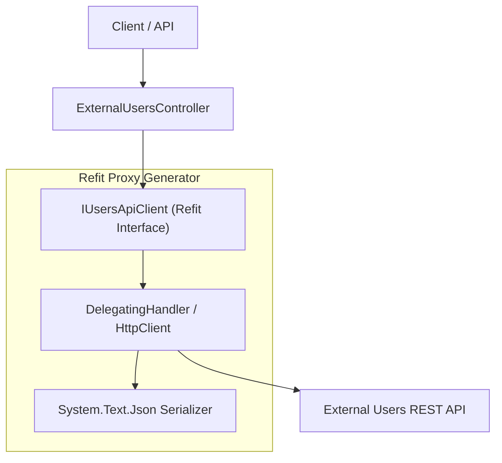
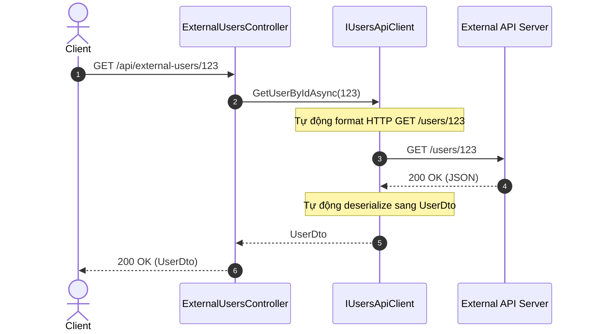

# 34-Refit: Type-Safe REST Client cho .NET 10

Dự án mẫu minh họa việc sử dụng **Refit** trong ứng dụng **ASP.NET Core Controllers** (.NET 10). Refit biến các REST API thành các interface C# có kiểu dữ liệu tường minh (type-safe), tích hợp hoàn hảo với `IHttpClientFactory` và bộ kiểm thử in-memory độc lập.

---

## 1. Giới thiệu tổng quan về Refit

**Refit** là thư viện REST client tự động hóa mạnh mẽ nhất cho .NET, lấy cảm hứng từ Square's Retrofit (Android/Java). Thay vì phải viết boilerplate code sử dụng `HttpClient` thủ công (tạo `HttpRequestMessage`, parse JSON, kiểm tra status code, nối query string), Refit cho phép bạn chỉ cần khai báo một C# `interface` cùng với các metadata attributes (`[Get]`, `[Post]`, `[Query]`, `[Body]`, `[Headers]`).

Refit sẽ tự động sinh mã proxy tại thời điểm biên dịch (compile-time source generation) hoặc runtime để thực thi các request HTTP tương ứng.

---

## 2. So sánh HttpClient, RestSharp và Refit

| Tiêu chí | Native HttpClient | RestSharp | Refit |
| :--- | :--- | :--- | :--- |
| **Cú pháp** | Thủ công, nhiều boilerplate | Fluent API hướng đối tượng | Declarative Interface (khai báo C# interface) |
| **Type Safety** | Thấp (URL là chuỗi thô) | Trung bình (URL builder) | Rất cao (tham số kiểu dữ liệu C#) |
| **Tích hợp DI** | `IHttpClientFactory` | Hỗ trợ DI tùy chỉnh | Native qua `AddRefitClient<T>()` |
| **Quản lý vòng đời kết nối** | Cần cấu hình factory | Cần chú ý connection pooling | Tự động qua `HttpMessageHandler` pool |
| **Khả năng Mock khi Test** | Khá phức tạp (`HttpMessageHandler`) | Mock `IRestClient` | Rất dễ (mock interface `IUsersApiClient` hoặc mock HTTP handler) |

---


## Sơ đồ Kiến trúc & Luồng dữ liệu (Architecture & Data Flow)

### 1. Sơ đồ Kiến trúc Tổng quan (Architecture Overview)


### 2. Mô hình Luồng dữ liệu Chi tiết (Data Flow & Sequence)


### 3. Các Use Cases Cụ thể trong Thực tế (Concrete Use Cases)
- **Gọi REST API Type-Safe**: Khai báo API bên ngoài bằng một interface C# thuần túy với các attribute `[Get]`, `[Post]`.
- **Loại bỏ Code Boilerplate**: Không cần tự viết `HttpClient`, serialize/deserialize JSON, quản lý URL và Query Parameters thủ công.
- **Tích hợp sâu với HttpClientFactory & Polly**: Dễ dàng gắn các chính sách retry, logging và bearer token authorization.


## 3. Cài đặt và Cấu hình

### Package NuGet
- `Refit` (8.0.0+)
- `Swashbuckle.AspNetCore` (10.2.3)

*(Lưu ý: Kể từ Refit 8.x, các tính năng `HttpClientFactory` đã được gộp trực tiếp vào package `Refit` chính).*

### Đăng ký DI trong `Program.cs`
```csharp
using Refit;
using RefitClientDemo.Api.Services;

var builder = WebApplication.CreateBuilder(args);

builder.Services.AddControllers();

var externalUrl = builder.Configuration["ExternalServices:UsersApiUrl"] ?? "https://api.example.com";

// Đăng ký Refit Typed Client cùng HttpClientFactory
builder.Services.AddRefitClient<IUsersApiClient>()
    .ConfigureHttpClient(c =>
    {
        c.BaseAddress = new Uri(externalUrl);
        c.Timeout = TimeSpan.FromSeconds(15);
    });
```

---

## 4. Cấu trúc Project

```
34-Refit/
├── RefitClientDemo.slnx
├── README.md
├── RefitClientDemo.Api/
│   ├── RefitClientDemo.Api.csproj
│   ├── Program.cs
│   ├── Properties/launchSettings.json (Port: 5134)
│   ├── appsettings.json
│   ├── appsettings.Development.json
│   ├── RefitClientDemo.Api.http
│   ├── Models/
│   │   └── UserDtos.cs
│   ├── Services/
│   │   └── IUsersApiClient.cs
│   └── Controllers/
│       └── ExternalUsersController.cs
└── RefitClientDemo.Tests/
    ├── RefitClientDemo.Tests.csproj
    └── RefitTests.cs
```

---

## 5. Các tính năng cốt lõi được triển khai

### 5.1. Khai báo Interface với Refit Attributes
```csharp
[Headers("User-Agent: RefitClientDemo/1.0", "Accept: application/json")]
public interface IUsersApiClient
{
    [Get("/api/external/users")]
    Task<ApiResponse<List<UserProfile>>> GetUsersAsync([Query] UserFilterQuery query, [Header("Authorization")] string? authorization = null);

    [Get("/api/external/users/{id}")]
    Task<ApiResponse<UserProfile>> GetUserByIdAsync(int id);

    [Post("/api/external/users")]
    Task<ApiResponse<UserProfile>> CreateUserAsync([Body] CreateUserProfileRequest request);

    [Put("/api/external/users/{id}")]
    Task<ApiResponse<UserProfile>> UpdateUserAsync(int id, [Body] UpdateUserProfileRequest request);

    [Delete("/api/external/users/{id}")]
    Task<IApiResponse> DeleteUserAsync(int id);
}
```

### 5.2. Sử dụng `ApiResponse<T>` để kiểm soát HTTP Status
Thay vì ném ngoại lệ khi gặp mã lỗi HTTP (404, 500), dùng `ApiResponse<T>` cho phép kiểm tra `response.IsSuccessStatusCode`, đọc `response.StatusCode`, `response.Content` hoặc `response.Error` một cách an toàn.

---

## 6. Controller Implementation

Dự án sử dụng **ASP.NET Core Controllers** kế thừa từ `ControllerBase` và inject trực tiếp `IUsersApiClient`:

```csharp
[ApiController]
[Route("api/[controller]")]
public class ExternalUsersController : ControllerBase
{
    private readonly IUsersApiClient _usersApi;

    public ExternalUsersController(IUsersApiClient usersApi)
    {
        _usersApi = usersApi;
    }

    [HttpGet("{id:int}")]
    public async Task<IActionResult> GetUserById(int id)
    {
        var response = await _usersApi.GetUserByIdAsync(id);
        if (response.StatusCode == HttpStatusCode.NotFound)
        {
            return NotFound(new { message = $"User with ID {id} not found." });
        }

        if (!response.IsSuccessStatusCode)
        {
            return StatusCode((int)response.StatusCode, new { message = "External API call failed" });
        }

        return Ok(response.Content);
    }
}
```

---

## 7. Tích hợp Resilience & DelegatingHandler

Refit hoạt động trực tiếp trên nền `IHttpClientFactory`, do đó có thể xâu chuỗi các `DelegatingHandler` và chính sách phục hồi (Polly) một cách tự nhiên:
```csharp
builder.Services.AddRefitClient<IUsersApiClient>()
    .ConfigureHttpClient(c => c.BaseAddress = new Uri("https://api.example.com"))
    .AddHttpMessageHandler<AuthHeaderHandler>()
    .AddStandardResilienceHandler(); // Polly resilience trong .NET 8/10
```

---

## 8. Hướng dẫn kiểm thử (TDD)

Dự án kiểm thử độc lập 100% không phụ thuộc internet bằng cách thay thế handler trong `WebApplicationFactory`:
```csharp
builder.ConfigureTestServices(services =>
{
    services.AddRefitClient<IUsersApiClient>()
        .ConfigureHttpClient(c => c.BaseAddress = new Uri("https://api.example.com"))
        .ConfigurePrimaryHttpMessageHandler(() => new MockExternalHttpHandler());
});
```

Bộ kiểm thử `RefitTests.cs` xác nhận:
1. `GetUsers_ReturnsListFromExternalApi` (200 OK)
2. `GetUsers_WithQueryFilter_PassesQueryToExternalApi` (Lọc theo query params)
3. `GetUserById_ExistingUser_ReturnsOk` (200 OK)
4. `GetUserById_NonExistent_ReturnsNotFound` (404 Not Found)
5. `CreateUser_Valid_ReturnsCreated` (201 Created)
6. `CreateUser_EmptyName_ReturnsBadRequest` (400 Bad Request)
7. `UpdateUser_Existing_ReturnsOk` (200 OK)
8. `UpdateUser_NonExistent_ReturnsNotFound` (404 Not Found)
9. `DeleteUser_Existing_ReturnsNoContent` (204 No Content)
10. `DeleteUser_NonExistent_ReturnsNotFound` (404 Not Found)

---

## 9. Hiệu năng & Best Practices

- **Dùng `IHttpClientFactory`**: Luôn đăng ký Refit thông qua `.AddRefitClient<T>()` để tận dụng cơ chế pooling socket của .NET, tránh tình trạng Socket Exhaustion.
- **Tùy biến JSON Serializer**: Cấu hình `RefitSettings` với `SystemTextJsonContentSerializer` đồng bộ các thiết lập `JsonSerializerOptions` (camelCase, enum converter) với toàn hệ thống.
- **Dùng CancellationToken**: Luôn truyền `CancellationToken` vào các phương thức interface để hỗ trợ hủy request khi client ngắt kết nối.

---

## 10. Các bẫy thường gặp (Common Pitfalls)

1. **Không bắt ngoại lệ `ApiException`**: Nếu interface trả về `Task<T>` thay vì `Task<ApiResponse<T>>`, khi server trả về 4xx/5xx Refit sẽ ném `ApiException`. Nên dùng `Task<ApiResponse<T>>` hoặc cấu hình global exception handling.
2. **Format ngày tháng trong Query String**: Mặc định DateTime có thể bị serialize theo định dạng locale của máy chủ. Nên sử dụng `[Format("yyyy-MM-dd")]` trên tham số query nếu API yêu cầu định dạng ISO chuẩn.
3. **Quên BaseAddress**: Quên khai báo `BaseAddress` trong cấu hình HttpClient sẽ khiến Refit ném ngoại lệ `InvalidOperationException: An invalid request URI was provided`.

---

## 11. Hướng dẫn chạy dự án

### Khởi chạy API
```bash
dotnet run --project RefitClientDemo.Api/RefitClientDemo.Api.csproj
```
- Swagger UI: `http://localhost:5134/swagger`

### Chạy Tests
```bash
dotnet test RefitClientDemo.slnx
```

---

## 12. Kết luận & Tài liệu tham khảo

- **Refit GitHub**: [https://github.com/reactiveui/refit](https://github.com/reactiveui/refit)
- **Microsoft Docs - IHttpClientFactory**: [https://learn.microsoft.com/en-us/dotnet/core/extensions/httpclient-factory](https://learn.microsoft.com/en-us/dotnet/core/extensions/httpclient-factory)
