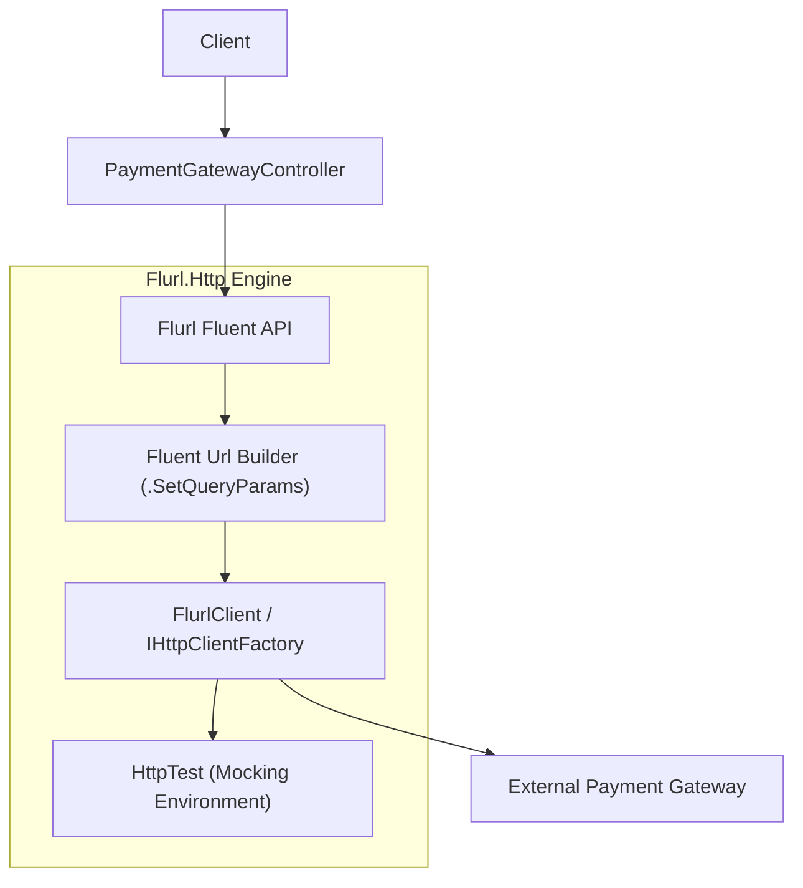
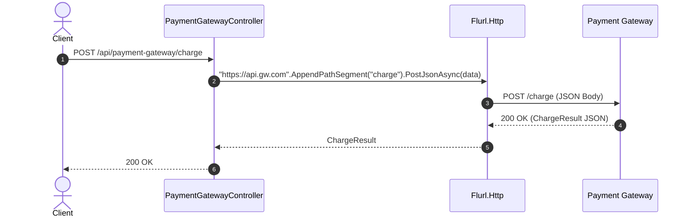

# 35-Flurl: Fluent, Testable HTTP Client cho .NET 10

Dự án mẫu minh họa việc sử dụng **Flurl.Http** trong ứng dụng **ASP.NET Core Controllers** (.NET 10). Flurl kết hợp khả năng xây dựng URL theo phong cách Fluent API (Fluent URL Builder) với client HTTP mạnh mẽ, hỗ trợ cơ chế kiểm thử giả lập độc lập (`HttpTest`) mà không cần dựng mock server bên ngoài.

---

## 1. Giới thiệu tổng quan về Flurl & Flurl.Http

**Flurl** là thư viện xây dựng URL và gọi HTTP client theo phong cách Fluent API dành cho .NET. Flurl chia làm hai phần chính:
- **Flurl (Core)**: Thư viện thuần túy để phân tích, nối chuỗi và thao tác với URL một cách an toàn và tiện lợi.
- **Flurl.Http**: Mở rộng trên nền HttpClient của .NET, cho phép gửi các request HTTP, serialize/deserialize JSON, quản lý header, cookie, xác thực và xử lý lỗi với cú pháp ngắn gọn, dễ đọc.

Kể từ phiên bản **Flurl.Http 4.0**, thư viện chuyển sang dùng mặc định `System.Text.Json` (thay vì `Newtonsoft.Json`), tối ưu hóa hiệu năng và tích hợp sâu với kiến trúc hiện đại của .NET.

---

## 2. So sánh HttpClient, RestSharp và Flurl

| Tiêu chí | Native HttpClient | RestSharp | Flurl.Http |
| :--- | :--- | :--- | :--- |
| **Cú pháp gọi API** | Dài dòng, nhiều boilerplate | Hướng đối tượng (`RestRequest`, `RestClient`) | Fluent API chuỗi xâu (`.AppendPathSegment().GetJsonAsync<T>()`) |
| **Xây dựng URL & Query** | Thủ công (`QueryHelpers` / chuỗi thô) | AddParameter / AddUrlSegment | Rất tự nhiên (`SetQueryParams`, `AppendPathSegments`) |
| **Testing & Mocking** | Phức tạp (cần mock `HttpMessageHandler`) | Mock interface `IRestClient` | Cực kỳ đơn giản với `HttpTest` (tích hợp sẵn) |
| **JSON Serializer** | `System.Text.Json` | `System.Text.Json` / custom | `System.Text.Json` (từ bản 4.0+) |
| **Quản lý Connection Pool** | Cần `IHttpClientFactory` | Quản lý bên trong | Tự động quản lý qua `FlurlClientCache` |

---


## Sơ đồ Kiến trúc & Luồng dữ liệu (Architecture & Data Flow)

### 1. Sơ đồ Kiến trúc Tổng quan (Architecture Overview)


### 2. Mô hình Luồng dữ liệu Chi tiết (Data Flow & Sequence)


### 3. Các Use Cases Cụ thể trong Thực tế (Concrete Use Cases)
- **Xây dựng URL & Gọi HTTP Cực Kỳ Tự Nhiên**: Cú pháp nối chuỗi URL, thêm query param, header trực quan và không bị lỗi thiếu/thừa dấu gạch chéo `/`.
- **Kiểm thử Không Cần Mạng với HttpTest**: Giả lập toàn bộ request/response HTTP trong Unit Test chỉ với 1 dòng code `using var httpTest = new HttpTest();`.
- **Xử lý Lỗi Tinh tế**: Bắt các ngoại lệ `FlurlHttpException` với thông tin chi tiết về request và response body.


## 3. Cài đặt và Cấu hình

### Package NuGet
- `Flurl.Http` (4.0.2+)
- `Swashbuckle.AspNetCore` (10.2.3)

### Cấu hình trong `Program.cs`
```csharp
using PaymentGatewayFlurl.Api.Services;

var builder = WebApplication.CreateBuilder(args);

builder.Services.AddControllers();

// Đăng ký Service giao tiếp HTTP qua Flurl
builder.Services.AddScoped<IPaymentGatewayService, PaymentGatewayService>();

builder.Services.AddEndpointsApiExplorer();
builder.Services.AddSwaggerGen();
```

---

## 4. Cấu trúc Project

```
35-Flurl/
├── PaymentGatewayFlurl.slnx
├── README.md
├── PaymentGatewayFlurl.Api/
│   ├── PaymentGatewayFlurl.Api.csproj
│   ├── Program.cs
│   ├── Properties/launchSettings.json (Port: 5135)
│   ├── appsettings.json
│   ├── appsettings.Development.json
│   ├── PaymentGatewayFlurl.Api.http
│   ├── Models/
│   │   └── PaymentDtos.cs
│   ├── Services/
│   │   ├── IPaymentGatewayService.cs
│   │   └── PaymentGatewayService.cs
│   └── Controllers/
│       └── PaymentGatewayController.cs
└── PaymentGatewayFlurl.Tests/
    ├── PaymentGatewayFlurl.Tests.csproj
    └── PaymentGatewayTests.cs
```

---

## 5. Các tính năng cốt lõi được triển khai

### 5.1. Xây dựng URL động & Query Parameters
```csharp
public async Task<ExchangeRatesResponse> GetRatesAsync(string baseCurrency, string[] symbols)
{
    return await _baseUrl
        .AppendPathSegment("rates")
        .SetQueryParam("base", baseCurrency)
        .SetQueryParam("symbols", string.Join(",", symbols))
        .WithOAuthBearerToken(_apiKey)
        .GetJsonAsync<ExchangeRatesResponse>();
}
```

### 5.2. Gửi dữ liệu JSON và nhận kết quả
```csharp
public async Task<TransactionResponse> ChargeAsync(ChargeRequest request)
{
    return await _baseUrl
        .AppendPathSegment("charges")
        .WithOAuthBearerToken(_apiKey)
        .WithHeader("Accept", "application/json")
        .PostJsonAsync(request)
        .ReceiveJson<TransactionResponse>();
}
```

### 5.3. Xử lý ngoại lệ với `FlurlHttpException`
```csharp
try
{
    return await _baseUrl
        .AppendPathSegments("charges", transactionId)
        .WithOAuthBearerToken(_apiKey)
        .GetJsonAsync<TransactionResponse>();
}
catch (FlurlHttpException ex) when (ex.StatusCode == 404)
{
    return null; // Xử lý trường hợp 404 Not Found êm dịu
}
```

---

## 6. Controller Implementation

Dự án sử dụng **ASP.NET Core Controllers** với đầy đủ xử lý mã trạng thái lỗi và map ngược `FlurlHttpException` về chuẩn phản hồi của API:

```csharp
[HttpPost("charges")]
public async Task<IActionResult> Charge([FromBody] ChargeRequest request)
{
    if (request.Amount <= 0)
    {
        return BadRequest(new { message = "Amount must be greater than 0." });
    }

    try
    {
        var result = await _gatewayService.ChargeAsync(request);
        return Ok(result);
    }
    catch (FlurlHttpException ex)
    {
        var errorResponse = await ex.GetResponseJsonAsync<GatewayErrorResponse>();
        return StatusCode(ex.StatusCode ?? StatusCodes.Status502BadGateway, errorResponse);
    }
}
```

---

## 7. Cơ chế Testing vượt trội với `HttpTest`

Điểm mạnh độc nhất của Flurl là công cụ `HttpTest`. Bất kỳ khi nào mở một khối `using var httpTest = new HttpTest();`, toàn bộ các lệnh gọi HTTP của Flurl trong phạm vi đó sẽ tự động bị chặn và mô phỏng phản hồi mà không gửi bất kỳ gói tin mạng nào ra ngoài:

```csharp
using var httpTest = new HttpTest();
httpTest.RespondWithJson(new TransactionResponse("txn_123", "Succeeded", 100m, "USD", "Test", DateTime.UtcNow), 200);

// Gửi request qua controller
var response = await _client.PostAsJsonAsync("/api/paymentgateway/charges", request);

// Kiểm tra khẳng định rằng Flurl đã gọi đúng URL, HTTP Method và Header
httpTest.ShouldHaveCalled("*/charges")
    .WithVerb(HttpMethod.Post)
    .WithOAuthBearerToken("sk_test_mock_secret_key_12345");
```

---

## 8. Hướng dẫn kiểm thử (TDD)

Bộ kiểm thử `PaymentGatewayTests.cs` chạy độc lập 100% không phụ thuộc gateway thật:
1. `Charge_SuccessfulTransaction_ReturnsOk` (200 OK & xác thực token)
2. `Charge_DeclinedByGateway_ReturnsBadRequestWithGatewayError` (400 Bad Request từ gateway)
3. `Charge_ZeroOrNegativeAmount_ReturnsBadRequestWithoutCallingGateway` (Validation chặn trước khi gọi gateway)
4. `GetTransaction_ExistingId_ReturnsTransaction` (200 OK)
5. `GetTransaction_NonExistent_ReturnsNotFound` (404 Not Found)
6. `Refund_SuccessfulRequest_ReturnsOk` (200 OK)
7. `Refund_InvalidAmount_ReturnsBadRequest` (400 Bad Request)
8. `GetRates_WithQueryParams_PassesCorrectUrlAndParams` (Xác thực query string `base` và `symbols`)

---

## 9. Hiệu năng & Best Practices

- **Tránh tạo HttpClient mới**: Flurl 4.x tự động sử dụng cache client theo host name (`FlurlClientCache`), giúp tái sử dụng socket và tránh cạn kiệt cổng (Socket Exhaustion).
- **Luôn giải phóng `HttpTest`**: Trong unit test, luôn đặt `HttpTest` trong câu lệnh `using` để tránh ảnh hưởng chéo giữa các bài kiểm thử.
- **Tận dụng System.Text.Json**: Không cần cài thêm Newtonsoft.Json trừ khi bạn phải làm việc với các hệ thống legacy đặc thù.

---

## 10. Các bẫy thường gặp (Common Pitfalls)

1. **Quên `using` cho `HttpTest`**: Nếu không dispose `HttpTest`, nó sẽ tiếp tục chặn tất cả các request HTTP của các test case chạy sau đó.
2. **Không phân biệt URL encode**: Flurl tự động encode các giá trị truyền qua `.SetQueryParam()`, không cần gọi `Uri.EscapeDataString()` thủ công để tránh bị double-encoding.
3. **Bắt nhầm Exception**: Cần bắt `FlurlHttpException` thay vì `HttpRequestException` thông thường để có thể đọc được nội dung body lỗi thông qua `ex.GetResponseJsonAsync<T>()`.

---

## 11. Hướng dẫn chạy dự án

### Khởi chạy API
```bash
dotnet run --project PaymentGatewayFlurl.Api/PaymentGatewayFlurl.Api.csproj
```
- Swagger UI: `http://localhost:5135/swagger`

### Chạy Tests
```bash
dotnet test PaymentGatewayFlurl.slnx
```

---

## 12. Kết luận & Tài liệu tham khảo

- **Flurl Official Website**: [https://flurl.dev/](https://flurl.dev/)
- **Flurl GitHub Repository**: [https://github.com/tmenier/Flurl](https://github.com/tmenier/Flurl)
- **Flurl Testing Guide**: [https://flurl.dev/docs/testable-http/](https://flurl.dev/docs/testable-http/)
