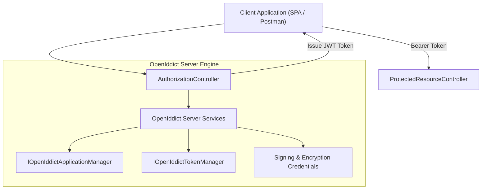
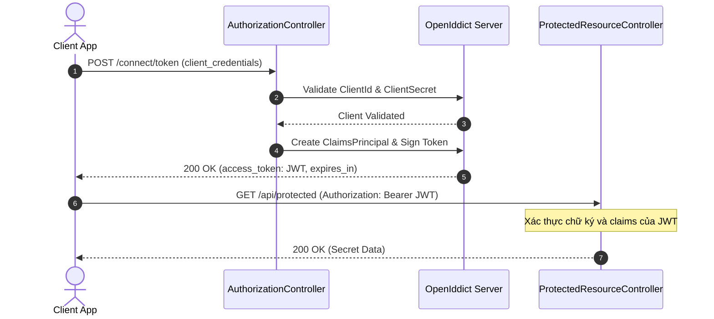

# 36-OpenIddict: OAuth 2.0 & OpenID Connect Server trong .NET 10

Dự án mẫu minh họa việc xây dựng máy chủ xác thực và cấp quyền chuẩn **OAuth 2.0 / OpenID Connect** sử dụng **OpenIddict** kết hợp với **ASP.NET Core Controllers** (.NET 10), lưu trữ dữ liệu client và token trên Entity Framework Core (SQLite).

---

## 1. Giới thiệu tổng quan về OpenIddict

**OpenIddict** là framework mã nguồn mở linh hoạt và mạnh mẽ nhất hiện nay để triển khai Authorization Server và Resource Server chuẩn OAuth 2.0 / OpenID Connect trong hệ sinh thái .NET.

Khác với các giải pháp all-in-one cồng kềnh, OpenIddict được thiết kế theo dạng module hóa cao:
- **OpenIddict.Core**: Quản lý các entity và business logic (Application, Authorization, Scope, Token).
- **OpenIddict.Server**: Cung cấp pipeline xử lý các giao thức OAuth 2.0 / OIDC (Token endpoint, Authorization endpoint, Introspection, Revocation).
- **OpenIddict.Validation**: Xác thực token cho Resource Server (local server hoặc remote introspection).
- **OpenIddict.EntityFrameworkCore**: Adapter lưu trữ dữ liệu trên EF Core.

---

## 2. So sánh OpenIddict vs Duende IdentityServer

| Tiêu chí | OpenIddict | Duende IdentityServer |
| :--- | :--- | :--- |
| **Giấy phép (License)** | **Mã nguồn mở hoàn toàn (Apache 2.0)**, miễn phí thương mại | Thương mại (RPL / Trả phí cho doanh nghiệp) |
| **Độ linh hoạt** | Rất cao, cho phép tùy biến controller và luồng xử lý | Nhiều tính năng sẵn có, quy chuẩn chặt chẽ |
| **Kiến trúc** | Module hóa độc lập (Core, Server, Validation) | Framework tích hợp nguyên khối |
| **Resource Server** | Tích hợp sẵn `UseLocalServer()` không cần gọi HTTP nội bộ | Cần cấu hình JWT Bearer hoặc Introspection |
| **Tương thích .NET 10** | Tương thích hoàn hảo | Tương thích theo license trả phí |

---


## Sơ đồ Kiến trúc & Luồng dữ liệu (Architecture & Data Flow)

### 1. Sơ đồ Kiến trúc Tổng quan (Architecture Overview)


### 2. Mô hình Luồng dữ liệu Chi tiết (Data Flow & Sequence)


### 3. Các Use Cases Cụ thể trong Thực tế (Concrete Use Cases)
- **Tự Xây dựng OAuth 2.0 / OpenID Connect Server**: Triển khai Identity Provider riêng cho hệ thống nội bộ của công ty.
- **Client Credentials Flow**: Xác thực giữa các dịch vụ Backend-to-Backend an toàn.
- **Authorization Code Flow with PKCE**: Xác thực người dùng cho ứng dụng di động (Mobile App) và Web SPA.


## 3. Cài đặt và Cấu hình

### Package NuGet
- `OpenIddict.AspNetCore` (7.7.0)
- `OpenIddict.EntityFrameworkCore` (7.7.0)
- `Microsoft.EntityFrameworkCore.Sqlite` (10.0.12)
- `Swashbuckle.AspNetCore` (10.2.3)

### Cấu hình trong `Program.cs`
```csharp
builder.Services.AddDbContext<AuthDbContext>(options =>
{
    options.UseSqlite(connectionString);
    options.UseOpenIddict();
});

builder.Services.AddOpenIddict()
    .AddCore(options =>
    {
        options.UseEntityFrameworkCore()
               .UseDbContext<AuthDbContext>();
    })
    .AddServer(options =>
    {
        options.SetTokenEndpointUris("/connect/token");
        options.AllowClientCredentialsFlow();

        options.AddDevelopmentEncryptionCertificate()
               .AddDevelopmentSigningCertificate();

        options.UseAspNetCore()
               .EnableTokenEndpointPassthrough();
    })
    .AddValidation(options =>
    {
        options.UseLocalServer();
        options.UseAspNetCore();
    });

builder.Services.AddAuthentication(OpenIddictValidationAspNetCoreDefaults.AuthenticationScheme);
builder.Services.AddAuthorization();
```

---

## 4. Cấu trúc Project

```
36-OpenIddict/
├── AuthServerOpenIddict.slnx
├── README.md
├── AuthServerOpenIddict.Api/
│   ├── AuthServerOpenIddict.Api.csproj
│   ├── Program.cs
│   ├── Properties/launchSettings.json (Port: 5136)
│   ├── appsettings.json
│   ├── appsettings.Development.json
│   ├── AuthServerOpenIddict.Api.http
│   ├── Data/
│   │   └── AuthDbContext.cs
│   ├── Models/
│   │   └── AuthDtos.cs
│   └── Controllers/
│       ├── AuthorizationController.cs
│       └── ProtectedResourceController.cs
└── AuthServerOpenIddict.Tests/
    ├── AuthServerOpenIddict.Tests.csproj
    └── OpenIddictTests.cs
```

---

## 5. Các tính năng cốt lõi được triển khai

### 5.1. Client Credentials Grant Type
Cho phép các dịch vụ backend, daemon worker hoặc cron job xác thực máy-với-máy (M2M) thông qua `client_id` và `client_secret`.

### 5.2. Tích hợp Passthrough với ASP.NET Core Controllers
Bằng cách bật `.EnableTokenEndpointPassthrough()`, request gửi đến `/connect/token` sẽ được chuyển trực tiếp vào `AuthorizationController` để lập trình viên tự do kiểm tra quyền hạn, gắn claim và audit log.

### 5.3. Claim Destinations
Trong OpenIddict, claim chỉ được nhúng vào JWT Access Token khi được chỉ định rõ ràng qua `claim.SetDestinations(OpenIddictConstants.Destinations.AccessToken)`.

---

## 6. Controller Implementation

### 6.1. `AuthorizationController`
```csharp
[HttpPost("~/connect/token")]
[Consumes("application/x-www-form-urlencoded")]
public async Task<IActionResult> Exchange()
{
    var request = HttpContext.GetOpenIddictServerRequest();
    if (request.IsClientCredentialsGrantType())
    {
        var application = await _applicationManager.FindByClientIdAsync(request.ClientId);
        // Kiểm tra và tạo ClaimsIdentity
        var identity = new ClaimsIdentity(OpenIddictServerAspNetCoreDefaults.AuthenticationScheme);
        identity.AddClaim(new Claim(OpenIddictConstants.Claims.Subject, request.ClientId));
        
        foreach (var claim in identity.Claims)
        {
            claim.SetDestinations(OpenIddictConstants.Destinations.AccessToken);
        }

        return SignIn(new ClaimsPrincipal(identity), OpenIddictServerAspNetCoreDefaults.AuthenticationScheme);
    }
    return BadRequest();
}
```

### 6.2. `ProtectedResourceController`
```csharp
[ApiController]
[Route("api/[controller]")]
[Authorize(AuthenticationSchemes = OpenIddictValidationAspNetCoreDefaults.AuthenticationScheme)]
public class ProtectedResourceController : ControllerBase
{
    [HttpGet("secret-data")]
    public IActionResult GetSecretData()
    {
        var clientId = User.FindFirstValue(OpenIddictConstants.Claims.Subject);
        return Ok(new SecretDataResponse("Confidential data", clientId, DateTime.UtcNow));
    }
}
```

---

## 7. Cơ chế Xác thực cục bộ (`UseLocalServer`)

Với kiến trúc monolithic hoặc API Gateway đóng vai trò vừa là Auth Server vừa là Resource Server, cấu hình `options.UseLocalServer()` trong `AddValidation` cho phép xác thực trực tiếp token mà không cần tạo kết nối HTTP round-trip, đem lại hiệu năng tối đa.

---

## 8. Hướng dẫn kiểm thử (TDD)

Bộ kiểm thử `OpenIddictTests.cs` chạy độc lập với SQLite in-memory:
1. `TokenEndpoint_ValidClientCredentials_ReturnsAccessToken` (200 OK & nhận JWT bearer token)
2. `TokenEndpoint_InvalidClientSecret_ReturnsBadRequest` (400 Bad Request)
3. `TokenEndpoint_UnsupportedGrantType_ReturnsBadRequest` (400 Bad Request)
4. `ProtectedResource_WithoutToken_ReturnsUnauthorized` (401 Unauthorized)
5. `ProtectedResource_WithValidToken_ReturnsSecretData` (200 OK khi có Header Authorization)
6. `UserInfo_WithValidToken_ReturnsCallerClaims` (Xác minh Claims và Roles được giải mã chính xác)

---

## 9. Hiệu năng & Best Practices

- **Chứng chỉ Production**: Khi chạy môi trường thật, thay thế `AddDevelopmentSigningCertificate()` bằng chứng chỉ X.509 lưu trong Azure Key Vault hoặc Certificate Store của hệ điều hành.
- **Index Database**: Đảm bảo bảng `OpenIddictTokens` và `OpenIddictAuthorizations` được dọn dẹp định kỳ bằng lệnh `IOpenIddictTokenManager.PruneAsync()`.

---

## 10. Các bẫy thường gặp (Common Pitfalls)

1. **Quên Set Destinations cho Claim**: Nếu không gọi `claim.SetDestinations(...)`, token sinh ra sẽ không chứa các claim quan trọng và `User.Claims` phía Resource Server sẽ bị trống.
2. **Thiếu Middleware**: Thứ tự middleware phải chuẩn xác: `app.UseAuthentication()` phải nằm TRƯỚC `app.UseAuthorization()`.
3. **Quên `EnableTokenEndpointPassthrough`**: Nếu không bật tùy chọn này, request đến `/connect/token` sẽ bị OpenIddict chặn lại trước khi tới Controller.

---

## 11. Hướng dẫn chạy dự án

### Khởi chạy Server
```bash
dotnet run --project AuthServerOpenIddict.Api/AuthServerOpenIddict.Api.csproj
```
- Swagger UI: `http://localhost:5136/swagger`

### Chạy Tests
```bash
dotnet test AuthServerOpenIddict.slnx
```

---

## 12. Kết luận & Tài liệu tham khảo

- **OpenIddict Documentation**: [https://documentation.openiddict.com/](https://documentation.openiddict.com/)
- **OpenIddict GitHub**: [https://github.com/openiddict/openiddict-core](https://github.com/openiddict/openiddict-core)
