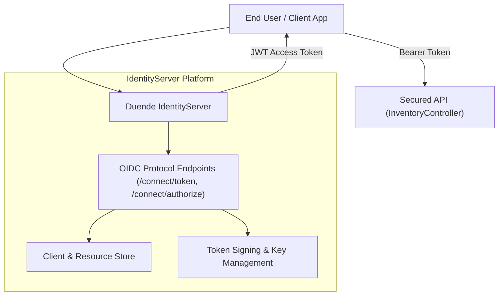
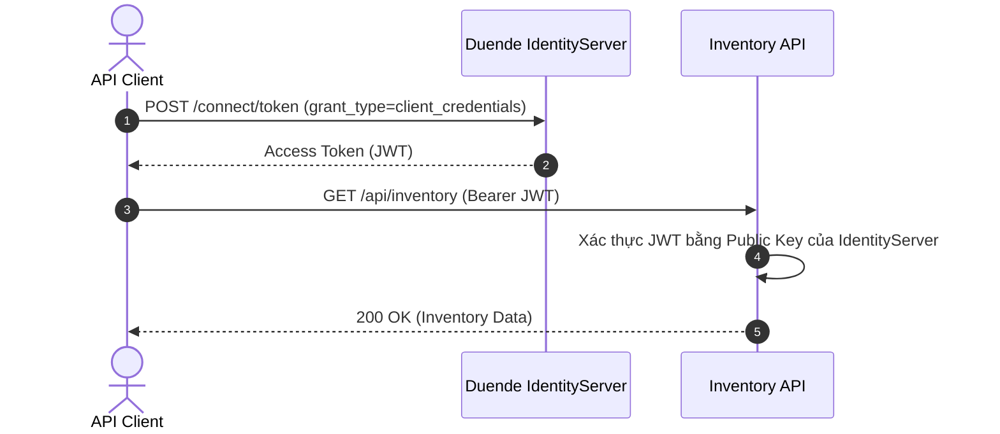

# 37-DuendeIdentityServer: Enterprise Identity & Access Management trong .NET 10

Dự án mẫu minh họa việc sử dụng **Duende IdentityServer** (phiên bản kế thừa chính thức của IdentityServer4) trong ứng dụng **ASP.NET Core Controllers** (.NET 10), cung cấp dịch vụ máy chủ OpenID Connect / OAuth 2.0 và bảo vệ Web API bằng chính sách xác thực `LocalApiAuthentication`.

---

## 1. Giới thiệu tổng quan về Duende IdentityServer

**Duende IdentityServer** là giải pháp OpenID Connect (OIDC) và OAuth 2.0 hàng đầu được thiết kế riêng cho nền tảng ASP.NET Core. Tiền thân là dự án mã nguồn mở nổi tiếng IdentityServer4, Duende IdentityServer được phát triển bởi Brock Allen và Dominick Baier nhằm cung cấp một framework bảo mật cấp doanh nghiệp, tuân thủ nghiêm ngặt các tiêu chuẩn OIDC/OAuth 2.0 hiện đại nhất.

Các tính năng cốt lõi:
- Cung cấp dịch vụ Single Sign-On (SSO) và Identity Provider (IdP).
- Cấp phát Access Token (JWT / Reference Token) cho các client application (SPA, Mobile, Machine-to-Machine).
- Quản lý phiên làm việc, thu hồi token (Token Revocation), và API Discovery Document (`/.well-known/openid-configuration`).

---

## 2. So sánh Duende IdentityServer vs OpenIddict & Keycloak

| Tiêu chí | Duende IdentityServer | OpenIddict | Keycloak |
| :--- | :--- | :--- | :--- |
| **Nền tảng** | C# / ASP.NET Core native | C# / ASP.NET Core native | Java (Stand-alone service) |
| **Mô hình triển khai** | Nhúng trực tiếp vào ứng dụng .NET | Nhúng trực tiếp vào ứng dụng .NET | Chạy container/server riêng biệt |
| **Giấy phép (License)** | Thương mại (Duende RPL / Enterprise) | **Mã nguồn mở Apache 2.0** | Mã nguồn mở Apache 2.0 |
| **Độ hoàn thiện OIDC** | Cực cao, hỗ trợ chuẩn FAPI, MTLS, DPoP | Rất cao, linh hoạt tùy biến | Rất cao, có sẵn giao diện quản trị UI |
| **Xác thực Local API** | Hỗ trợ qua `AddLocalApiAuthentication()` | Hỗ trợ qua `AddValidation().UseLocalServer()` | Phải dùng JWT Bearer qua mạng |

---


## Sơ đồ Kiến trúc & Luồng dữ liệu (Architecture & Data Flow)

### 1. Sơ đồ Kiến trúc Tổng quan (Architecture Overview)


### 2. Mô hình Luồng dữ liệu Chi tiết (Data Flow & Sequence)


### 3. Các Use Cases Cụ thể trong Thực tế (Concrete Use Cases)
- **Đăng nhập một lần (Single Sign-On - SSO)**: Đăng nhập 1 lần cho hàng chục ứng dụng web và mobile trong toàn doanh nghiệp.
- **Quản lý Định danh Doanh nghiệp**: Tiêu chuẩn vàng cho Identity & Access Management trong hệ sinh thái .NET.
- **Phân quyền Theo Phạm vi (Scope-based Access Control)**: Cấp quyền truy cập chi tiết tới từng API resource.


## 3. Cài đặt và Cấu hình

### Package NuGet
- `Duende.IdentityServer` (8.0.8+)
- `Swashbuckle.AspNetCore` (10.2.3)

### Cấu hình trong `Program.cs`
```csharp
using InventoryIdServer.Api.Configuration;

var builder = WebApplication.CreateBuilder(args);

builder.Services.AddControllers();

// Cấu hình Duende IdentityServer với In-Memory Stores
builder.Services.AddIdentityServer(options =>
{
    options.Events.RaiseErrorEvents = true;
    options.Events.RaiseInformationEvents = true;
    options.Events.RaiseFailureEvents = true;
    options.Events.RaiseSuccessEvents = true;
    options.EmitStaticAudienceClaim = true;
})
.AddInMemoryIdentityResources(Config.IdentityResources)
.AddInMemoryApiScopes(Config.ApiScopes)
.AddInMemoryApiResources(Config.ApiResources)
.AddInMemoryClients(Config.Clients);

// Đăng ký Local API Authentication handler
builder.Services.AddLocalApiAuthentication();

var app = builder.Build();

app.UseIdentityServer();
app.UseAuthorization();
app.MapControllers();
```

---

## 4. Cấu trúc Project

```
37-DuendeIdentityServer/
├── InventoryIdServer.slnx
├── README.md
├── InventoryIdServer.Api/
│   ├── InventoryIdServer.Api.csproj
│   ├── Program.cs
│   ├── Properties/launchSettings.json (Port: 5137)
│   ├── appsettings.json
│   ├── appsettings.Development.json
│   ├── InventoryIdServer.Api.http
│   ├── Configuration/
│   │   └── Config.cs
│   ├── Models/
│   │   └── InventoryDtos.cs
│   └── Controllers/
│       └── InventoryController.cs
└── InventoryIdServer.Tests/
    ├── InventoryIdServer.Tests.csproj
    └── IdentityServerTests.cs
```

---

## 5. Các tính năng cốt lõi được triển khai

### 5.1. Cấu hình In-Memory Clients & Scopes
```csharp
public static IEnumerable<Client> Clients =>
    new List<Client>
    {
        new()
        {
            ClientId = "machine_worker",
            ClientName = "Internal Background Worker",
            AllowedGrantTypes = GrantTypes.ClientCredentials,
            ClientSecrets = { new Secret("worker_secret_key_123".Sha256()) },
            AllowedScopes =
            {
                IdentityServerConstants.LocalApi.ScopeName,
                "inventory_api"
            }
        }
    };
```

### 5.2. OpenID Connect Discovery Document
Tự động xuất bản tài liệu cấu hình tại `/.well-known/openid-configuration`, chứa danh sách các endpoint, thuật toán mã hóa, và public keys (JWKS).

---

## 6. Controller Implementation

Dự án sử dụng **ASP.NET Core Controllers** với thuộc tính `[Authorize]` áp dụng policy mặc định của Local API (`IdentityServerConstants.LocalApi.PolicyName`):

```csharp
[ApiController]
[Route("api/[controller]")]
[Authorize(IdentityServerConstants.LocalApi.PolicyName)]
public class InventoryController : ControllerBase
{
    [HttpGet]
    public IActionResult GetAll() => Ok(Items);

    [HttpPost]
    public IActionResult Create([FromBody] InventoryItemDto newItem)
    {
        Items.Add(newItem);
        return CreatedAtAction(nameof(GetBySku), new { sku = newItem.Sku }, newItem);
    }
}
```

---

## 7. Cơ chế Local API Authentication

Khi API và IdentityServer chạy chung trong cùng một tiến trình web, `builder.Services.AddLocalApiAuthentication()` giúp xác thực các token mang scope `IdentityServerApi` trực tiếp bằng memory handler mà không cần:
1. Thiết lập JwtBearer với Authority trỏ ngược về chính mình qua mạng.
2. Tải JWKS qua HTTP.
3. Lo ngại về chứng chỉ HTTPS trong môi trường local test.

---

## 8. Hướng dẫn kiểm thử (TDD)

Bộ kiểm thử `IdentityServerTests.cs` chạy độc lập với `WebApplicationFactory<Program>`:
1. `DiscoveryEndpoint_ReturnsValidConfiguration` (200 OK & chứa `token_endpoint`)
2. `TokenEndpoint_ValidClientCredentials_ReturnsAccessToken` (200 OK & trả về Bearer JWT token)
3. `TokenEndpoint_InvalidSecret_ReturnsBadRequest` (400 Bad Request khi sai secret)
4. `InventoryApi_WithoutToken_ReturnsUnauthorized` (401 Unauthorized)
5. `InventoryApi_WithValidToken_ReturnsInventoryList` (200 OK với Header Authorization)
6. `InventoryApi_PostItem_WithValidToken_ReturnsCreated` (201 Created khi thêm mới item)

---

## 9. Hiệu năng & Best Practices

- **Chuyển sang EF Core Store trong Production**: Dùng `Duende.IdentityServer.EntityFramework` để lưu trữ Clients và Scopes vào Database thay vì cấu hình cứng trong code.
- **Key Rotation**: Quản lý khóa ký (Signing Keys) tự động với cơ chế Automatic Key Management tích hợp sẵn trong Duende.
- **Reference Tokens**: Với các token cần thu hồi ngay lập tức, chuyển sang dùng Reference Token thay vì JWT tự thân (Self-contained JWT).

---

## 10. Các bẫy thường gặp (Common Pitfalls)

1. **Thứ tự Middleware**: `app.UseIdentityServer()` đã bao gồm cả `app.UseAuthentication()`, không cần gọi thêm `UseAuthentication()` thủ công để tránh đăng ký 2 lần.
2. **Hash Secret**: Bắt buộc phải hash secret khi đăng ký (`"secret".Sha256()`), nếu để plain-text request xác thực sẽ thất bại.
3. **Môi trường Test**: Khi viết test in-memory, `AddLocalApiAuthentication` là giải pháp tối ưu nhất để tránh lỗi SSL hoặc loopback HTTP request.

---

## 11. Hướng dẫn chạy dự án

### Khởi chạy Server
```bash
dotnet run --project InventoryIdServer.Api/InventoryIdServer.Api.csproj
```
- Swagger UI: `http://localhost:5137/swagger`

### Chạy Tests
```bash
dotnet test InventoryIdServer.slnx
```

---

## 12. Kết luận & Tài liệu tham khảo

- **Duende Software Official**: [https://duendesoftware.com/](https://duendesoftware.com/)
- **Duende IdentityServer Docs**: [https://docs.duendesoftware.com/identityserver/v7/](https://docs.duendesoftware.com/identityserver/v7/)
