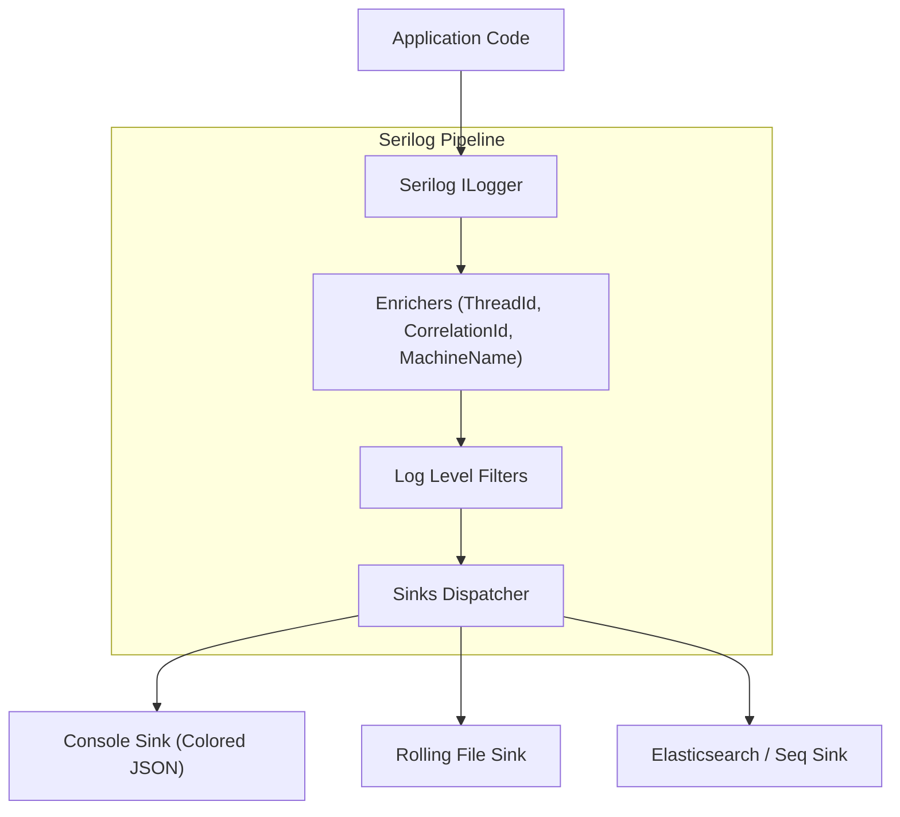
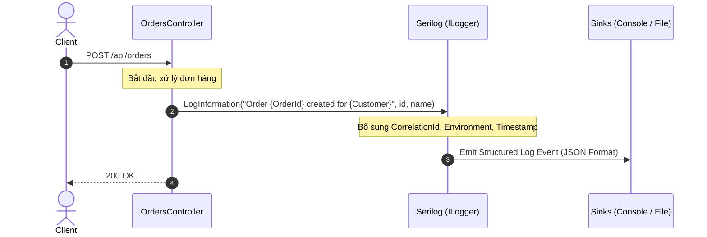

# 38-Serilog: Structured Logging trong .NET 10

Dự án mẫu minh họa việc sử dụng **Serilog** trong ứng dụng **ASP.NET Core Controllers** (.NET 10), áp dụng nguyên lý ghi log có cấu trúc (Structured Logging), làm giàu ngữ cảnh (Log Context Enrichment), ghi log HTTP request tự động và kiểm thử log độc lập bằng Test Sink.

---

## 1. Giới thiệu tổng quan về Serilog

**Serilog** là thư viện ghi log có cấu trúc (Structured Logging) phổ biến và mạnh mẽ nhất cho hệ sinh thái .NET. Thay vì chỉ ghi ra các dòng chữ văn bản thô (unstructured plain text) khó tìm kiếm và phân tích, Serilog lưu trữ các tham số log dưới dạng các cặp thuộc tính khóa-giá trị (key-value properties) kèm theo message template.

Điều này cho phép các hệ thống giám sát và quản lý log hiện đại (như Elasticsearch, Seq, Datadog, Grafana Loki, AWS CloudWatch, Azure Application Insights) có thể lọc, truy vấn, và tổng hợp số liệu theo từng trường dữ liệu cụ thể (ví dụ: tìm tất cả các log có `Amount > 100` và `CustomerId = 'cust_123'`).

---

## 2. So sánh Unstructured Logging vs Structured Logging

| Tiêu chí | Unstructured Logging (Chuỗi văn bản thô) | Structured Logging (Serilog) |
| :--- | :--- | :--- |
| **Cú pháp** | `logger.LogInformation($"Order {id} created");` | `logger.LogInformation("Order {OrderId} created", id);` |
| **Định dạng dữ liệu** | Chuỗi phẳng: `"Order ORD-123 created"` | Chuỗi + Thuộc tính: `{ "OrderId": "ORD-123", ... }` |
| **Tìm kiếm & Phân tích** | Dùng regex chậm, dễ sai lệch | Truy vấn trực tiếp theo trường `OrderId = "ORD-123"` |
| **Tác động hiệu năng** | Nối chuỗi vô điều kiện ngay cả khi tắt log | Chỉ định dạng chuỗi khi log level được kích hoạt |
| **Tích hợp ELK / Seq** | Cần viết logstash parser phức tạp | Đẩy JSON trực tiếp không cần parse |

---


## Sơ đồ Kiến trúc & Luồng dữ liệu (Architecture & Data Flow)

### 1. Sơ đồ Kiến trúc Tổng quan (Architecture Overview)


### 2. Mô hình Luồng dữ liệu Chi tiết (Data Flow & Sequence)


### 3. Các Use Cases Cụ thể trong Thực tế (Concrete Use Cases)
- **Ghi log có Cấu trúc (Structured Logging)**: Log dữ liệu dạng JSON với các tham số cụ thể thay vì chuỗi string thô.
- **Log Enrichment**: Tự động đính kèm `CorrelationId`, `EnvironmentName`, `UserId` vào mọi log entry.
- **Tập trung hóa Nhật ký**: Đẩy log dễ dàng về Seq, Elasticsearch, Grafana Loki hoặc Application Insights.


## 3. Cài đặt và Cấu hình

### Package NuGet
- `Serilog.AspNetCore` (10.0.0+)
- `Serilog.Sinks.File` (6.0.0+)
- `Swashbuckle.AspNetCore` (10.2.3)

### Cấu hình trong `Program.cs`
```csharp
using Serilog;

var builder = WebApplication.CreateBuilder(args);

// Tích hợp Serilog vào ASP.NET Core Host
builder.Host.UseSerilog((context, services, configuration) =>
{
    configuration
        .ReadFrom.Configuration(context.Configuration)
        .ReadFrom.Services(services)
        .Enrich.FromLogContext();
});

builder.Services.AddControllers();

var app = builder.Build();

// Middleware ghi log tất cả HTTP requests một cách ngắn gọn
app.UseSerilogRequestLogging(options =>
{
    options.MessageTemplate = "HTTP {RequestMethod} {RequestPath} responded {StatusCode} in {Elapsed:0.0000} ms";
});
```

---

## 4. Cấu trúc Project

```
38-Serilog/
├── OrderProcessingSerilog.slnx
├── README.md
├── OrderProcessingSerilog.Api/
│   ├── OrderProcessingSerilog.Api.csproj
│   ├── Program.cs
│   ├── Properties/launchSettings.json (Port: 5138)
│   ├── appsettings.json
│   ├── appsettings.Development.json
│   ├── OrderProcessingSerilog.Api.http
│   ├── Models/
│   │   └── OrderDtos.cs
│   └── Controllers/
│       └── OrdersController.cs
└── OrderProcessingSerilog.Tests/
    ├── OrderProcessingSerilog.Tests.csproj
    └── SerilogTests.cs
```

---

## 5. Các tính năng cốt lõi được triển khai

### 5.1. Message Templates & Tham số hóa
```csharp
_logger.LogInformation("Successfully created order {OrderId} for customer {CustomerId} with amount {Amount:C}",
    order.OrderId, order.CustomerId, order.Amount);
```

### 5.2. Làm giàu ngữ cảnh qua `LogContext.PushProperty`
```csharp
using (LogContext.PushProperty("CorrelationId", Guid.NewGuid().ToString()))
{
    _logger.LogInformation("Processing step...");
}
```

### 5.3. Ghi log ngoại lệ kèm toàn bộ Exception & StackTrace
```csharp
_logger.LogError(ex, "Failed to complete transaction for order {OrderId}", id);
```

---

## 6. Controller Implementation

Dự án sử dụng **ASP.NET Core Controllers** với `ILogger<OrdersController>` chuẩn của Microsoft kết hợp cơ chế structured properties của Serilog:

```csharp
[ApiController]
[Route("api/[controller]")]
public class OrdersController : ControllerBase
{
    private readonly ILogger<OrdersController> _logger;

    public OrdersController(ILogger<OrdersController> logger)
    {
        _logger = logger;
    }

    [HttpPost]
    public IActionResult CreateOrder([FromBody] CreateOrderRequest request)
    {
        // Ghi warning nếu request không hợp lệ
        if (string.IsNullOrWhiteSpace(request.CustomerId))
        {
            _logger.LogWarning("Invalid order request: CustomerId is empty");
            return BadRequest();
        }

        // Tạo order và ghi structured event kèm CorrelationId
        using (LogContext.PushProperty("CorrelationId", Guid.NewGuid().ToString()))
        {
            _logger.LogInformation("Created order {OrderId} for {CustomerId}", order.OrderId, request.CustomerId);
        }

        return CreatedAtAction(nameof(GetById), new { id = order.OrderId }, order);
    }
}
```

---

## 7. Middleware `UseSerilogRequestLogging`

ASP.NET Core mặc định ghi rất nhiều dòng log cho một HTTP request (Authentication, Routing, ActionExecuting, ActionExecuted). `UseSerilogRequestLogging` cô đọng toàn bộ vòng đời của request thành đúng 1 dòng log có cấu trúc:
```
HTTP POST /api/orders responded 201 in 14.5200 ms
```

---

## 8. Hướng dẫn kiểm thử (TDD)

Dự án triển khai `TestLogSink : ILogEventSink` để bắt và kiểm tra các log event ngay trong bộ nhớ:
1. `CreateOrder_LogsInformationWithStructuredProperties` (Xác thực log level Information và các trường `OrderId`, `CustomerId`, `Amount`)
2. `CreateOrder_EnrichesLogWithCorrelationId` (Xác thực thuộc tính được làm giàu từ `LogContext`)
3. `CreateOrder_InvalidRequest_LogsWarning` (Xác thực log level Warning khi dữ liệu không hợp lệ)
4. `GetById_LogsDiagnosticSearchEvent` (Xác thực diagnostic query log)
5. `FailOrder_LogsErrorWithExceptionDetails` (Xác thực log level Error và đối tượng ngoại lệ đính kèm)

---

## 9. Hiệu năng & Best Practices

- **Tránh dùng String Interpolation (`$""`)**: Tuyệt đối không dùng `$"User {id}"` vì sẽ làm mất cấu trúc của log và tốn tài nguyên format chuỗi.
- **Sử dụng Async Sink**: Trong môi trường tải cao, sử dụng `Serilog.Sinks.Async` để đẩy việc ghi I/O sang luồng background, tránh làm nghẽn luồng xử lý HTTP request.
- **CompactJsonFormatter**: Khi gửi log về Elasticsearch/Loki, dùng `Serilog.Formatting.Compact.CompactJsonFormatter` để tiết kiệm băng thông và dung lượng lưu trữ.

---

## 10. Các bẫy thường gặp (Common Pitfalls)

1. **Dùng String Interpolation**: Viết `_logger.LogInformation($"Order {id}")` biến log thành chuỗi phẳng, làm mất hoàn toàn tính năng structured logging.
2. **Quên gọi `Enrich.FromLogContext()`**: Nếu không bật enricher này trong cấu hình, các thuộc tính đẩy qua `LogContext.PushProperty` sẽ bị bỏ qua.
3. **Log dữ liệu nhạy cảm**: Tránh đưa mật khẩu, thẻ tín dụng, hoặc số CCCD vào các trường log. Có thể sử dụng `Destructure.ByTransforming` để lọc dữ liệu.

---

## 11. Hướng dẫn chạy dự án

### Khởi chạy Server
```bash
dotnet run --project OrderProcessingSerilog.Api/OrderProcessingSerilog.Api.csproj
```
- Swagger UI: `http://localhost:5138/swagger`

### Chạy Tests
```bash
dotnet test OrderProcessingSerilog.slnx
```

---

## 12. Kết luận & Tài liệu tham khảo

- **Serilog Official Site**: [https://serilog.net/](https://serilog.net/)
- **Serilog GitHub**: [https://github.com/serilog/serilog](https://github.com/serilog/serilog)
- **Serilog.AspNetCore**: [https://github.com/serilog/serilog-aspnetcore](https://github.com/serilog/serilog-aspnetcore)
