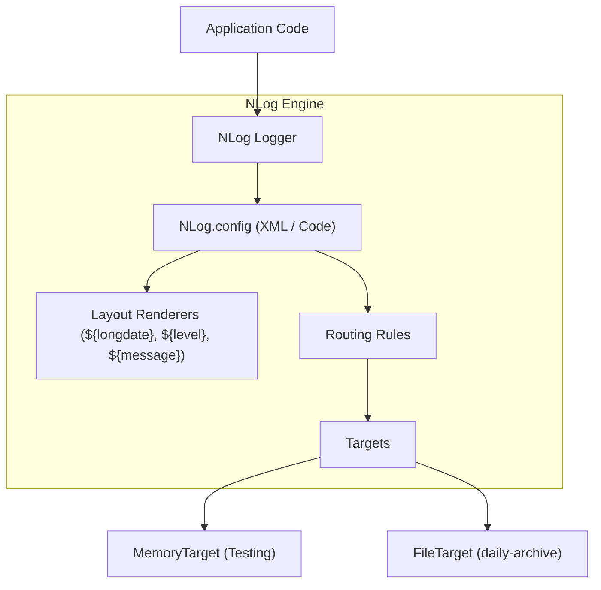
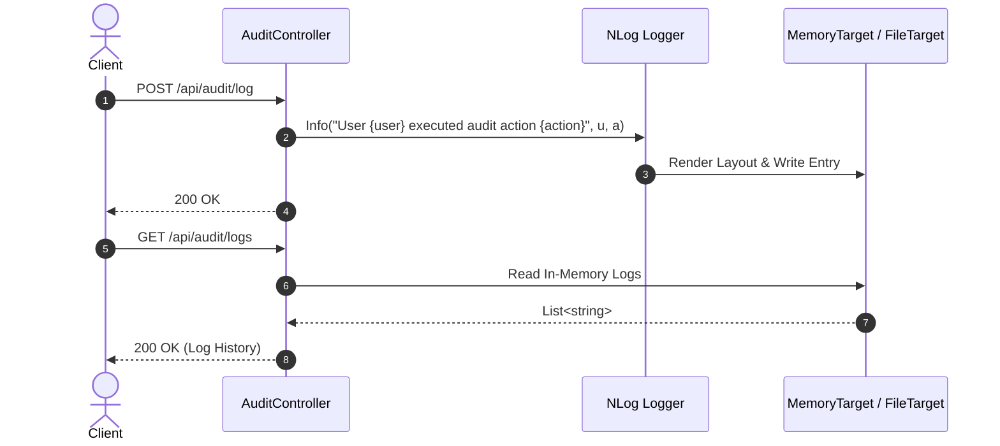

# 39-NLog: Flexible Structured Logging trong .NET 10

Dự án mẫu minh họa việc sử dụng **NLog** kết hợp với **ASP.NET Core Controllers** (.NET 10), cấu hình ghi log linh hoạt qua tệp XML `nlog.config`, phân loại mức độ log (Log Levels), định tuyến mục tiêu (Targets & Rules), và kiểm thử log in-memory bằng `MemoryTarget`.

---

## 1. Giới thiệu tổng quan về NLog

**NLog** là một trong những thư viện logging lâu đời, ổn định và linh hoạt nhất trên nền tảng .NET. NLog hỗ trợ định cấu hình phong phú qua mã C# hoặc tệp cấu hình XML (`nlog.config`), cho phép thay đổi cấu hình log, mục tiêu ghi log (Console, File, Database, Network, Mail) mà không cần biên dịch lại ứng dụng (nhờ tính năng `autoReload="true"`).

Với gói mở rộng **NLog.Web.AspNetCore**, NLog tích hợp trực tiếp vào hệ thống Dependency Injection và luồng xử lý HTTP request của ASP.NET Core, cung cấp các Layout Renderer đặc thù của web như `${aspnet-request-url}`, `${aspnet-request-ip}`, `${aspnet-user-identity}`.

---

## 2. So sánh NLog vs Serilog

| Tiêu chí | NLog | Serilog |
| :--- | :--- | :--- |
| **Triết lý thiết kế** | Layout Renderers & XML/Code config | Message Template & Code/JSON config |
| **Cấu hình động (Hot Reload)** | Rất mạnh qua `nlog.config` (`autoReload="true"`) | Hỗ trợ qua `appsettings.json` |
| **Hệ sinh thái Targets/Sinks** | Cực kỳ phong phú (Mail, EventLog, DB, File, Memory) | Phong phú (Sinks cho hầu hết cloud provider) |
| **Độ trễ & Bộ nhớ** | Rất thấp, tối ưu hóa zero-allocation | Rất thấp, tối ưu hóa cho JSON |
| **Độ thân thuộc** | Rất quen thuộc với lập trình viên .NET truyền thống | Chuẩn mực cho Microservices & Cloud-native |

---


## Sơ đồ Kiến trúc & Luồng dữ liệu (Architecture & Data Flow)

### 1. Sơ đồ Kiến trúc Tổng quan (Architecture Overview)


### 2. Mô hình Luồng dữ liệu Chi tiết (Data Flow & Sequence)


### 3. Các Use Cases Cụ thể trong Thực tế (Concrete Use Cases)
- **Hệ thống Nhật ký Cổ điển & Mạnh mẽ**: Quản lý log cấu hình bằng file XML mà không cần build lại ứng dụng.
- **MemoryTarget phục vụ Unit/Integration Test**: Bắt và xác minh log xuất ra ngay trong test case mà không cần đọc file ổ đĩa.
- **Tự động Lưu trữ & Nén (Auto Archiving)**: Tự động chia file log theo ngày và nén định dạng zip khi file vượt quá kích thước.


## 3. Cài đặt và Cấu hình

### Package NuGet
- `NLog.Web.AspNetCore` (6.2.1+)
- `Swashbuckle.AspNetCore` (10.2.3)

### Cấu hình trong `Program.cs`
```csharp
using NLog;
using NLog.Web;

var logger = LogManager.Setup().LoadConfigurationFromFile("nlog.config").GetCurrentClassLogger();

try
{
    var builder = WebApplication.CreateBuilder(args);

    // Xóa các logging provider mặc định và thay thế bằng NLog
    builder.Logging.ClearProviders();
    builder.Host.UseNLog();

    builder.Services.AddControllers();
    var app = builder.Build();

    app.MapControllers();
    app.Run();
}
finally
{
    LogManager.Shutdown();
}
```

---

## 4. Cấu trúc Project

```
39-NLog/
├── AuditLogNLog.slnx
├── README.md
├── AuditLogNLog.Api/
│   ├── AuditLogNLog.Api.csproj
│   ├── Program.cs
│   ├── Properties/launchSettings.json (Port: 5139)
│   ├── appsettings.json
│   ├── appsettings.Development.json
│   ├── nlog.config
│   ├── AuditLogNLog.Api.http
│   ├── Models/
│   │   └── AuditDtos.cs
│   └── Controllers/
│       └── AuditController.cs
└── AuditLogNLog.Tests/
    ├── AuditLogNLog.Tests.csproj
    └── NLogTests.cs
```

---

## 5. Các tính năng cốt lõi được triển khai

### 5.1. Định nghĩa Targets & Rules trong `nlog.config`
```xml
<targets>
  <target xsi:type="Console" name="lifetimeConsole" layout="${level:truncate=4:tolower=true}: ${logger}[0]${newline}      ${message}${exception:format=tostring}" />
  <target xsi:type="File" name="allfile" fileName="logs/nlog-all-${shortdate}.log"
          layout="${longdate}|${level:uppercase=true}|${logger}|${message} ${exception:format=tostring}" />
</targets>

<rules>
  <logger name="System.*" finalMinLevel="Warn" />
  <logger name="Microsoft.*" finalMinLevel="Warn" />
  <logger name="*" minlevel="Info" writeTo="allfile,lifetimeConsole" />
</rules>
```

### 5.2. Layout Renderers
NLog cung cấp hệ thống layout renderer dạng `${...}` rất mạnh mẽ:
- `${longdate}`: Thời gian chi tiết theo định dạng `yyyy-MM-dd HH:mm:ss.ffff`.
- `${level:uppercase=true}`: Cấp độ log in hoa (`INFO`, `WARN`, `ERROR`).
- `${logger}`: Tên class/logger phát sinh sự kiện log.
- `${message}`: Nội dung thông điệp log sau khi đã format.
- `${exception:format=tostring}`: Toàn bộ stack trace của ngoại lệ nếu có.

---

## 6. Controller Implementation

Dự án sử dụng **ASP.NET Core Controllers** với `ILogger<AuditController>` tiêu chuẩn:

```csharp
[ApiController]
[Route("api/[controller]")]
public class AuditController : ControllerBase
{
    private readonly ILogger<AuditController> _logger;

    public AuditController(ILogger<AuditController> logger)
    {
        _logger = logger;
    }

    [HttpPost("login")]
    public IActionResult RecordLogin([FromBody] LoginAuditRequest request)
    {
        var eventId = $"AUD-LOG-{Guid.NewGuid().ToString()[..8].ToUpperInvariant()}";
        if (request.Success)
        {
            _logger.LogInformation("Audit [{EventId}]: User '{Username}' logged in successfully from IP '{IpAddress}'",
                eventId, request.Username, request.IpAddress);
        }
        else
        {
            _logger.LogWarning("Audit [{EventId}]: Failed login attempt for user '{Username}' from IP '{IpAddress}'",
                eventId, request.Username, request.IpAddress);
        }
        return Ok(new AuditResponse(eventId, request.Success ? "LoginSuccess" : "LoginFailure", DateTime.UtcNow));
    }
}
```

---

## 7. Cơ chế In-Memory Testing với `MemoryTarget`

Trong unit/integration tests, thay vì đọc file log trên đĩa, ta có thể gắn động một `MemoryTarget` vào cấu hình NLog để bắt toàn bộ log sự kiện:

```csharp
var memoryTarget = new MemoryTarget("memTarget")
{
    Layout = "${level:uppercase=true}|${logger}|${message}"
};
var config = LogManager.Configuration ?? new LoggingConfiguration();
config.AddTarget(memoryTarget);
config.AddRuleForAllLevels(memoryTarget);
LogManager.Configuration = config;
LogManager.ReconfigExistingLoggers();
```

---

## 8. Hướng dẫn kiểm thử (TDD)

Bộ kiểm thử `NLogTests.cs` chạy độc lập sử dụng `WebApplicationFactory<Program>`:
1. `Login_Success_LogsInfoWithUserAndIp` (Xác thực log level INFO và nội dung IP/User)
2. `Login_Failure_LogsWarning` (Xác thực log level WARN khi đăng nhập thất bại)
3. `Action_AdminAction_LogsInfoWithAuditDetails` (Xác thực audit event cho hành động quản trị)
4. `Health_LogsAuditHeartbeat` (Xác thực log kiểm tra định kỳ)
5. `Login_EmptyUsername_ReturnsBadRequest` (Kiểm tra validation dữ liệu đầu vào)

---

## 9. Hiệu năng & Best Practices

- **Dùng Async Target Wrapper**: Bọc các target I/O nặng (File, Database) trong `<target xsi:type="AsyncWrapper">` để chuyển tác vụ ghi log sang luồng nền.
- **LogManager.Shutdown()**: Luôn gọi `LogManager.Shutdown()` trong khối `finally` của `Program.cs` để đảm bảo bộ đệm log (buffer) được xả hết (flush) trước khi tiến trình kết thúc.
- **Giới hạn log thư viện bên thứ 3**: Sử dụng quy tắc `<logger name="Microsoft.*" finalMinLevel="Warn" />` để tránh ô nhiễm file log bởi các thông báo nội bộ của framework.

---

## 10. Các bẫy thường gặp (Common Pitfalls)

1. **Quên Copy `nlog.config` vào thư mục Output**: Cần đảm bảo file `nlog.config` có thuộc tính `CopyToOutputDirectory = Always` hoặc `PreserveNewest` trong file `.csproj`.
2. **Không gọi `ClearProviders()`**: Nếu không xóa các provider mặc định của ASP.NET Core, log có thể bị in 2 lần trên Console.
3. **Bỏ qua `internalLogLevel` khi debug lỗi**: Khi cấu hình NLog không hoạt động, bật `internalLogLevel="Debug"` để xem thông báo lỗi chi tiết của chính NLog.

---

## 11. Hướng dẫn chạy dự án

### Khởi chạy Server
```bash
dotnet run --project AuditLogNLog.Api/AuditLogNLog.Api.csproj
```
- Swagger UI: `http://localhost:5139/swagger`

### Chạy Tests
```bash
dotnet test AuditLogNLog.slnx
```

---

## 12. Kết luận & Tài liệu tham khảo

- **NLog Official Site**: [https://nlog-project.org/](https://nlog-project.org/)
- **NLog GitHub**: [https://github.com/NLog/NLog](https://github.com/NLog/NLog)
- **NLog.Web.AspNetCore Wiki**: [https://github.com/NLog/NLog.Web/wiki/Getting-started-with-ASP.NET-Core-6](https://github.com/NLog/NLog.Web/wiki/Getting-started-with-ASP.NET-Core-6)
