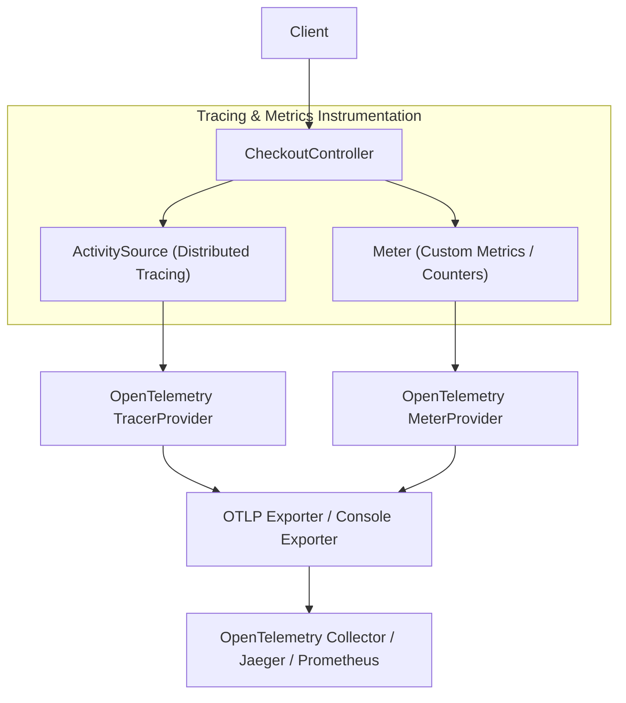
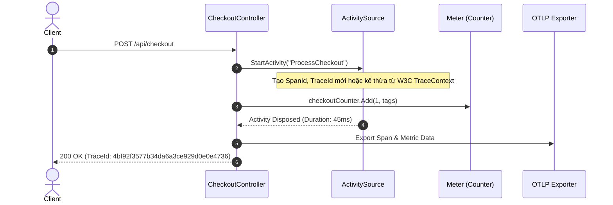

# 40-OpenTelemetry: Distributed Tracing & Metrics trong .NET 10

Dự án mẫu minh họa việc sử dụng **OpenTelemetry** trong ứng dụng **ASP.NET Core Controllers** (.NET 10), thiết lập giám sát phân tán (Distributed Tracing) với `ActivitySource`, đo lường chỉ số thời gian thực (Metrics) với `Meter`, lan truyền ngữ cảnh chuẩn W3C Trace Context và kiểm thử tự động bằng `ActivityListener` / `MeterListener`.

---

## 1. Giới thiệu tổng quan về OpenTelemetry

**OpenTelemetry (OTel)** là dự án nguồn mở thuộc Cloud Native Computing Foundation (CNCF), đóng vai trò là tiêu chuẩn công nghiệp toàn cầu cho việc thu thập và xuất dữ liệu đo lường từ xa (telemetry data) bao gồm: **Traces**, **Metrics**, và **Logs**.

Trong .NET, Microsoft đã tích hợp sâu OpenTelemetry vào thư viện lớp cơ sở (BCL):
- `System.Diagnostics.ActivitySource` / `Activity`: Tương ứng với Tracer và Span trong OTel.
- `System.Diagnostics.Metrics.Meter` / `Instrument`: Tương ứng với Meter và Metric Instrument trong OTel.
- Các exporter (OTLP, Prometheus, Console) cho phép gửi dữ liệu về Jaeger, Zipkin, Prometheus, Grafana, Datadog hoặc Azure Application Insights mà không làm thay đổi mã nghiệp vụ.

---

## 2. Ba trụ cột Observability trong .NET

| Trụ cột | Lớp đối tượng .NET | Chức năng chính | Ví dụ |
| :--- | :--- | :--- | :--- |
| **Distributed Tracing** | `ActivitySource`, `Activity` | Theo dõi hành trình của request qua nhiều service, đo thời gian xử lý từng bước | Đo thời gian gọi thanh toán, DB query |
| **Metrics** | `Meter`, `Counter`, `Histogram` | Thống kê số lượng, tỷ lệ, độ trễ theo thời gian thực | Số đơn hàng thành công, latency P95 |
| **Logging** | `ILogger`, `OpenTelemetry.Logs` | Ghi lại các sự kiện có ngữ cảnh tại từng thời điểm | Lỗi kết nối cổng thanh toán |

---


## Sơ đồ Kiến trúc & Luồng dữ liệu (Architecture & Data Flow)

### 1. Sơ đồ Kiến trúc Tổng quan (Architecture Overview)


### 2. Mô hình Luồng dữ liệu Chi tiết (Data Flow & Sequence)


### 3. Các Use Cases Cụ thể trong Thực tế (Concrete Use Cases)
- **Khả năng Giám sát Toàn diện (Observability)**: Tiêu chuẩn mở toàn cầu cho Metrics, Traces và Logs.
- **Truy vết Phân tán (Distributed Tracing)**: Theo dõi một request đi qua hàng chục microservices để phát hiện điểm nghẽn hiệu năng.
- **Thu thập Chỉ số Nghiệp vụ (Business Metrics)**: Đếm số lượng đơn hàng, đo thời gian xử lý thanh toán và đẩy lên Prometheus/Grafana.


## 3. Cài đặt và Cấu hình

### Package NuGet
- `OpenTelemetry.Extensions.Hosting` (1.19.0+)
- `OpenTelemetry.Instrumentation.AspNetCore` (1.19.0+)
- `OpenTelemetry.Instrumentation.Http` (1.19.0+)
- `OpenTelemetry.Exporter.Console` (1.19.0+)
- `Swashbuckle.AspNetCore` (10.2.3)

### Cấu hình trong `Program.cs`
```csharp
using EcommerceTelemetry.Api.Diagnostics;
using OpenTelemetry.Metrics;
using OpenTelemetry.Resources;
using OpenTelemetry.Trace;

var builder = WebApplication.CreateBuilder(args);

builder.Services.AddControllers();

builder.Services.AddOpenTelemetry()
    .ConfigureResource(resource => resource
        .AddService(serviceName: TelemetryConstants.ServiceName, serviceVersion: TelemetryConstants.ServiceVersion))
    .WithTracing(tracing =>
    {
        tracing
            .AddSource(TelemetryConstants.ActivitySourceName)
            .AddAspNetCoreInstrumentation()
            .AddHttpClientInstrumentation()
            .AddConsoleExporter();
    })
    .WithMetrics(metrics =>
    {
        metrics
            .AddMeter(TelemetryConstants.MeterName)
            .AddAspNetCoreInstrumentation()
            .AddHttpClientInstrumentation()
            .AddConsoleExporter();
    });
```

---

## 4. Cấu trúc Project

```
40-OpenTelemetry/
├── EcommerceTelemetry.slnx
├── README.md
├── EcommerceTelemetry.Api/
│   ├── EcommerceTelemetry.Api.csproj
│   ├── Program.cs
│   ├── Properties/launchSettings.json (Port: 5140)
│   ├── appsettings.json
│   ├── appsettings.Development.json
│   ├── EcommerceTelemetry.Api.http
│   ├── Diagnostics/
│   │   └── TelemetryConstants.cs
│   ├── Models/
│   │   └── CheckoutDtos.cs
│   └── Controllers/
│       └── CheckoutController.cs
└── EcommerceTelemetry.Tests/
    ├── EcommerceTelemetry.Tests.csproj
    └── OpenTelemetryTests.cs
```

---

## 5. Các tính năng cốt lõi được triển khai

### 5.1. Tạo Custom Span với `ActivitySource`
```csharp
using var activity = TelemetryConstants.ActivitySource.StartActivity("ProcessCheckout", ActivityKind.Server);
activity?.SetTag("customer.id", request.CustomerId);
activity?.SetTag("order.amount", request.Amount);
activity?.SetStatus(ActivityStatusCode.Ok);
activity?.AddEvent(new ActivityEvent("PaymentAuthorized"));
```

### 5.2. Đo lường Metrics với `Counter` và `Histogram`
```csharp
// Đếm tổng số đơn hàng đã xử lý
TelemetryConstants.OrdersCounter.Add(1, new KeyValuePair<string, object?>("status", "success"));

// Ghi nhận thời gian hoàn thành vào histogram
TelemetryConstants.OrderDurationHistogram.Record(stopwatch.Elapsed.TotalMilliseconds);
```

### 5.3. Lan truyền W3C Trace Context
ASP.NET Core tự động đọc và truyền header `traceparent` (chuẩn W3C: `00-{traceId}-{spanId}-{flags}`), liên kết tất cả các span trong cùng một giao dịch phân tán.

---

## 6. Controller Implementation

Dự án sử dụng **ASP.NET Core Controllers** với đầy đủ các thao tác ghi nhận telemetry nghiệp vụ:

```csharp
[ApiController]
[Route("api/[controller]")]
public class CheckoutController : ControllerBase
{
    [HttpPost("process")]
    public IActionResult ProcessCheckout([FromBody] CheckoutRequest request)
    {
        using var activity = TelemetryConstants.ActivitySource.StartActivity("ProcessCheckout");
        // Kiểm tra hợp lệ dữ liệu
        if (request.Amount <= 0)
        {
            activity?.SetStatus(ActivityStatusCode.Error, "Invalid amount");
            return BadRequest();
        }

        // Ghi nhận metric và trả về TraceId
        TelemetryConstants.OrdersCounter.Add(1);
        return Ok(new CheckoutResponse(orderId, "Completed", Activity.Current?.TraceId.ToString()));
    }
}
```

---

## 7. Cơ chế Testing vượt trội với `ActivityListener` & `MeterListener`

Thay vì phải chạy backend Jaeger hoặc Prometheus trong lúc chạy unit/integration test, ta có thể dùng trực tiếp `ActivityListener` và `MeterListener` của .NET BCL để kiểm tra:

```csharp
var activityListener = new ActivityListener
{
    ShouldListenTo = s => s.Name == TelemetryConstants.ActivitySourceName,
    Sample = (ref ActivityCreationOptions<ActivityContext> _) => ActivitySamplingResult.AllDataAndRecorded,
    ActivityStopped = activity => recordedActivities.Add(activity)
};
ActivitySource.AddActivityListener(activityListener);
```

---

## 8. Hướng dẫn kiểm thử (TDD)

Bộ kiểm thử `OpenTelemetryTests.cs` xác nhận:
1. `Checkout_SuccessfulOrder_EmitsActivityWithCustomTags` (Kiểm tra Span `ProcessCheckout`, tags `customer.id`, `order.amount`)
2. `Checkout_NegativeAmount_SetsActivityErrorStatus` (Kiểm tra trạng thái `ActivityStatusCode.Error`)
3. `Checkout_SuccessfulOrder_RecordsOrderCounter` (Kiểm tra Counter `ecommerce_orders_total` tăng 1)
4. `GetTrace_ReturnsW3CTraceAndSpanIds` (Xác thực TraceId và SpanId hợp lệ)
5. `GetTrace_WithTraceparentHeader_PropagatesTraceId` (Xác thực tính tương thích và lan truyền header `traceparent`)

---

## 9. Hiệu năng & Best Practices

- **Zero Allocation khi không có Listener**: `ActivitySource.StartActivity` trả về `null` ngay lập tức nếu không có exporter/listener nào đăng ký lắng nghe, giúp giảm thiểu tối đa overhead hiệu năng.
- **Tránh High-Cardinality Tags**: Không bao giờ đặt User ID, Order ID hoặc GUID ngẫu nhiên làm tag của Metric `Counter` hoặc `Histogram` vì sẽ gây bùng nổ bộ nhớ (High Cardinality explosion). Chỉ dùng các giá trị tập hữu hạn (status, payment_method, region).
- **Sampling**: Trong môi trường production lưu lượng lớn, sử dụng `ParentBased(new TraceIdRatioBasedSampler(0.1))` để lấy mẫu 10% traces thay vì 100%.

---

## 10. Các bẫy thường gặp (Common Pitfalls)

1. **Quên gọi `.AddSource()`**: Nếu khởi tạo `ActivitySource` trong code nhưng không đăng ký tên source đó trong `.WithTracing(t => t.AddSource("..."))`, các span sẽ không bao giờ được ghi lại.
2. **Quên gọi `using var activity`**: Không giải phóng activity sẽ khiến span không có thời điểm kết thúc (`EndTime`), dẫn đến việc trace bị treo hoặc mất dữ liệu độ trễ.
3. **Quên gán `ActivityKind`**: Khai báo `ActivityKind.Server` cho span nhận request từ bên ngoài và `ActivityKind.Client` cho span gọi ra dịch vụ ngoài để các công cụ APM vẽ đúng sơ đồ Topology.

---

## 11. Hướng dẫn chạy dự án

### Khởi chạy Server
```bash
dotnet run --project EcommerceTelemetry.Api/EcommerceTelemetry.Api.csproj
```
- Swagger UI: `http://localhost:5140/swagger`

### Chạy Tests
```bash
dotnet test EcommerceTelemetry.slnx
```

---

## 12. Kết luận & Tài liệu tham khảo

- **OpenTelemetry Official**: [https://opentelemetry.io/](https://opentelemetry.io/)
- **OpenTelemetry .NET GitHub**: [https://github.com/open-telemetry/opentelemetry-dotnet](https://github.com/open-telemetry/opentelemetry-dotnet)
- **Microsoft Docs - Tracing & Metrics**: [https://learn.microsoft.com/en-us/dotnet/core/diagnostics/distributed-tracing](https://learn.microsoft.com/en-us/dotnet/core/diagnostics/distributed-tracing)
