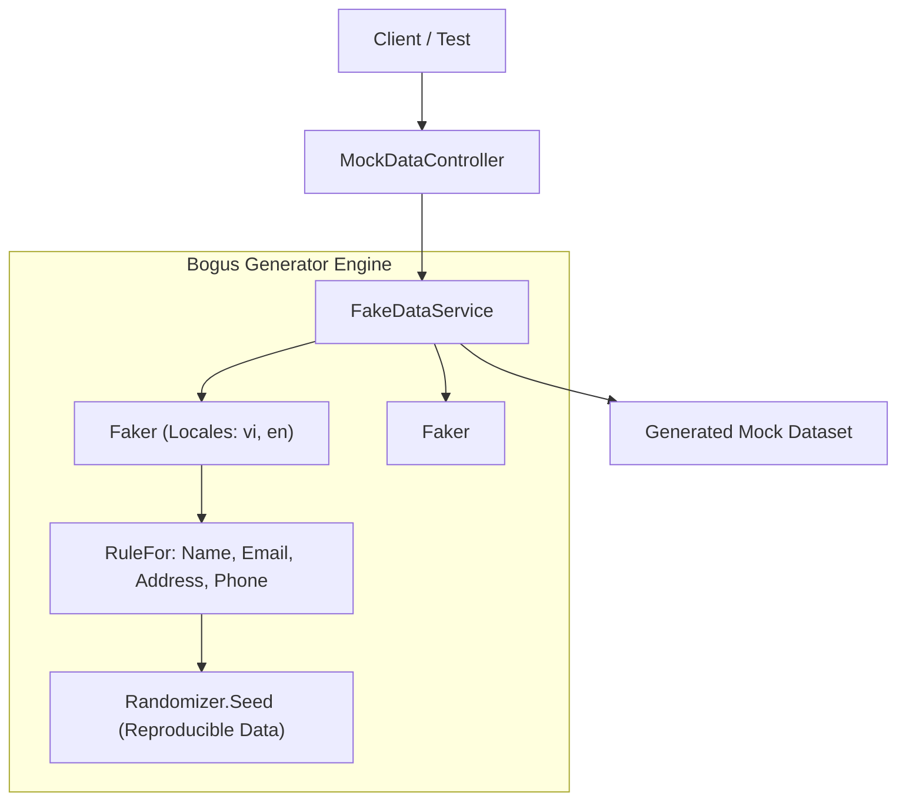
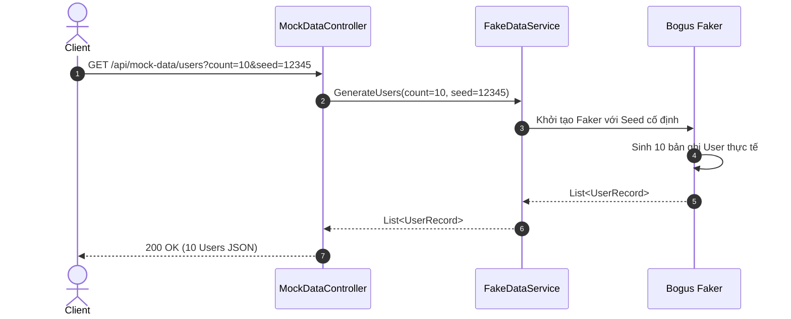

# 41-Bogus: Bộ Sinh Dữ Liệu Giả Lập Đa Ngôn Ngữ & Xác Định (Deterministic Fake Data)

Dự án mẫu .NET 10 (C# 13) minh họa việc sử dụng thư viện **Bogus** để tự động tạo dữ liệu thử nghiệm thực tế (Users, Orders, Addresses, Sản phẩm) phục vụ kiểm thử đơn vị, kiểm thử tích hợp và kiểm thử hiệu năng (benchmarking/load testing).

---

## 1. Giới thiệu tổng quan về Bogus

**Bogus** là một thư viện mã nguồn mở phổ biến trong hệ sinh thái .NET, được chuyển thể và nâng cấp từ Faker.js. Bogus cho phép các nhà phát triển tạo ra dữ liệu giả lập (mock/fake data) phong phú, có cấu trúc chặt chẽ và cực kỳ thực tế mà không cần tốn công gõ tay từng dòng dữ liệu mẫu.

### Đặc tính nổi bật của Bogus:
- **Tạo dữ liệu theo ngữ cảnh thực tế**: Họ tên, email, số điện thoại, địa chỉ đường phố, mã bưu chính, thẻ tín dụng, giá sản phẩm, mã đơn hàng.
- **Hỗ trợ đa ngôn ngữ (Locales)**: Hỗ trợ tiếng Anh (`en`), tiếng Việt (`vi`), tiếng Pháp, tiếng Nhật và hàng chục ngôn ngữ khác.
- **Tính tiền định (Deterministic Seeding)**: Hỗ trợ `faker.UseSeed(seed)` hoặc `Randomizer.Seed` giúp tạo ra cùng một bộ dữ liệu giống nhau qua các lần chạy test, đảm bảo test case luôn ổn định (reproducible).
- **Quy tắc linh hoạt (Rule-based Generation)**: Cung cấp API Fluent `RuleFor(x => x.Prop, f => ...)` và `CustomInstantiator` hỗ trợ khởi tạo cả mutable class lẫn immutable records / C# primary constructors.

---

## 2. Vị trí & Vai trò trong kiến trúc ứng dụng

```
┌────────────────────────────────────────────────────────┐
│               Test Scenarios / CI-CD Pipeline          │
└───────────────────────────┬────────────────────────────┘
                            │
                            ▼
┌────────────────────────────────────────────────────────┐
│                   IFakeDataService                     │
│  ┌──────────────────┐           ┌──────────────────┐   │
│  │ UserProfileFaker │           │CustomerOrderFaker│   │
│  └────────┬─────────┘           └────────┬─────────┘   │
│           │                              │             │
│           ▼                              ▼             │
│    Faker<UserAddress>             Faker<OrderItem>     │
└───────────────────────────┬────────────────────────────┘
                            │
            ┌───────────────┴───────────────┐
            ▼                               ▼
┌───────────────────────┐       ┌───────────────────────┐
│  Integration Tests    │       │  Development Seeding  │
│  (xUnit / MvcTesting) │       │  (In-Memory / SQLite) │
└───────────────────────┘       └───────────────────────┘
```

- **Tầng Kiểm thử (Testing)**: Cung cấp payload chuẩn xác cho các integration test mà không phụ thuộc dữ liệu database bên ngoài.
- **Tầng Phát triển (Development & Staging)**: Sinh hàng nghìn bản ghi để kiểm tra phân trang (pagination), tìm kiếm (search/filter), và đo lường hiệu năng câu truy vấn.
- **Tầng Demo / Mock Service**: Cung cấp API trả về dữ liệu mẫu cho đội ngũ Frontend khi Backend thực tế chưa hoàn thiện.

---


## Sơ đồ Kiến trúc & Luồng dữ liệu (Architecture & Data Flow)

### 1. Sơ đồ Kiến trúc Tổng quan (Architecture Overview)


### 2. Mô hình Luồng dữ liệu Chi tiết (Data Flow & Sequence)


### 3. Các Use Cases Cụ thể trong Thực tế (Concrete Use Cases)
- **Tạo Dữ liệu Kiểm thử (Test Data Generation)**: Tạo hàng ngàn bản ghi thực tế (tên, email, địa chỉ, sđt) cho Unit/Integration tests.
- **Deterministic Seeding**: Cố định seed ngẫu nhiên để dữ liệu sinh ra luôn giống nhau 100% giữa các lần chạy test.
- **Đa ngôn ngữ (Locales)**: Hỗ trợ tạo họ tên, địa chỉ bằng tiếng Việt (`vi`) hoặc tiếng Anh (`en`).


## 3. Cấu trúc thư mục dự án

```
41-Bogus/
├── FakeDataGenerator.slnx
├── README.md
├── FakeDataGenerator.Api/
│   ├── FakeDataGenerator.Api.csproj
│   ├── Program.cs
│   ├── Properties/
│   │   └── launchSettings.json
│   ├── appsettings.json
│   ├── FakeDataGenerator.Api.http
│   ├── Models/
│   │   ├── UserModels.cs
│   │   └── OrderModels.cs
│   ├── Services/
│   │   └── FakeDataService.cs
│   └── Controllers/
│       └── MockDataController.cs
└── FakeDataGenerator.Tests/
    ├── FakeDataGenerator.Tests.csproj
    └── MockDataTests.cs
```

---

## 4. Cài đặt & Cấu hình thư viện

### Cài đặt qua NuGet:
```bash
dotnet add package Bogus --version 35.6.2
```

### Khai báo trong `.csproj`:
```xml
<Project Sdk="Microsoft.NET.Sdk.Web">
  <PropertyGroup>
    <TargetFramework>net10.0</TargetFramework>
    <Nullable>enable</Nullable>
    <ImplicitUsings>enable</ImplicitUsings>
  </PropertyGroup>

  <ItemGroup>
    <PackageReference Include="Bogus" Version="35.6.2" />
    <PackageReference Include="Swashbuckle.AspNetCore" Version="10.2.3" />
  </ItemGroup>
</Project>
```

---

## 5. Các khái niệm cốt lõi của Bogus

### 5.1. `Faker<T>`
Lớp đại diện cho bộ sinh dữ liệu cho một kiểu đối tượng `T`. Cho phép định nghĩa quy tắc cho từng thuộc tính thông qua `RuleFor`:
```csharp
var userFaker = new Faker<UserProfile>()
    .RuleFor(u => u.FirstName, f => f.Name.FirstName())
    .RuleFor(u => u.LastName, f => f.Name.LastName());
```

### 5.2. `CustomInstantiator`
Rất hữu ích khi đối tượng là **C# record** hoặc có constructor có tham số (immutable types):
```csharp
var addressFaker = new Faker<UserAddress>()
    .CustomInstantiator(f => new UserAddress(
        f.Address.StreetAddress(),
        f.Address.City(),
        f.Address.State(),
        f.Address.ZipCode(),
        f.Address.Country()
    ));
```

### 5.3. Hỗ trợ Đa ngôn ngữ (Locales)
Truyền mã ngôn ngữ vào constructor của `Faker<T>`:
```csharp
var vietnameseUserFaker = new Faker<UserProfile>("vi");
```

### 5.4. Tính tiền định (Deterministic Seeding)
Sử dụng `.UseSeed(seed)` để luôn nhận được cùng một kết quả cho cùng một seed:
```csharp
var faker = new Faker<UserProfile>().UseSeed(12345);
var user1 = faker.Generate();
// user1 sẽ luôn có cùng tên, email, địa chỉ trong mọi lần chạy
```

---

## 6. Triển khai Models & Services

### 6.1. Domain Models (`UserModels.cs`, `OrderModels.cs`)
Sử dụng các C# immutable records mô tả cấu trúc dữ liệu người dùng và đơn hàng phức tạp có lồng nhau (nested models):
- `UserAddress`: Địa chỉ chi tiết.
- `UserProfile`: Thông tin cá nhân, liên lạc, công ty và vai trò.
- `OrderItem`: Chi tiết từng món hàng, đơn giá, số lượng, thành tiền.
- `CustomerOrder`: Thông tin đơn hàng hoàn chỉnh lồng danh sách `OrderItem` và `UserAddress`.

### 6.2. `FakeDataService.cs`
Triển khai logic khởi tạo các `Faker<T>` có cấu hình quan hệ phụ thuộc:
- `CreateAddressFaker`: Sinh địa chỉ theo locale.
- `CreateUserFaker`: Sinh hồ sơ người dùng kết hợp địa chỉ.
- `CreateOrderItemFaker`: Sinh các món hàng với giá trị tính toán nhất quán (`TotalPrice = UnitPrice * Quantity`).
- `CreateOrderFaker`: Sinh đơn hàng với mã tự sinh chuẩn `ORD-yyyyMMdd-XXXXXX`, danh sách món hàng và tính tổng tiền tự động (`TotalAmount = Items.Sum(i => i.TotalPrice)`).
- `GenerateCustomerById(Guid id)`: Dùng mã băm của GUID làm seed để khi gọi cùng một Id, API luôn trả về chính xác cùng một khách hàng giả lập.

---

## 7. Triển khai API Controller

Controller kế thừa `ControllerBase` với route `api/mock`:

```csharp
[ApiController]
[Route("api/mock")]
public class MockDataController : ControllerBase
{
    private readonly IFakeDataService _fakeDataService;

    public MockDataController(IFakeDataService fakeDataService)
    {
        _fakeDataService = fakeDataService;
    }

    [HttpGet("users")]
    public IActionResult GetUsers([FromQuery] int count = 10, [FromQuery] int? seed = null, [FromQuery] string locale = "en")
    {
        if (count < 1 || count > 100)
            return BadRequest(new { error = "Count must be between 1 and 100." });

        return Ok(_fakeDataService.GenerateUsers(count, seed, locale));
    }

    [HttpGet("orders")]
    public IActionResult GetOrders([FromQuery] int count = 5, [FromQuery] int? seed = null)
    {
        if (count < 1 || count > 50)
            return BadRequest(new { error = "Count must be between 1 and 50." });

        return Ok(_fakeDataService.GenerateOrders(count, seed));
    }

    [HttpGet("customers/{id:guid}")]
    public IActionResult GetCustomerById([FromRoute] Guid id)
    {
        return Ok(_fakeDataService.GenerateCustomerById(id));
    }

    [HttpPost("seed-db")]
    public IActionResult SeedDatabase([FromBody] SeedDatabaseRequest request)
    {
        // Khởi tạo hàng loạt dữ liệu và trả về thống kê số lượng + thời gian thực thi (ms)
    }
}
```

---

## 8. Seeding dữ liệu & Kịch bản thực tế

Trong phát triển phần mềm, Bogus giải quyết 3 bài toán lớn:
1. **Database Seeding ban đầu**: Tự động chèn 1,000 khách hàng và 5,000 đơn hàng vào cơ sở dữ liệu local để lập trình viên có sẵn dữ liệu test UI/UX.
2. **Stress / Benchmark Testing**: Tạo hàng trăm nghìn bản ghi trong bộ nhớ để đo tốc độ serialize JSON, ghi file CSV/Excel hoặc đo độ trễ câu truy vấn EF Core.
3. **Reproducible Bug Reports**: Khi phát hiện lỗi với một bộ dữ liệu cụ thể, chỉ cần lưu lại `Seed` để tái hiện chính xác lỗi đó trên máy của lập trình viên khác.

---

## 9. Kiểm thử tự động (TDD với xUnit & WebApplicationFactory)

Dự án kiểm thử `FakeDataGenerator.Tests` kiểm tra toàn bộ các khía cạnh của Bogus:
- `GetUsers_Default_Returns10Users`: Kiểm tra số lượng mặc định và tính hợp lệ của trường dữ liệu (không rỗng, có `@` trong email).
- `GetUsers_InvalidCount_ReturnsBadRequest`: Kiểm tra validation tham số đầu vào.
- `GetUsers_DeterministicSeed_ReturnsIdenticalUsers`: Kiểm tra tính nhất quán 100% khi sử dụng cùng một `seed`.
- `GetUsers_DifferentSeeds_ReturnsDifferentUsers`: Kiểm tra dữ liệu khác biệt khi dùng 2 seed khác nhau.
- `GetUsers_VietnameseLocale_ReturnsPopulatedUsers`: Kiểm tra sinh dữ liệu theo locale tiếng Việt.
- `GetOrders_ReturnsValidOrdersWithItemsAndCorrectTotals`: Kiểm tra logic tính toán phụ thuộc (nested items và tổng tiền).
- `GetCustomerById_Deterministic_ReturnsSameData`: Kiểm tra tính nhất quán của định danh GUID làm seed.
- `SeedDatabase_ValidRequest_ReturnsSummary`: Kiểm tra endpoint mô phỏng seeding số lượng lớn.

---

## 10. Hướng dẫn chạy & Kiểm thử

### Chạy API trực tiếp:
```powershell
cd 41-Bogus/FakeDataGenerator.Api
dotnet run
# Mở Swagger UI tại: http://localhost:5141/swagger
```

### Chạy kiểm thử tự động:
```powershell
dotnet test 41-Bogus/FakeDataGenerator.slnx
```

---

## 11. So sánh Bogus với các giải pháp khác

| Tiêu chí | Bogus | AutoFixture | Dữ liệu mẫu gõ tay (Hardcoded) |
|---|---|---|---|
| **Độ chân thực của dữ liệu** | Rất cao (Tên thật, địa chỉ thật, email thật) | Thấp (Thường là GUID, chuỗi `Name-34b6e...`) | Cao nhưng tốn thời gian soạn thảo |
| **Hỗ trợ đa ngôn ngữ** | Có sẵn hơn 40 locales | Không chuyên về locale | Không khả thi |
| **Tính tiền định (Deterministic)** | Có (`UseSeed`) | Khó kiểm soát hạt giống ngẫu nhiên | Cố định |
| **Hỗ trợ Record / Immutable** | Cực tốt với `CustomInstantiator` | Hỗ trợ tốt | Hỗ trợ tốt |
| **Hiệu năng sinh dữ liệu** | Rất nhanh (~hàng trăm nghìn bản ghi/giây) | Nhanh | Không áp dụng |

---

## 12. Lưu ý & Best Practices

1. **Không tạo mới `Faker<T>` trong mỗi request nếu không cần seed riêng**: Để tối ưu hiệu năng và tránh cấp phát bộ nhớ không cần thiết, nên cache hoặc tái sử dụng instance `Faker<T>` nếu cùng cấu hình.
2. **Quản lý Randomizer.Seed trong kiểm thử song song**: Khi chạy test song song (parallel tests), tránh dùng static `Randomizer.Seed` toàn cục vì có thể gây xung đột giữa các luồng. Hãy sử dụng `.UseSeed(...)` trên từng instance `Faker<T>`.
3. **Sử dụng `CustomInstantiator` cho C# records**: C# records với primary constructor thường không có default constructor, nên dùng `CustomInstantiator` để tránh lỗi reflection.
4. **Không dùng dữ liệu nhạy cảm thực tế**: Bogus đảm bảo dữ liệu tuân thủ GDPR/quy định bảo mật vì toàn bộ thông tin là giả lập toán học, hoàn toàn an toàn để demo hoặc log ra console.
