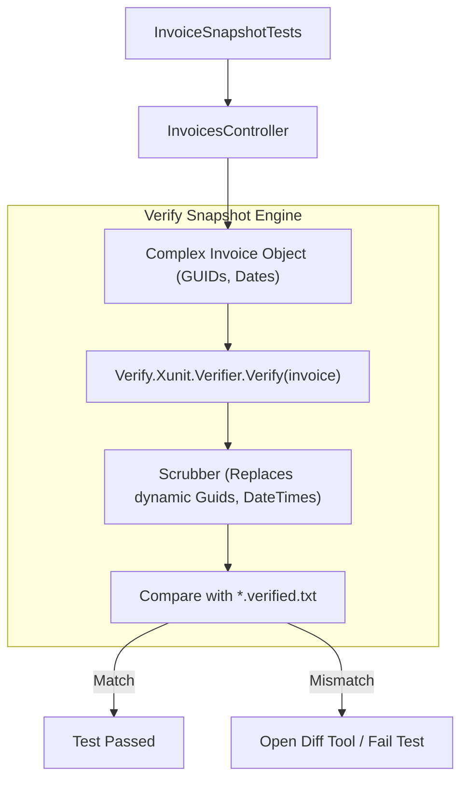
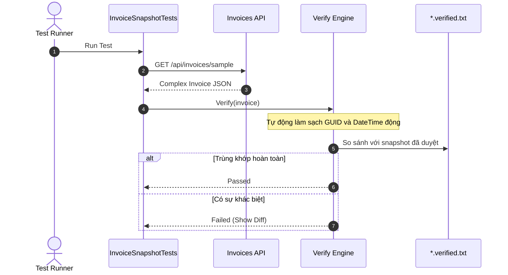

# 42-Verify: Kiểm Thử Ảnh Chụp Dữ Liệu Phức Tạp (Snapshot Testing)

Dự án mẫu .NET 10 (C# 13) minh họa việc sử dụng thư viện **Verify** (`Verify.Xunit`) để thực hiện **Snapshot Testing** (kiểm thử ảnh chụp) cho các cấu trúc dữ liệu JSON, tài liệu hóa đơn và báo cáo phức tạp mà không cần viết hàng chục câu lệnh `Assert.Equal` thủ công.

---

## 1. Giới thiệu tổng quan về Verify

Trong kiểm thử phần mềm truyền thống, khi một API trả về một đối tượng lớn chứa hàng chục thuộc tính, danh sách lồng nhau (nested lists) và các phép tính toán (như hóa đơn, báo cáo tài chính, biểu đồ tổ chức), việc viết assertion kiểm tra từng trường riêng lẻ:
- Tốn nhiều thời gian và công sức viết mã kiểm thử.
- Dễ bỏ sót các trường bị thay đổi ngoài ý muốn (accidental regression).
- Khó bảo trì khi cấu trúc dữ liệu mở rộng.

**Verify** giải quyết triệt để vấn đề này bằng kỹ thuật **Snapshot Testing**:
1. Tuần tự hóa (serialize) đối tượng cần kiểm tra thành định dạng văn bản chuẩn (JSON/YAML-like format).
2. Tự động chuẩn hóa (scrub) các giá trị động dễ thay đổi như `Guid`, `DateTime`, `DateTimeOffset` thành các nhãn tiền định (`Guid_1`, `DateTime_1`).
3. So sánh kết quả hiện tại (`*.received.txt`) với ảnh chụp chuẩn đã được phê duyệt trước đó (`*.verified.txt`).
4. Báo lỗi và hiển thị công cụ so sánh trực quan (Diff Tool) nếu phát hiện bất kỳ sự sai lệch nào.

---

## 2. Vị trí & Vai trò trong kiến trúc ứng dụng

```
┌────────────────────────────────────────────────────────┐
│                   InvoicesController                   │
│   (POST /api/invoices, GET /api/invoices/{id})         │
└───────────────────────────┬────────────────────────────┘
                            │ Returns Complex InvoiceDetail
                            ▼
┌────────────────────────────────────────────────────────┐
│                  Verify.Xunit Engine                   │
│  1. Serialize Object to Formatted Text                 │
│  2. Scrubbing: Guids -> Guid_1, Dates -> DateTime_1    │
│  3. Diff Check: *.received.txt vs *.verified.txt       │
└───────────────────────────┬────────────────────────────┘
                            │
            ┌───────────────┴───────────────┐
            ▼                               ▼
┌───────────────────────┐       ┌───────────────────────┐
│     Snapshot Match    │       │     Snapshot Diff     │
│   ✅ Test Passed      │       │ ❌ Fail & Launch Diff │
└───────────────────────┘       └───────────────────────┘
```

- **Kiểm thử hợp đồng API (API Contract Testing)**: Đảm bảo payload trả về cho client không bị vô tình sửa đổi, xóa trường hoặc thay đổi kiểu dữ liệu.
- **Tài liệu phức tạp (Complex Documents)**: Hóa đơn điện tử, báo cáo PDF/Excel dạng text, dữ liệu cây danh mục.
- **Kiểm thử hồi quy (Regression Testing)**: Tự động bắt mọi thay đổi ngoài dự kiến khi refactor mã nguồn.

---


## Sơ đồ Kiến trúc & Luồng dữ liệu (Architecture & Data Flow)

### 1. Sơ đồ Kiến trúc Tổng quan (Architecture Overview)


### 2. Mô hình Luồng dữ liệu Chi tiết (Data Flow & Sequence)


### 3. Các Use Cases Cụ thể trong Thực tế (Concrete Use Cases)
- **Kiểm thử Ảnh chụp (Snapshot Testing)**: Kiểm tra toàn bộ đối tượng JSON hoặc tài liệu phức tạp mà không cần viết hàng chục dòng `Assert.Equal`.
- **Phát hiện Thay đổi Ngoài Ý Muốn (Regression Testing)**: Tự động cảnh báo khi có một trường mới bị thêm, xóa hoặc đổi format.
- **Auto-Scrubbing**: Tự động chuẩn hóa các giá trị biến động như `Guid.NewGuid()` và `DateTime.UtcNow`.


## 3. Cấu trúc thư mục dự án

```
42-Verify/
├── SnapshotTesting.slnx
├── README.md
├── SnapshotTesting.Api/
│   ├── SnapshotTesting.Api.csproj
│   ├── Program.cs
│   ├── Properties/
│   │   └── launchSettings.json
│   ├── appsettings.json
│   ├── SnapshotTesting.Api.http
│   ├── Models/
│   │   └── InvoiceModels.cs
│   ├── Services/
│   │   └── InvoiceService.cs
│   └── Controllers/
│       └── InvoicesController.cs
└── SnapshotTesting.Tests/
    ├── SnapshotTesting.Tests.csproj
    ├── InvoiceSnapshotTests.cs
    ├── InvoiceSnapshotTests.GetInvoiceById_SnapshotMatches.verified.txt
    └── InvoiceSnapshotTests.GetInvoiceSummary_SnapshotMatches.verified.txt
```

---

## 4. Cài đặt & Cấu hình thư viện

### Cài đặt qua NuGet:
```bash
dotnet add package Verify.Xunit --version 28.16.0
```

### Khai báo trong `SnapshotTesting.Tests.csproj`:
```xml
<Project Sdk="Microsoft.NET.Sdk">
  <PropertyGroup>
    <TargetFramework>net10.0</TargetFramework>
    <ImplicitUsings>enable</ImplicitUsings>
    <Nullable>enable</Nullable>
    <IsTestProject>true</IsTestProject>
  </PropertyGroup>

  <ItemGroup>
    <PackageReference Include="Microsoft.AspNetCore.Mvc.Testing" Version="10.0.0-preview.1.25120.3" />
    <PackageReference Include="Microsoft.NET.Test.Sdk" Version="17.13.0" />
    <PackageReference Include="Verify.Xunit" Version="28.16.0" />
    <PackageReference Include="xunit" Version="2.9.3" />
    <PackageReference Include="xunit.runner.visualstudio" Version="3.0.2" />
  </ItemGroup>

  <ItemGroup>
    <ProjectReference Include="..\SnapshotTesting.Api\SnapshotTesting.Api.csproj" />
  </ItemGroup>
</Project>
```

---

## 5. Các khái niệm cốt lõi của Verify

### 5.1. File `*.verified.txt` và `*.received.txt`
- `*.verified.txt`: File snapshot chuẩn đã được chấp thuận và lưu vào Git repository.
- `*.received.txt`: File kết quả thực tế thu được trong lần chạy test gần nhất. Chỉ xuất hiện khi test thất bại hoặc snapshot chưa từng tồn tại.

### 5.2. Scrubbing (Tẩy rửa dữ liệu động)
Verify tự động nhận diện và làm sạch các giá trị biến động theo thời gian:
- Các `Guid` như `11111111-1111-1111-1111-111111111111` tự động được thay bằng `Guid_1`, `Guid_2`.
- Các `DateTime` tự động được thay bằng `DateTime_1`, `DateTime_2`.
Nhờ vậy, bài test luôn ổn định bất kể ngày giờ chạy hay giá trị ID ngẫu nhiên.

### 5.3. Cú pháp `await Verify(target)`
Trong xUnit test, chỉ cần gọi:
```csharp
[Fact]
public async Task GetInvoiceById_SnapshotMatches()
{
    var invoice = await _client.GetFromJsonAsync<InvoiceDetail>("/api/invoices/11111111-1111-1111-1111-111111111111");
    await Verify(invoice);
}
```

---

## 6. Triển khai Models & Services

### 6.1. Domain Models (`InvoiceModels.cs`)
- `CustomerInfo`: Thông tin khách hàng (Tên, MST, Email, Địa chỉ).
- `InvoiceLineItem`: Chi tiết dòng hàng (Mã, Tên, Đơn giá, Số lượng, Chiết khấu, Thành tiền).
- `InvoiceDetail`: Hóa đơn đầy đủ (Số hóa đơn, Ngày lập, Hạn thanh toán, Khách hàng, Danh sách dòng hàng, Tiền hàng, Thuế suất, Tiền thuế, Tổng chiết khấu, Tổng thanh toán).
- `InvoiceSummary`: Bản tóm tắt hóa đơn rút gọn phục vụ danh sách.

### 6.2. `InvoiceService.cs`
- Lưu trữ hóa đơn trong `ConcurrentDictionary<Guid, InvoiceDetail>`.
- Khởi tạo sẵn hóa đơn mẫu cố định để phục vụ snapshot testing.
- Tính toán chính xác các giá trị tài chính:
  - `SubTotal = Sum(UnitPrice * Quantity)`
  - `TaxAmount = (SubTotal - DiscountTotal) * TaxRate`
  - `GrandTotal = (SubTotal - DiscountTotal) + TaxAmount`

---

## 7. Triển khai API Controller

`InvoicesController.cs` kế thừa `ControllerBase` với các endpoint chuẩn:
- `GET /api/invoices`: Danh sách tóm tắt hóa đơn.
- `GET /api/invoices/{id}`: Chi tiết hóa đơn đầy đủ.
- `GET /api/invoices/{id}/summary`: Tóm tắt một hóa đơn.
- `POST /api/invoices`: Tạo mới hóa đơn với validation hợp lệ.

---

## 8. Quy trình làm việc với Snapshot Testing

1. **Lần chạy đầu tiên**: Chưa có file `*.verified.txt`. Test sẽ fail và sinh file `*.received.txt`.
2. **Review kết quả**: Lập trình viên kiểm tra nội dung `*.received.txt` xem dữ liệu có đúng yêu cầu nghiệp vụ hay không.
3. **Chấp nhận (Accept Snapshot)**: Đổi tên hoặc copy `*.received.txt` thành `*.verified.txt` và commit vào Git.
4. **Các lần chạy tiếp theo**: Test sẽ so sánh kết quả mới với `*.verified.txt`. Nếu khớp 100%, test pass. Nếu có thay đổi, test fail để cảnh báo thay đổi.

---

## 9. Kiểm thử tự động (TDD với xUnit & Verify.Xunit)

Dự án kiểm thử gồm 7 test case:
1. `GetInvoiceById_SnapshotMatches`: So khớp toàn bộ hóa đơn chi tiết với file snapshot chuẩn `InvoiceSnapshotTests.GetInvoiceById_SnapshotMatches.verified.txt`.
2. `GetInvoiceSummary_SnapshotMatches`: So khớp tóm tắt hóa đơn với file snapshot `InvoiceSnapshotTests.GetInvoiceSummary_SnapshotMatches.verified.txt`.
3. `GetAllInvoices_Returns200WithList`: Kiểm tra endpoint lấy danh sách.
4. `GetInvoiceById_NotFound_Returns404`: Kiểm tra trường hợp ID không tồn tại trả về 404.
5. `CreateInvoice_ValidRequest_Returns201WithCalculatedValues`: Kiểm tra logic tạo mới và tính toán thuế/chiết khấu.
6. `CreateInvoice_MissingCustomer_Returns400`: Kiểm tra validation thiếu khách hàng.
7. `CreateInvoice_EmptyItems_Returns400`: Kiểm tra validation danh sách hàng rỗng.

---

## 10. Hướng dẫn chạy & Kiểm thử

### Chạy API trực tiếp:
```powershell
cd 42-Verify/SnapshotTesting.Api
dotnet run
# Mở Swagger UI tại: http://localhost:5142/swagger
```

### Chạy kiểm thử tự động:
```powershell
dotnet test 42-Verify/SnapshotTesting.slnx
```

---

## 11. So sánh Snapshot Testing vs Traditional Assertions

| Tiêu chí | Verify Snapshot Testing | Traditional `Assert.Equal` |
|---|---|---|
| **Thời gian viết test** | Cực nhanh (1 dòng `await Verify(obj)`) | Lâu (phải assert từng property) |
| **Phát hiện thuộc tính mới** | Tự động bắt được ngay khi có trường mới | Bỏ qua hoàn toàn nếu không viết assert |
| **Dễ bảo trì khi đổi schema** | Chỉ cần review diff và chấp nhận snapshot mới | Phải sửa hàng chục dòng assert |
| **Mức độ trực quan** | Xem diff trực quan dạng văn bản | Đọc chuỗi exception trong console |
| **Phù hợp với** | Payloads lớn, JSON API, HTML, báo cáo | Logic tính toán đơn lẻ, cờ boolean |

---

## 12. Lưu ý & Best Practices trong CI/CD

1. **Commit file `*.verified.txt` vào Git**: File snapshot là nguồn sự thật (source of truth), bắt buộc phải được commit vào repository.
2. **Thêm `*.received.txt` vào `.gitignore`**: Không commit file received vì đây là file tạm thời sinh ra khi có diff.
3. **Cấu hình CI/CD**: Trong môi trường CI/CD (GitHub Actions, Azure Pipelines), Verify sẽ tự động nhận diện môi trường không có UI để không mở cửa sổ diff tool.
4. **Tránh lưu thông tin nhạy cảm vào snapshot**: Sử dụng scrubber hoặc cấu hình Verify để che giấu mật khẩu, token hoặc số thẻ tín dụng trước khi snapshot được ghi xuống ổ đĩa.
