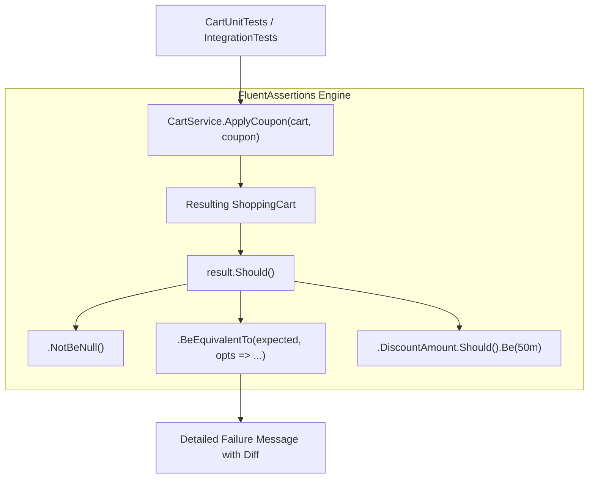
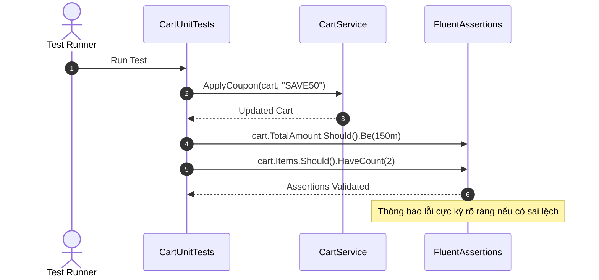

# 43-FluentAssertions: Thư Viện Khẳng Định Tự Nhiên & Biểu Cảm Cho Kiểm Thử .NET

Dự án mẫu .NET 10 (C# 13) minh họa việc sử dụng thư viện **FluentAssertions** để viết các câu lệnh kiểm tra (assertions) tự nhiên, dễ đọc như văn nói tiếng Anh, kết hợp khả năng so sánh đối tượng sâu (deep object equivalency) và thông báo lỗi trực quan chi tiết cho hệ thống Giỏ hàng & Khuyến mãi (Shopping Cart & Promotion Engine).

---

## 1. Giới thiệu tổng quan về FluentAssertions

**FluentAssertions** là một trong những thư viện assertion phổ biến nhất trong hệ sinh thái .NET. Thay vì sử dụng cú pháp truyền thống `Assert.Equal(expected, actual)` của xUnit/NUnit:
- FluentAssertions đảo ngược thứ tự tự nhiên: `actual.Should().Be(expected)`.
- Cho phép nối chuỗi (fluent chaining): `items.Should().HaveCount(3).And.OnlyHaveUniqueItems()`.
- Cung cấp thông báo lỗi (failure message) cực kỳ tường minh: chỉ rõ thuộc tính nào lệch, giá trị mong đợi là gì và giá trị thực tế nhận được là gì.
- Hỗ trợ so sánh cấu trúc đối tượng phức tạp không cần cùng kiểu (`BeEquivalentTo`).

---

## 2. Vị trí & Vai trò trong kiến trúc ứng dụng

```
┌────────────────────────────────────────────────────────┐
│                   CartController                       │
│    (POST /api/cart/{id}/items, /coupon, /checkout)     │
└───────────────────────────┬────────────────────────────┘
                            │
                            ▼
┌────────────────────────────────────────────────────────┐
│             CartService (Domain Logic)                 │
│   - Tính toán subtotal, chiết khấu coupon              │
│   - Validation min spend, max discount, giỏ hàng rỗng  │
└───────────────────────────┬────────────────────────────┘
                            │
            ┌───────────────┴───────────────┐
            ▼                               ▼
┌───────────────────────┐       ┌───────────────────────┐
│     CartUnitTests     │       │  CartIntegrationTests │
│  - FluentAssertions   │       │  - WebApplication     │
│    Domain Rules       │       │    Factory + Should() │
└───────────────────────┘       └───────────────────────┘
```

- **Tầng Domain / Unit Tests**: Kiểm tra các logic nghiệp vụ phức tạp, điều kiện biên, ném ngoại lệ đúng loại và đúng thông điệp.
- **Tầng Integration Tests**: Khẳng định mã trạng thái HTTP, cấu trúc JSON trả về và tính toàn vẹn của dữ liệu sau các luồng nghiệp vụ liên hoàn (End-to-End).

---


## Sơ đồ Kiến trúc & Luồng dữ liệu (Architecture & Data Flow)

### 1. Sơ đồ Kiến trúc Tổng quan (Architecture Overview)


### 2. Mô hình Luồng dữ liệu Chi tiết (Data Flow & Sequence)


### 3. Các Use Cases Cụ thể trong Thực tế (Concrete Use Cases)
- **Viết Assertions Tự Nhiên & Dễ Đọc**: Cú pháp tiếng Anh tự nhiên `result.Should().NotBeNull().And.HaveCount(5)`.
- **So sánh Tương đương Sâu (Deep Equivalency)**: So sánh hai cây đối tượng phức tạp mà không cần triển khai `IEquatable`.
- **Thông báo Lỗi Chi tiết**: Khi test fail, hiển thị chính xác trường nào, dòng nào bị sai lệch giá trị.


## 3. Cấu trúc thư mục dự án

```
43-FluentAssertions/
├── CartPromotionEngine.slnx
├── README.md
├── CartPromotionEngine.Api/
│   ├── CartPromotionEngine.Api.csproj
│   ├── Program.cs
│   ├── Properties/
│   │   └── launchSettings.json
│   ├── appsettings.json
│   ├── CartPromotionEngine.Api.http
│   ├── Models/
│   │   └── CartModels.cs
│   ├── Services/
│   │   └── CartService.cs
│   └── Controllers/
│       └── CartController.cs
└── CartPromotionEngine.Tests/
    ├── CartPromotionEngine.Tests.csproj
    ├── CartUnitTests.cs
    └── CartIntegrationTests.cs
```

---

## 4. Cài đặt & Cấu hình thư viện

### Cài đặt qua NuGet:
```bash
dotnet add package FluentAssertions --version 7.2.0
```

### Khai báo trong `CartPromotionEngine.Tests.csproj`:
```xml
<Project Sdk="Microsoft.NET.Sdk">
  <PropertyGroup>
    <TargetFramework>net10.0</TargetFramework>
    <ImplicitUsings>enable</ImplicitUsings>
    <Nullable>enable</Nullable>
    <IsTestProject>true</IsTestProject>
  </PropertyGroup>

  <ItemGroup>
    <PackageReference Include="FluentAssertions" Version="7.2.0" />
    <PackageReference Include="Microsoft.AspNetCore.Mvc.Testing" Version="10.0.0-preview.1.25120.3" />
    <PackageReference Include="Microsoft.NET.Test.Sdk" Version="17.13.0" />
    <PackageReference Include="xunit" Version="2.9.3" />
    <PackageReference Include="xunit.runner.visualstudio" Version="3.0.2" />
  </ItemGroup>
</Project>
```

---

## 5. Các kỹ thuật Assert cốt lõi trong FluentAssertions

### 5.1. So sánh đối tượng & Thuộc tính (Object & Equivalency)
```csharp
cart.Should().NotBeNull();
cart.Id.Should().Be(cartId);
cart.Should().BeEquivalentTo(expectedCart, options => options.Excluding(x => x.UpdatedAt));
```

### 5.2. Khẳng định tập hợp (Collections)
```csharp
cart.Items.Should().ContainSingle();
cart.Items.Should().HaveCount(2);
cart.Items.Should().ContainSingle(i => i.Quantity == 3 && i.TotalPrice == 45.00m);
clearedCart.Items.Should().BeEmpty();
```

### 5.3. Khẳng định số học & Khoảng giá trị (Numbers & Ranges)
```csharp
cart.TotalAmount.Should().Be(90.00m);
cart.DiscountTotal.Should().BeInRange(10m, 50m);
```

### 5.4. Khẳng định thời gian (Dates & Times)
```csharp
// Đảm bảo thời điểm tạo nằm trong phạm vi 2 giây so với hiện tại
cart.CreatedAt.Should().BeCloseTo(DateTime.UtcNow, TimeSpan.FromSeconds(2));
```

### 5.5. Khẳng định chuỗi (Strings)
```csharp
result.OrderNumber.Should().StartWith("ORD-");
couponCode.Should().Be("SAVE10");
```

### 5.6. Khẳng định Ngoại lệ (Exceptions)
```csharp
Action act = () => _service.AddItem(cartId, request);
act.Should().Throw<ArgumentOutOfRangeException>()
   .WithParameterName("Quantity");

Action actCoupon = () => _service.ApplyCoupon(cartId, "INVALID");
actCoupon.Should().Throw<ArgumentException>()
   .WithMessage("*Invalid or expired coupon*");
```

---

## 6. Triển khai Models & Services

### 6.1. Domain Models (`CartModels.cs`)
- `CartItem`: Món hàng trong giỏ (Id, ProductId, ProductName, UnitPrice, Quantity, TotalPrice).
- `AppliedCoupon`: Mã khuyến mãi (Code, DiscountPercent, MaxDiscountAmount, ActualDiscount).
- `ShoppingCart`: Giỏ hàng đầy đủ (Items, Coupon, SubTotal, DiscountTotal, TotalAmount, CreatedAt, UpdatedAt).
- `CheckoutResult`: Kết quả thanh toán (OrderId, CartId, OrderNumber, TotalPaid, ItemsCount, OrderDate, Status).

### 6.2. `CartService.cs`
- Quản lý giỏ hàng theo cơ chế in-memory thread-safe (`ConcurrentDictionary`).
- Bảng quy tắc Coupon:
  - `SAVE10`: Giảm 10%, tối đa $50, đơn tối thiểu $20.
  - `VIP20`: Giảm 20%, tối đa $100, đơn tối thiểu $100.
  - `SUMMER2026`: Giảm 15%, tối đa $75, đơn tối thiểu $50.
- Tự động tính toán lại chiết khấu khi giỏ hàng thêm bớt món.
- Ném ngoại lệ chuẩn xác khi vi phạm điều kiện (giỏ hàng rỗng, đơn chưa đạt mức tối thiểu).

---

## 7. Triển khai API Controller

`CartController.cs` kế thừa `ControllerBase` với các endpoint RESTful:
- `GET /api/cart/{id}`: Lấy thông tin giỏ hàng.
- `POST /api/cart/{id}/items`: Thêm sản phẩm vào giỏ.
- `POST /api/cart/{id}/coupon`: Áp dụng mã giảm giá.
- `POST /api/cart/{id}/checkout`: Thanh toán và hoàn tất đơn hàng.

---

## 8. Kịch bản kiểm thử thực tế

Dự án triển khai cả 2 cấp độ kiểm thử:
1. **Unit Testing (`CartUnitTests.cs`)**:
   - Thêm món hàng đơn lẻ và tính toán tổng tiền.
   - Thêm trùng sản phẩm và tự động gộp số lượng.
   - Kiểm tra ném ngoại lệ khi số lượng <= 0.
   - Áp dụng coupon hợp lệ và kiểm tra mức giảm giá trong khoảng cho phép.
   - Áp dụng coupon không tồn tại hoặc chưa đạt giá trị đơn tối thiểu.
   - Thanh toán giỏ hàng rỗng ném ngoại lệ.
   - Thanh toán thành công, xóa giỏ hàng và trả về mã đơn hàng `ORD-`.
2. **Integration Testing (`CartIntegrationTests.cs`)**:
   - Lấy giỏ hàng rỗng trả về HTTP 200.
   - Toàn bộ chu trình End-to-End: `AddItem` -> `ApplyCoupon` -> `Checkout`.
   - Áp dụng mã sai trả về HTTP 400.
   - Checkout giỏ rỗng trả về HTTP 400.

---

## 9. Kiểm thử tự động (TDD & WebApplicationFactory)

Toàn bộ 13 test case đều vượt qua:
- 9 Unit tests tập trung kiểm tra logic nghiệp vụ và ngoại lệ.
- 4 Integration tests thông qua `WebApplicationFactory<Program>`.

---

## 10. Hướng dẫn chạy & Kiểm thử

### Chạy API trực tiếp:
```powershell
cd 43-FluentAssertions/CartPromotionEngine.Api
dotnet run
# Mở Swagger UI tại: http://localhost:5143/swagger
```

### Chạy kiểm thử tự động:
```powershell
dotnet test 43-FluentAssertions/CartPromotionEngine.slnx
```

---

## 11. So sánh FluentAssertions vs xUnit Assertions vs Shouldly

| Tiêu chí | FluentAssertions | xUnit `Assert` | Shouldly |
|---|---|---|---|
| **Cú pháp** | `actual.Should().Be(expected)` | `Assert.Equal(expected, actual)` | `actual.ShouldBe(expected)` |
| **Nối chuỗi assertions** | Rất mạnh (`.And.`, `.Which.`) | Không hỗ trợ | Hạn chế |
| **So sánh đối tượng sâu** | Cực mạnh (`BeEquivalentTo`) | Không hỗ trợ sẵn | Khá |
| **Thông báo lỗi** | Chi tiết, nêu rõ ngữ cảnh | Đơn giản, khó hình dung | Chi tiết |
| **Hỗ trợ thời gian** | Rất tiện (`BeCloseTo`, `1.Seconds()`) | Phải tự tính `TimeSpan` | Hỗ trợ |

---

## 12. Lưu ý & Best Practices

1. **Tránh assert nhiều điều kiện không liên quan trong 1 test**: Mặc dù FluentAssertions cho phép nối chuỗi, hãy giữ mỗi bài test tập trung vào một hành vi cụ thể (Single Responsibility).
2. **Sử dụng `AssertionScope` khi cần kiểm tra nhiều thuộc tính**: Khi muốn kiểm tra nhiều thuộc tính mà không dừng lại ngay ở lỗi đầu tiên:
   ```csharp
   using (new AssertionScope())
   {
       cart.SubTotal.Should().Be(100m);
       cart.DiscountTotal.Should().Be(10m);
       cart.TotalAmount.Should().Be(90m);
   }
   ```
3. **Cẩn thận với `BeEquivalentTo` trên collection lớn**: Phép so sánh sâu (reflection) tốn chi phí CPU nếu tập dữ liệu hàng nghìn phần tử.
