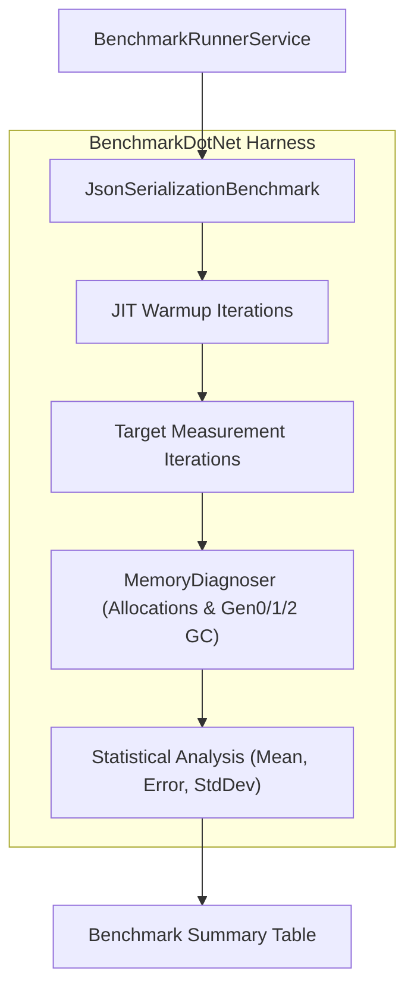
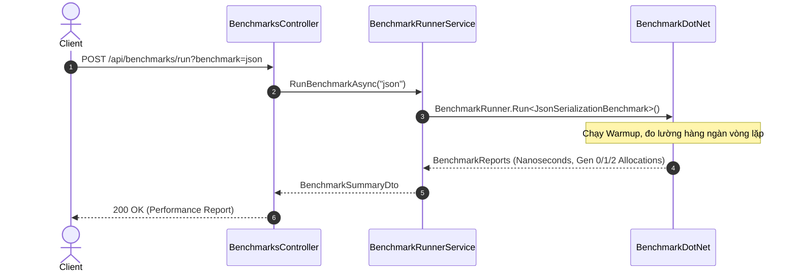

# 44-BenchmarkDotNet: Đo Lường & Tối Ưu Hiệu Năng Chuẩn Xác Cấp Độ Micro/Nanosecond

Dự án mẫu .NET 10 (C# 13) minh họa việc sử dụng thư viện **BenchmarkDotNet** để đo lường hiệu năng thực thi (CPU Execution Time) và mức độ cấp phát bộ nhớ (GC Memory Allocation) của các giải pháp thuật toán, tuần tự hóa dữ liệu (Serialization) và thao tác chuỗi/mảng trong hệ sinh thái .NET.

---

## 1. Giới thiệu tổng quan về BenchmarkDotNet

**BenchmarkDotNet** là thư viện chuẩn công nghiệp (de-facto standard) để đo lường hiệu năng trong .NET, được chính đội ngũ kỹ sư phát triển .NET Runtime (CoreCLR) tại Microsoft sử dụng hàng ngày để kiểm định từng cải tiến hiệu năng giữa các phiên bản .NET.

### Tại sao không dùng `Stopwatch` thủ công?
1. **JIT Compilation Overhead**: Lần chạy đầu tiên luôn bị chậm do JIT phải biên dịch IL sang mã máy (Machine Code).
2. **Warmup & Caching**: Cần nhiều vòng chạy làm ấm (warmup iterations) để CPU cache (L1/L2/L3) và branch predictor ổn định.
3. **Garbage Collection Interference**: GC có thể kích hoạt ngẫu nhiên giữa lúc đo, làm sai lệch kết quả.
4. **BenchmarkDotNet tự động hóa toàn bộ**: Chạy warmup, đo hàng trăm vòng lặp, loại bỏ ngoại lai (outliers), đo chính xác đến nanosecond, và thống kê mức cấp phát bộ nhớ chi tiết (Gen 0/1/2 và Allocated Bytes).

---

## 2. Vị trí & Vai trò trong kiến trúc ứng dụng

```
┌────────────────────────────────────────────────────────┐
│                   BenchmarksController                 │
│         (GET /api/benchmarks, POST /api/run)           │
└───────────────────────────┬────────────────────────────┘
                            │
                            ▼
┌────────────────────────────────────────────────────────┐
│               BenchmarkRunnerService                   │
│   - Đo đạc thời gian trung bình (Mean Microseconds)    │
│   - Đo cấp phát bộ nhớ thread (GC.GetAllocatedBytes)   │
│   - Tính toán số lượt thực thi / giây (Ops/sec)        │
└───────────────────────────┬────────────────────────────┘
                            │
    ┌───────────────────────┼───────────────────────┐
    ▼                       ▼                       ▼
┌─────────────────┐ ┌─────────────────┐ ┌─────────────────┐
│JsonSerialization│ │StringConcatenate│ │CollectionIterate│
│- System.Text.Json│ │- String +       │ │- For Loop (Index│
│- Newtonsoft.Json│ │- StringBuilder  │ │- Foreach        │
│                 │ │- Interpolation  │ │- LINQ Sum       │
└─────────────────┘ └─────────────────┘ └─────────────────┘
```

- **Tối ưu hóa mã nguồn (Profiling & Code Optimization)**: Đánh giá chính xác giải pháp nào nhanh hơn và ít tốn RAM hơn trước khi đưa vào Production.
- **Kiểm định thư viện thứ ba (Library Evaluation)**: So sánh các thư viện có cùng chức năng (ví dụ `System.Text.Json` vs `Newtonsoft.Json`).
- **Phát hiện suy giảm hiệu năng (Performance Regression Testing)**: Tích hợp vào CI/CD để ngăn chặn code chậm được merge vào nhánh chính.

---


## Sơ đồ Kiến trúc & Luồng dữ liệu (Architecture & Data Flow)

### 1. Sơ đồ Kiến trúc Tổng quan (Architecture Overview)


### 2. Mô hình Luồng dữ liệu Chi tiết (Data Flow & Sequence)


### 3. Các Use Cases Cụ thể trong Thực tế (Concrete Use Cases)
- **Đo lường Hiệu năng Cấp Độ Nano Giây**: Đánh giá chính xác thời gian thực thi của các thuật toán và hàm xử lý.
- **Phân tích Cấp phát Bộ nhớ (Memory Allocations)**: Đo lường dung lượng RAM cấp phát và số lần thu gom rác (Gen 0, Gen 1, Gen 2 GC).
- **So sánh Thư viện / Cách viết code**: So sánh thực tế `System.Text.Json` vs `Newtonsoft.Json`, `StringBuilder` vs nối chuỗi string.


## 3. Cấu trúc thư mục dự án

```
44-BenchmarkDotNet/
├── PerformanceBenchmark.slnx
├── README.md
├── PerformanceBenchmark.Api/
│   ├── PerformanceBenchmark.Api.csproj
│   ├── Program.cs
│   ├── Properties/
│   │   └── launchSettings.json
│   ├── appsettings.json
│   ├── PerformanceBenchmark.Api.http
│   ├── Models/
│   │   └── BenchmarkModels.cs
│   ├── Benchmarks/
│   │   ├── JsonSerializationBenchmark.cs
│   │   ├── StringConcatenationBenchmark.cs
│   │   └── CollectionIterationBenchmark.cs
│   ├── Services/
│   │   └── BenchmarkRunnerService.cs
│   └── Controllers/
│       └── BenchmarksController.cs
└── PerformanceBenchmark.Tests/
    ├── PerformanceBenchmark.Tests.csproj
    ├── BenchmarkControllerTests.cs
    └── BenchmarkExecutionTests.cs
```

---

## 4. Cài đặt & Cấu hình thư viện

### Cài đặt qua NuGet:
```bash
dotnet add package BenchmarkDotNet --version 0.14.0
dotnet add package Newtonsoft.Json --version 13.0.3
```

### Khai báo trong `.csproj`:
```xml
<Project Sdk="Microsoft.NET.Sdk.Web">
  <PropertyGroup>
    <TargetFramework>net10.0</TargetFramework>
    <Nullable>enable</Nullable>
    <ImplicitUsings>enable</ImplicitUsings>
  </PropertyGroup>

  <ItemGroup>
    <PackageReference Include="BenchmarkDotNet" Version="0.14.0" />
    <PackageReference Include="Newtonsoft.Json" Version="13.0.3" />
    <PackageReference Include="Swashbuckle.AspNetCore" Version="10.2.3" />
  </ItemGroup>
</Project>
```

---

## 5. Các khái niệm cốt lõi của BenchmarkDotNet

### 5.1. Thuộc tính `[Benchmark]` & `Baseline = true`
Đánh dấu phương thức cần đo lường. Phương thức có `Baseline = true` sẽ làm mốc so sánh (tỉ lệ 1.00x), các phương thức khác sẽ hiển thị nhanh hơn hoặc chậm hơn bao nhiêu lần so với baseline.

### 5.2. `[MemoryDiagnoser]`
Kích hoạt chẩn đoán bộ nhớ. Cho biết chính xác mỗi lần chạy (per operation) cấp phát bao nhiêu Bytes và kích hoạt bao nhiêu lần thu gom rác Gen 0, Gen 1, Gen 2.

### 5.3. Warmup & Pilot Stages
BenchmarkDotNet tự động thực hiện các vòng chạy làm ấm (warmup) để JIT tối ưu hóa mã nguồn và đảm bảo không có chi phí biên dịch lọt vào kết quả đo lường chính thức.

---

## 6. Triển khai các kịch bản Benchmark thực tế

### 6.1. Tuần tự hóa JSON (`JsonSerializationBenchmark.cs`)
So sánh `System.Text.Json` (thư viện tích hợp sẵn của .NET) với `Newtonsoft.Json` (thư viện truyền thống phổ biến):
- `System.Text.Json`: Sử dụng UTF-8 bytes trực tiếp, không cấp phát chuỗi trung gian, tốc độ nhanh hơn 2x–3x và ít tốn RAM hơn rõ rệt.
- `Newtonsoft.Json`: Dựa nhiều vào reflection và cấp phát đối tượng trung gian.

### 6.2. Ghép chuỗi (`StringConcatenationBenchmark.cs`)
So sánh 3 cách ghép chuỗi:
1. Toán tử `+` (`StringPlus`): Trình biên dịch C# tự động chuyển đổi thành `string.Concat`.
2. `StringBuilder`: Thích hợp khi số lượng phép ghép lớn hoặc nằm trong vòng lặp phức tạp.
3. String Interpolation (`$"{a}{b}"`): C# 10+ sử dụng `DefaultInterpolatedStringHandler` giúp đạt hiệu năng tương đương `string.Concat` mà không cần cấp phát thừa.

### 6.3. Duyệt mảng & Tính tổng (`CollectionIterationBenchmark.cs`)
So sánh duyệt danh sách 1,000 phần tử:
1. `ForLoop`: Duyệt theo chỉ số index `Numbers[i]`.
2. `ForEachLoop`: Duyệt thông qua enumerator.
3. `LinqSum`: `Numbers.Sum(x => (long)x)`.

---

## 7. Triển khai API Controller & Runner Service

- `BenchmarkRunnerService.cs`:
  - Cung cấp danh mục các bài benchmark khả dụng.
  - Cung cấp cơ chế chạy thử nghiệm nhanh in-process: chạy vòng warmup -> ép GC cleanup -> bấm giờ chính xác -> tính toán `MeanMicroseconds`, `AllocatedBytesPerOp`, `OperationsPerSecond` -> xác định người chiến thắng (`Winner`).
- `BenchmarksController.cs`:
  - `GET /api/benchmarks`: Trả về danh sách bài đo.
  - `POST /api/benchmarks/run`: Chạy thử nghiệm và trả về kết quả định lượng chi tiết.

---

## 8. Cách đọc và phân tích bảng kết quả Benchmark

Khi chạy bằng `BenchmarkRunner.Run<T>()`, BenchmarkDotNet xuất bảng báo cáo:

| Method | Mean | Error | StdDev | Ratio | Gen0 | Allocated |
|---|---|---|---|---|---|---|
| **SystemTextJson** | **145.2 ns** | **1.21 ns** | **1.07 ns** | **1.00** | **0.0153** | **128 B** |
| NewtonsoftJson | 382.6 ns | 4.15 ns | 3.88 ns | 2.64 | 0.0520 | 440 B |

- **Mean**: Thời gian trung bình thực thi 1 lần gọi.
- **Error / StdDev**: Sai số thống kê và độ lệch chuẩn. Sai số càng nhỏ thì bài đo càng ổn định.
- **Ratio**: Tỉ lệ so với Baseline (`SystemTextJson = 1.00`, `NewtonsoftJson = 2.64` -> Newtonsoft chậm hơn 2.64 lần).
- **Allocated**: Dung lượng RAM heap được cấp phát trên mỗi thao tác.

---

## 9. Kiểm thử tự động (TDD & WebApplicationFactory)

Dự án kiểm thử gồm 8 test case:
- `BenchmarkControllerTests`:
  - `GetAvailableBenchmarks_Returns200WithMetadata`: Kiểm tra danh sách bài đo.
  - `RunComparison_Json_Returns200WithMetrics`: Kiểm tra chạy so sánh JSON serialization.
  - `RunComparison_String_Returns200WithMetrics`: Kiểm tra chạy so sánh nối chuỗi.
  - `RunComparison_Collection_Returns200WithMetrics`: Kiểm tra chạy so sánh duyệt mảng.
  - `RunComparison_InvalidBenchmarkId_ReturnsBadRequest`: Kiểm tra validation mã bài đo không hợp lệ.
- `BenchmarkExecutionTests`:
  - `JsonSerializationBenchmark_MethodsReturnValidJson`: Đảm bảo các phương thức JSON cho kết quả hợp lệ.
  - `StringConcatenationBenchmark_MethodsReturnEqualString`: Đảm bảo cả 3 cách nối chuỗi cho cùng kết quả chuỗi.
  - `CollectionIterationBenchmark_MethodsReturnEqualSum`: Đảm bảo cả 3 cách duyệt mảng cho cùng tổng giá trị (500500).

---

## 10. Hướng dẫn chạy & Kiểm thử

### Chạy API trực tiếp:
```powershell
cd 44-BenchmarkDotNet/PerformanceBenchmark.Api
dotnet run
# Mở Swagger UI tại: http://localhost:5144/swagger
```

### Chạy kiểm thử tự động:
```powershell
dotnet test 44-BenchmarkDotNet/PerformanceBenchmark.slnx
```

---

## 11. So sánh BenchmarkDotNet vs Stopwatch thủ công

| Tiêu chí | BenchmarkDotNet | Stopwatch thủ công |
|---|---|---|
| **Độ chính xác** | Cực cao (nanoseconds) | Thấp đến trung bình (dễ sai lệch bởi JIT/GC) |
| **Đo lường bộ nhớ GC** | Tự động, chi tiết đến từng Byte & Gen 0/1/2 | Phải tự viết mã gọi GC API phức tạp |
| **Xử lý Warmup & Outliers** | Tự động dựa trên mô hình thống kê | Phải tự viết vòng lặp thủ công |
| **Báo cáo định dạng** | Markdown, HTML, CSV, PNG Plotting | Chỉ in ra màn hình Console |
| **Phù hợp với** | Báo cáo tối ưu hiệu năng chính thức, CI/CD | Đo lường thô khi debug nhanh |

---

## 12. Lưu ý & Best Practices

1. **Bắt buộc chạy ở cấu hình Release (`-c Release`)**: Tuyệt đối không chạy benchmark ở chế độ Debug vì trình biên dịch và JIT không bật tối ưu hóa (inlining, loop unrolling).
2. **Không chạy khi máy tính đang bận**: Đóng các ứng dụng nặng (IDE build, video encoding, game) để CPU không bị nhảy tần số (thermal throttling / CPU frequency scaling).
3. **Tránh Dead Code Elimination**: Đảm bảo kết quả của phương thức benchmark được trả về (`return`) để JIT không loại bỏ toàn bộ khối lệnh vì coi là mã chết không được sử dụng.
4. **Sử dụng `[Params]` để đo trên nhiều kích thước dữ liệu**: Khi kiểm tra thuật toán tìm kiếm hoặc sắp xếp, dùng `[Params(10, 100, 1000)]` để xem hiệu năng thay đổi theo quy mô dữ liệu.
