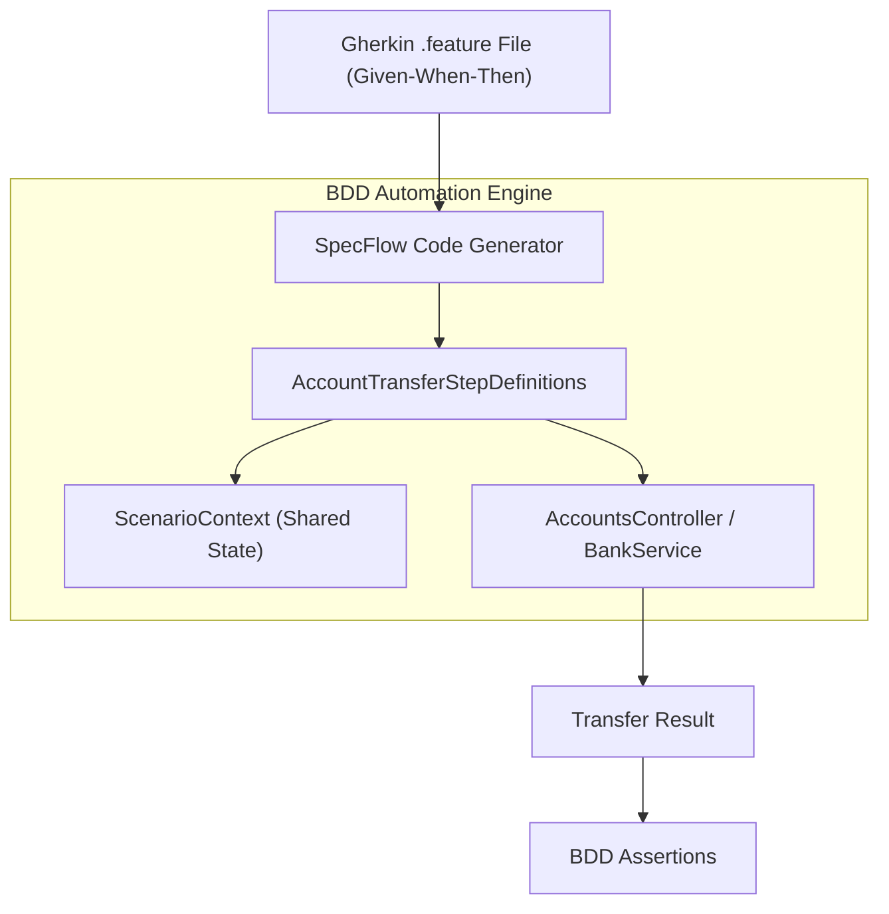
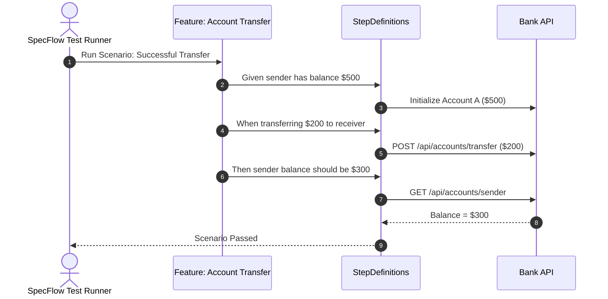

# 45-SpecFlow: Phát Triển Hướng Hành Vi & Tài Liệu Sống (Behavior-Driven Development - BDD)

Dự án mẫu .NET 10 (C# 13) minh họa việc sử dụng thư viện **SpecFlow** (`SpecFlow.xUnit`) để áp dụng phương pháp **BDD (Behavior-Driven Development)**, cho phép mô tả các yêu cầu nghiệp vụ ngân hàng (Chuyển khoản, số dư, tài khoản hoạt động/vô hiệu hóa) bằng ngôn ngữ tự nhiên **Gherkin** và tự động thực thi chúng thành các kịch bản kiểm thử mã nguồn.

---

## 1. Giới thiệu tổng quan về SpecFlow & BDD

**BDD (Behavior-Driven Development)** là phương pháp phát triển phần mềm mở rộng từ TDD, nhằm xóa bỏ rào cản giao tiếp giữa 3 bên (The Three Amigos):
1. **Business Analyst (BA) / Product Owner (PO)**: Người nắm rõ yêu cầu nghiệp vụ.
2. **Software Developer**: Người thiết kế và viết mã thực thi.
3. **Quality Assurance (QA) / Tester**: Người kiểm định tính đúng đắn của phần mềm.

**SpecFlow** là framework BDD hàng đầu cho hệ sinh thái .NET:
- Sử dụng cú pháp **Gherkin** (`Given - When - Then`) để mô tả kịch bản bằng ngôn ngữ tự nhiên (tiếng Anh hoặc tiếng Việt).
- Tự động sinh mã kiểm thử C# (code-behind) ánh xạ trực tiếp đến các lớp `[Binding]` và phương thức `[Given]`, `[When]`, `[Then]`.
- Đóng vai trò là **Living Documentation** (Tài liệu sống): tài liệu đặc tả nghiệp vụ luôn luôn chính xác 100% vì nếu tài liệu sai, bài test sẽ fail ngay lập tức.

---

## 2. Vị trí & Vai trò trong kiến trúc ứng dụng

```
┌────────────────────────────────────────────────────────┐
│               Gherkin Feature File                     │
│    "Given an active account... When customer... Then"  │
└───────────────────────────┬────────────────────────────┘
                            │ SpecFlow Code Generator
                            ▼
┌────────────────────────────────────────────────────────┐
│               Step Definitions ([Binding])             │
│    - [Given], [When], [Then] regex matching            │
└───────────────────────────┬────────────────────────────┘
                            │
            ┌───────────────┴───────────────┐
            ▼                               ▼
┌───────────────────────┐       ┌───────────────────────┐
│     BankService       │       │   AccountsController  │
│  - Domain Logic       │       │  - HTTP API Endpoint  │
│  - Atomic Transfer    │       │  - RESTful Responses  │
└───────────────────────┘       └───────────────────────┘
```

- **Tầng Phân tích Nghiệp vụ (Requirements)**: Biến các câu chuyện người dùng (User Stories) thành các kịch bản kiểm thử có thể chạy được.
- **Tầng Tự động hóa Kiểm thử (Test Automation)**: Cung cấp bộ kiểm thử hồi quy tự động không phụ thuộc vào giao diện (UI-less Acceptance Testing).
- **Tầng Tích hợp API (API Testing)**: Kết hợp `WebApplicationFactory` để kiểm thử toàn diện cả tầng Controller và Middleware.

---


## Sơ đồ Kiến trúc & Luồng dữ liệu (Architecture & Data Flow)

### 1. Sơ đồ Kiến trúc Tổng quan (Architecture Overview)


### 2. Mô hình Luồng dữ liệu Chi tiết (Data Flow & Sequence)


### 3. Các Use Cases Cụ thể trong Thực tế (Concrete Use Cases)
- **Phát triển Hướng Hành vi (Behavior-Driven Development - BDD)**: Cầu nối giao tiếp giữa Business Analyst, Tester và Developer.
- **Tài liệu Sống (Living Documentation)**: Các kịch bản Gherkin vừa là tài liệu nghiệp vụ vừa là test case tự động chạy được.
- **Kiểm thử Chấp nhận Người dùng (User Acceptance Testing - UAT)**: Đảm bảo phần mềm đáp ứng đúng nhu cầu nghiệp vụ thực tế.


## 3. Cấu trúc thư mục dự án

```
45-SpecFlow/
├── BddTesting.slnx
├── README.md
├── BddTesting.Api/
│   ├── BddTesting.Api.csproj
│   ├── Program.cs
│   ├── Properties/
│   │   └── launchSettings.json
│   ├── appsettings.json
│   ├── BddTesting.Api.http
│   ├── Models/
│   │   └── AccountModels.cs
│   ├── Services/
│   │   └── BankService.cs
│   └── Controllers/
│       └── AccountsController.cs
└── BddTesting.Tests/
    ├── BddTesting.Tests.csproj
    ├── Features/
    │   └── AccountTransfer.feature
    ├── StepDefinitions/
    │   └── AccountTransferStepDefinitions.cs
    └── AccountControllerIntegrationTests.cs
```

---

## 4. Cài đặt & Cấu hình thư viện

### Cài đặt qua NuGet:
```bash
dotnet add package SpecFlow.xUnit --version 3.9.74
dotnet add package SpecFlow.Plus.LivingDocPlugin --version 3.9.57
```

### Khai báo trong `BddTesting.Tests.csproj`:
```xml
<Project Sdk="Microsoft.NET.Sdk">
  <PropertyGroup>
    <TargetFramework>net10.0</TargetFramework>
    <ImplicitUsings>enable</ImplicitUsings>
    <Nullable>enable</Nullable>
    <IsTestProject>true</IsTestProject>
  </PropertyGroup>

  <ItemGroup>
    <PackageReference Include="Microsoft.AspNetCore.Mvc.Testing" Version="10.0.0-preview.1.25120.3" />
    <PackageReference Include="Microsoft.NET.Test.Sdk" Version="17.13.0" />
    <PackageReference Include="SpecFlow.xUnit" Version="3.9.74" />
    <PackageReference Include="SpecFlow.Plus.LivingDocPlugin" Version="3.9.57" />
    <PackageReference Include="xunit" Version="2.9.3" />
    <PackageReference Include="xunit.runner.visualstudio" Version="3.0.2" />
  </ItemGroup>
</Project>
```

---

## 5. Các khái niệm cốt lõi của SpecFlow & Gherkin

### 5.1. Ngôn ngữ Gherkin
Mỗi kịch bản gồm các mệnh đề tiêu chuẩn:
- **Feature**: Mô tả tổng quan tính năng nghiệp vụ.
- **Scenario**: Một kịch bản người dùng cụ thể.
- **Given**: Tiền điều kiện (dữ liệu ban đầu, trạng thái tài khoản).
- **When**: Hành động kích hoạt (thực hiện lệnh chuyển tiền).
- **Then**: Kết quả mong đợi (số dư mới, trạng thái giao dịch, thông báo lỗi).
- **And / But**: Nối thêm các bước bổ sung.

### 5.2. `[Binding]` & Step Definitions
Lớp C# chứa các thuộc tính liên kết với từng câu chữ trong file `.feature`:
```csharp
[Binding]
public class AccountTransferStepDefinitions
{
    [Given(@"an active source account ""(.*)"" with balance \$(.*)")]
    public void GivenSourceAccount(string accNum, decimal balance) { ... }

    [When(@"the customer transfers \$(.*) from ""(.*)"" to ""(.*)""")]
    public void WhenCustomerTransfers(decimal amount, string from, string to) { ... }

    [Then(@"the transfer should be successful")]
    public void ThenTransferSuccessful() { ... }
}
```

---

## 6. Triển khai Models & Services

### 6.1. Domain Models (`AccountModels.cs`)
- `BankAccount`: Số tài khoản, Chủ tài khoản, Số dư, Đơn vị tiền tệ, Trạng thái kích hoạt, Ngày tạo.
- `CreateAccountRequest`: Yêu cầu tạo tài khoản mới.
- `TransferRequest`: Yêu cầu chuyển tiền (Từ TK, Đến TK, Số tiền, Ghi chú).
- `TransferResult`: Kết quả giao dịch (Mã GD, Số dư còn lại TK gửi, Số dư mới TK nhận, Trạng thái).

### 6.2. `BankService.cs`
Triển khai logic nghiệp vụ ngân hàng:
- Quản lý danh sách tài khoản an toàn đa luồng (`ConcurrentDictionary`).
- Giao dịch chuyển khoản an toàn (`lock (_lock)`) đảm bảo tính nguyên tử (Atomicity):
  - Số tiền chuyển phải > 0.
  - Hai tài khoản phải khác nhau.
  - Cả hai tài khoản phải đang kích hoạt (`IsActive == true`).
  - Tài khoản nguồn phải có đủ số dư (`Balance >= Amount`).

---

## 7. Triển khai API Controller

`AccountsController.cs` kế thừa `ControllerBase` với các endpoint chuẩn:
- `GET /api/accounts`: Danh sách toàn bộ tài khoản.
- `GET /api/accounts/{accountNumber}`: Chi tiết một tài khoản.
- `POST /api/accounts`: Mở tài khoản mới.
- `POST /api/accounts/transfer`: Thực hiện giao dịch chuyển khoản.

---

## 8. Kịch bản BDD thực tế (`AccountTransfer.feature`)

Các kịch bản được viết bằng ngôn ngữ tự nhiên dễ hiểu:
1. **Chuyển tiền thành công**: Chuyển $150 từ TK có $500 sang TK có $100 -> số dư còn lại lần lượt là $350 và $250.
2. **Chuyển tiền thất bại do không đủ số dư**: TK có $50 chuyển $100 -> báo lỗi "Insufficient funds", số dư giữ nguyên.
3. **Chuyển tiền thất bại do tài khoản đích bị khóa**: Báo lỗi "inactive", số dư TK nguồn giữ nguyên.
4. **Chuyển tiền thất bại do trùng tài khoản nguồn và đích**: Báo lỗi "cannot be the same".

---

## 9. Kiểm thử tự động (TDD & WebApplicationFactory)

Toàn bộ 11 bài kiểm thử đều vượt qua:
- **4 Kịch bản BDD Gherkin**: Chạy trực tiếp qua SpecFlow test generator.
- **7 Integration test cases**: Kiểm thử HTTP endpoints (Status 200, 201 Created with Location header, 400 Bad Request, 404 Not Found).

---

## 10. Hướng dẫn chạy & Kiểm thử

### Chạy API trực tiếp:
```powershell
cd 45-SpecFlow/BddTesting.Api
dotnet run
# Mở Swagger UI tại: http://localhost:5145/swagger
```

### Chạy kiểm thử tự động:
```powershell
dotnet test 45-SpecFlow/BddTesting.slnx
```

---

## 11. So sánh SpecFlow vs Reqnroll vs Unit Tests thông thường

| Tiêu chí | SpecFlow / Reqnroll | Unit Tests thông thường (xUnit) |
|---|---|---|
| **Người đọc hiểu được** | Mọi người (BA, PO, QA, Dev) | Chỉ lập trình viên |
| **Định dạng kịch bản** | Ngôn ngữ tự nhiên Gherkin (`.feature`) | Mã C# thuần túy |
| **Tái sử dụng bước test** | Rất cao (dùng lại các câu Given/When/Then) | Phải viết hàm helper thủ công |
| **Tài liệu sống (Living Doc)**| Xuất file HTML LivingDoc trực quan | Không có |
| **Tốc độ thực thi** | Nhanh (có chi phí ánh xạ regex nhỏ) | Cực nhanh |

---

## 12. Lưu ý & Best Practices

1. **Chuyển dịch sang Reqnroll trong các dự án mới**: Dự án mã nguồn mở SpecFlow đã chính thức dừng phát triển từ năm 2024. Cộng đồng và các tác giả chính đã chuyển sang duy trì **Reqnroll** (100% tương thích ngược với SpecFlow).
2. **Giữ Step Definitions ngắn gọn**: Không đưa logic nghiệp vụ vào Step Definitions, hãy gọi trực tiếp Domain Services hoặc API Client.
3. **Tránh viết kịch bản quá chi tiết về UI**: Hãy viết kịch bản tập trung vào giá trị nghiệp vụ (Business Value), không mô tả hành động kỹ thuật như "Click vào nút X có class Y".
