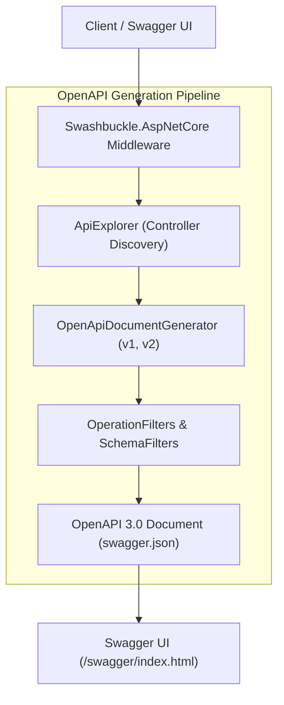
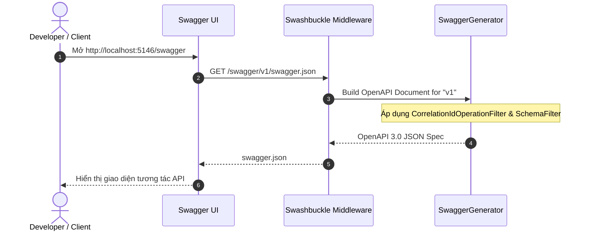

# 46-Swashbuckle: Tự Động Hóa Tài Liệu Hóa & Kiểm Thử Tương Tác API Với Swagger/OpenAPI

Dự án mẫu .NET 10 (C# 13) minh họa việc sử dụng thư viện **Swashbuckle.AspNetCore** để tự động sinh tài liệu chuẩn **OpenAPI (Swagger)**, hỗ trợ nhiều phiên bản API (V1 & V2), tích hợp chú thích XML (XML Documentation Comments), bộ lọc tùy biến (Operation & Schema Filters), và xác thực JWT Bearer trong giao diện Swagger UI tương tác.

---

## 1. Giới thiệu tổng quan về Swashbuckle

**Swashbuckle.AspNetCore** là thư viện phổ biến nhất trong hệ sinh thái .NET dùng để tích hợp công cụ Swagger/OpenAPI vào các dự án ASP.NET Core:
- Tự động quét (inspect) các Controller, Action, Route và Model để sinh tài liệu chuẩn OpenAPI (JSON/YAML).
- Cung cấp giao diện đồ họa tương tác trực quan (**Swagger UI**) cho phép các lập trình viên frontend, đối tác thứ ba và tester gọi thử API trực tiếp trên trình duyệt.
- Hỗ trợ đầy đủ các tính năng mở rộng: chú thích tài liệu XML, xác thực Bearer Token / API Key, đánh dấu phiên bản (API Versioning), và tùy biến metadata qua Filter.

---

## 2. Vị trí & Vai trò trong kiến trúc ứng dụng

```
┌────────────────────────────────────────────────────────┐
│                   ASP.NET Core App                     │
│    Controllers (V1 / V2) + XML Documentation Comments  │
└───────────────────────────┬────────────────────────────┘
                            │
                            ▼
┌────────────────────────────────────────────────────────┐
│               Swashbuckle.AspNetCore                   │
│  - SwaggerGenerator (Tạo OpenAPI Document)            │
│  - CorrelationIdOperationFilter (Thêm Header)          │
│  - ProductSchemaFilter (Tùy biến Schema Description)   │
└───────────────────────────┬────────────────────────────┘
                            │
            ┌───────────────┴───────────────┐
            ▼                               ▼
┌───────────────────────┐       ┌───────────────────────┐
│ /swagger/v1/swagger.json│      │  Swagger UI           │
│ /swagger/v2/swagger.json│      │  http://localhost:    │
│ (Machine-readable)    │       │  5146/swagger         │
└───────────────────────┘       └───────────────────────┘
```

- **Tầng Giao tiếp (API Contract)**: Đóng vai trò là bản hợp đồng dữ liệu chuẩn hóa giữa Backend và Frontend / Mobile / Microservices.
- **Tầng Phát triển & Thử nghiệm (Developer Experience - DX)**: Giúp nhà phát triển kiểm tra nhanh các API mà không cần dùng Postman hay curl.
- **Tầng Sinh Mã Nguồn Tự Động (Code Generation)**: File `swagger.json` có thể được dùng để sinh tự động Client SDK bằng NSwag, OpenAPI Generator hoặc Kiota.

---


## Sơ đồ Kiến trúc & Luồng dữ liệu (Architecture & Data Flow)

### 1. Sơ đồ Kiến trúc Tổng quan (Architecture Overview)


### 2. Mô hình Luồng dữ liệu Chi tiết (Data Flow & Sequence)


### 3. Các Use Cases Cụ thể trong Thực tế (Concrete Use Cases)
- **Tạo Tài liệu API Tự động**: Tự động sinh tài liệu OpenAPI 3.0 từ các Controller và Model C#.
- **Hỗ trợ Đa Phiên bản API (Multi-versioning)**: Phân tách rõ ràng tài liệu giữa phiên bản V1 và V2.
- **Tùy biến với Filters**: Thêm Header tùy chỉnh (Correlation ID, Bearer Token) và mô tả chi tiết bằng Operation Filters.


## 3. Cấu trúc thư mục dự án

```
46-Swashbuckle/
├── SwaggerDocumentation.slnx
├── README.md
├── SwaggerDocumentation.Api/
│   ├── SwaggerDocumentation.Api.csproj
│   ├── Program.cs
│   ├── Properties/
│   │   └── launchSettings.json
│   ├── appsettings.json
│   ├── SwaggerDocumentation.Api.http
│   ├── Models/
│   │   └── ProductModels.cs
│   ├── Filters/
│   │   ├── CorrelationIdOperationFilter.cs
│   │   └── ProductSchemaFilter.cs
│   └── Controllers/
│       ├── V1/
│       │   └── ProductsV1Controller.cs
│       └── V2/
│           └── ProductsV2Controller.cs
└── SwaggerDocumentation.Tests/
    ├── SwaggerDocumentation.Tests.csproj
    └── SwaggerDocTests.cs
```

---

## 4. Cài đặt & Cấu hình thư viện

### Cài đặt qua NuGet:
```bash
dotnet add package Swashbuckle.AspNetCore --version 10.2.3
dotnet add package Swashbuckle.AspNetCore.Annotations --version 10.2.3
```

### Khai báo trong `SwaggerDocumentation.Api.csproj`:
Bật `<GenerateDocumentationFile>true</GenerateDocumentationFile>` để trình biên dịch xuất file `.xml` chứa các chú thích code:
```xml
<Project Sdk="Microsoft.NET.Sdk.Web">
  <PropertyGroup>
    <TargetFramework>net10.0</TargetFramework>
    <Nullable>enable</Nullable>
    <ImplicitUsings>enable</ImplicitUsings>
    <GenerateDocumentationFile>true</GenerateDocumentationFile>
    <NoWarn>$(NoWarn);1591</NoWarn>
  </PropertyGroup>

  <ItemGroup>
    <PackageReference Include="Swashbuckle.AspNetCore" Version="10.2.3" />
    <PackageReference Include="Swashbuckle.AspNetCore.Annotations" Version="10.2.3" />
  </ItemGroup>
</Project>
```

---

## 5. Các khái niệm cốt lõi của Swashbuckle

### 5.1. `SwaggerDoc` (Định nghĩa tài liệu & phiên bản)
Cấu hình thông tin tài liệu như Tiêu đề, Phiên bản, Mô tả, Bản quyền và Người liên hệ:
```csharp
c.SwaggerDoc("v1", new OpenApiInfo { Title = "Products API - V1", Version = "v1" });
c.SwaggerDoc("v2", new OpenApiInfo { Title = "Products API - V2", Version = "v2" });
```

### 5.2. `IOperationFilter`
Cho phép can thiệp và chỉnh sửa siêu dữ liệu của từng endpoint (Action) trong tài liệu OpenAPI. Ví dụ thêm header `X-Correlation-Id`:
```csharp
public class CorrelationIdOperationFilter : IOperationFilter
{
    public void Apply(OpenApiOperation operation, OperationFilterContext context)
    {
        operation.Parameters ??= [];
        operation.Parameters.Add(new OpenApiParameter
        {
            Name = "X-Correlation-Id",
            In = ParameterLocation.Header,
            Required = false,
            Schema = new OpenApiSchema { Type = JsonSchemaType.String, Format = "uuid" }
        });
    }
}
```

### 5.3. `ISchemaFilter`
Tùy biến mô tả và cấu trúc của từng model trong tài liệu Swagger.

### 5.4. Annotations (`[SwaggerOperation]`, `[SwaggerResponse]`)
Gắn trực tiếp vào Controller/Action để chỉ định rõ `Summary`, `Description` và `OperationId`.

---

## 6. Triển khai Models & Controllers đa phiên bản

### 6.1. Phiên bản V1 (`ProductsV1Controller.cs`)
- Nhóm: `[ApiExplorerSettings(GroupName = "v1")]`
- Route: `api/v1/products`
- Model cơ bản: `ProductV1` (Id, Name, Price, Category).

### 6.2. Phiên bản V2 (`ProductsV2Controller.cs`)
- Nhóm: `[ApiExplorerSettings(GroupName = "v2")]`
- Route: `api/v2/products`
- Model nâng cao: `ProductV2` (Id, Sku, Name, Price, Category, Rating, InStock, Tags).

---

## 7. Tích hợp JWT Bearer & UI tùy biến

Trong `Program.cs`, cấu hình định nghĩa bảo mật:
```csharp
c.AddSecurityDefinition("Bearer", new OpenApiSecurityScheme
{
    Description = "Nhập token JWT theo định dạng: Bearer {token}",
    Name = "Authorization",
    In = ParameterLocation.Header,
    Type = SecuritySchemeType.ApiKey
});

c.AddSecurityRequirement(_ => new OpenApiSecurityRequirement
{
    { new OpenApiSecuritySchemeReference("Bearer"), new List<string>() }
});
```
Swagger UI hiển thị nút **Authorize** với biểu tượng ổ khóa, cho phép người dùng dán JWT token và tự động đính kèm vào mọi request sau đó.

---

## 8. Các kịch bản thực tế

1. **Quản lý đa phiên bản API trong cùng một ứng dụng**: Người dùng có thể chọn xem spec `v1` hoặc `v2` từ danh sách thả xuống ở góc trên cùng bên phải giao diện Swagger UI.
2. **Distributed Tracing Header**: Toàn bộ các API đều có trường `X-Correlation-Id` để tester có thể truyền mã vết theo dõi.
3. **XML Comments phong phú**: Các thẻ `<summary>`, `<param>`, `<returns>`, `<response>` được hiển thị đẹp mắt, rõ ràng trên UI.

---

## 9. Kiểm thử tự động (TDD & WebApplicationFactory)

Dự án kiểm thử gồm 9 test case:
1. `GetSwaggerV1Json_Returns200WithOpenApiDoc`: Kiểm tra tính hợp lệ của tài liệu JSON V1, chứa đường dẫn `/api/v1/products`, header `X-Correlation-Id` và định nghĩa `Bearer`.
2. `GetSwaggerV2Json_Returns200WithOpenApiDoc`: Kiểm tra tài liệu JSON V2 chứa `/api/v2/products`.
3. `GetSwaggerUI_Returns200`: Kiểm tra trang giao diện HTML Swagger UI tải thành công.
4. `GetProductsV1_Returns200`: Kiểm tra endpoint V1 trả về danh sách.
5. `GetProductsV2_Returns200`: Kiểm tra endpoint V2 trả về danh sách kèm SKU.
6. `CreateProductV1_Valid_Returns201WithLocation`: Kiểm tra tạo sản phẩm V1.
7. `CreateProductV2_Valid_Returns201WithLocation`: Kiểm tra tạo sản phẩm V2.
8. `CreateProductV1_EmptyName_Returns400`: Kiểm tra validation đầu vào.
9. `GetProductV1ById_NotFound_Returns404`: Kiểm tra trường hợp không tìm thấy.

---

## 10. Hướng dẫn chạy & Kiểm thử

### Chạy API trực tiếp:
```powershell
cd 46-Swashbuckle/SwaggerDocumentation.Api
dotnet run
# Mở Swagger UI tại: http://localhost:5146/swagger
```

### Chạy kiểm thử tự động:
```powershell
dotnet test 46-Swashbuckle/SwaggerDocumentation.slnx
```

---

## 11. So sánh Swashbuckle vs NSwag vs Microsoft.AspNetCore.OpenApi

| Tiêu chí | Swashbuckle | NSwag | Microsoft.AspNetCore.OpenApi (.NET 9+) |
|---|---|---|---|
| **Mục đích chính** | Sinh Swagger UI & spec | Sinh spec & Client SDK (TS/C#) | Sinh spec OpenAPI gốc |
| **Giao diện UI** | Tích hợp sẵn Swagger UI | Hỗ trợ cả Swagger UI & ReDoc | Cần dùng thư viện bên ngoài (Scalar/SwaggerUI) |
| **Cộng đồng & Mẫu có sẵn**| Lớn nhất trong .NET | Rất phổ biến | Mới ra mắt |
| **Tốc độ sinh spec** | Trung bình (Reflection) | Tốt | Rất nhanh (Source Gen / Native) |

---

## 12. Lưu ý & Best Practices

1. **Giới hạn truy cập Swagger UI trên Production**: Nên bọc `app.UseSwagger()` trong điều kiện `if (app.Environment.IsDevelopment())` hoặc yêu cầu phân quyền để tránh lộ cấu trúc API nội bộ ra Internet.
2. **Luôn bật `<GenerateDocumentationFile>`**: Chú thích XML là cách tự nhiên và sạch sẽ nhất để tài liệu hóa code mà không làm rác mã nguồn bằng quá nhiều attributes.
3. **Sử dụng `OperationId` duy nhất**: Đặt `OperationId` tường minh (ví dụ `GetProductsV1`) giúp các công cụ sinh mã nguồn (Client SDK generator) tạo ra tên phương thức đẹp mắt, không bị trùng lặp.
