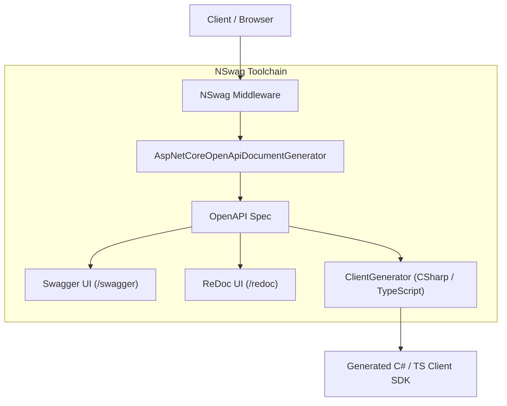
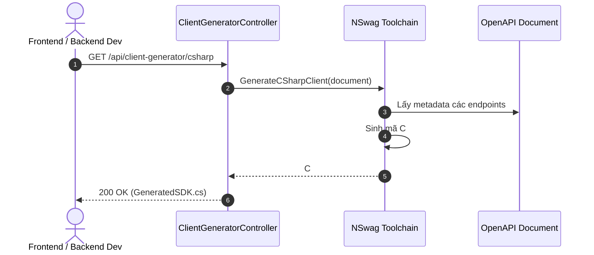

# 47-NSwag: Bộ Công Cụ OpenAPI Toàn Diện, Swagger UI, ReDoc & Tự Động Sinh Mã Nguồn Client SDK

Dự án mẫu .NET 10 (C# 13) minh họa việc sử dụng thư viện **NSwag** (`NSwag.AspNetCore`, `NSwag.CodeGeneration.CSharp`, `NSwag.CodeGeneration.TypeScript`) để thiết lập một chuỗi công cụ OpenAPI hoàn chỉnh: tự động sinh tài liệu chuẩn OpenAPI 3.0, phục vụ song song cả **Swagger UI** và **ReDoc UI**, và tự động sinh mã nguồn **Client SDK** cho cả **C#** và **TypeScript (Fetch API)** trực tiếp tại runtime.

---

## 1. Giới thiệu tổng quan về NSwag

**NSwag** là một bộ công cụ (toolchain) OpenAPI/Swagger toàn diện và mạnh mẽ bậc nhất trong hệ sinh thái .NET. Khác với Swashbuckle chủ yếu tập trung vào việc tạo Swagger UI:
- **NSwag vừa tạo tài liệu OpenAPI vừa sinh mã nguồn Client SDK**: Cung cấp các trình sinh mã chuyên dụng (`CSharpClientGenerator`, `TypeScriptClientGenerator`).
- **Hỗ trợ đa giao diện tài liệu**: Tích hợp sẵn cả **Swagger UI** (cho phép gọi thử API tương tác) và **ReDoc** (giao diện 3 cột hiện đại, cực kỳ đẹp mắt và dễ đọc cho tài liệu kỹ thuật).
- **Độ chính xác cao**: Sử dụng thư viện `NJsonSchema` nền tảng giúp phản ánh chính xác cấu trúc kiểu dữ liệu của C# (Nullable reference types, Enums dạng chuỗi, Records, Polymorphic inheritance).

---

## 2. Vị trí & Vai trò trong kiến trúc ứng dụng

```
┌────────────────────────────────────────────────────────┐
│                   TasksController                      │
│     (CRUD: Tasks, Priority, Status, Assignee)          │
└───────────────────────────┬────────────────────────────┘
                            │
                            ▼
┌────────────────────────────────────────────────────────┐
│                   NSwag Toolchain                      │
│  - AspNetCoreOpenApiDocumentGenerator                  │
│  - /swagger/v1/swagger.json                            │
└─────────────┬───────────────────────────┬──────────────┘
              │                           │
     ┌────────┴────────┐         ┌────────┴────────┐
     ▼                 ▼         ▼                 ▼
┌──────────┐     ┌──────────┐ ┌──────────────┐ ┌────────────────┐
│Swagger UI│     │ ReDoc UI │ │ C# Client    │ │ TypeScript     │
│ /swagger │     │  /redoc  │ │ Generator    │ │ Client (Fetch) │
└──────────┘     └──────────┘ └──────────────┘ └────────────────┘
```

- **Tầng Tài liệu Hóa (API Documentation)**: Cung cấp 2 lựa chọn giao diện: Swagger UI cho Devs/QA kiểm thử và ReDoc cho tài liệu tích hợp đối tác.
- **Tầng Đồng bộ Client - Server (Type-Safe Contracts)**: Đội ngũ Frontend (React/Angular/Vue) và ứng dụng Mobile/Desktop có thể tự động sinh Client SDK mỗi khi Backend cập nhật API, loại bỏ hoàn toàn lỗi gõ sai URL hoặc sai cấu trúc JSON.

---


## Sơ đồ Kiến trúc & Luồng dữ liệu (Architecture & Data Flow)

### 1. Sơ đồ Kiến trúc Tổng quan (Architecture Overview)


### 2. Mô hình Luồng dữ liệu Chi tiết (Data Flow & Sequence)


### 3. Các Use Cases Cụ thể trong Thực tế (Concrete Use Cases)
- **Sinh Mã SDK Client Tự Động**: Tự động tạo C# HttpClient hoặc TypeScript/Axios client từ OpenAPI spec, giúp Frontend không cần viết code gọi API thủ công.
- **Hỗ trợ Cả Swagger UI và ReDoc**: Cung cấp giao diện xem tài liệu phong phú, hiện đại.
- **Độ tương thích Cao**: Hỗ trợ đầy đủ các tính năng hiện đại của OpenAPI 3.0 và JSON Schema.


## 3. Cấu trúc thư mục dự án

```
47-NSwag/
├── NswagToolchain.slnx
├── README.md
├── NswagToolchain.Api/
│   ├── NswagToolchain.Api.csproj
│   ├── Program.cs
│   ├── Properties/
│   │   └── launchSettings.json
│   ├── appsettings.json
│   ├── NswagToolchain.Api.http
│   ├── Models/
│   │   └── TaskModels.cs
│   ├── Services/
│   │   └── TaskService.cs
│   └── Controllers/
│       ├── TasksController.cs
│       └── ClientGeneratorController.cs
└── NswagToolchain.Tests/
    ├── NswagToolchain.Tests.csproj
    └── NswagIntegrationTests.cs
```

---

## 4. Cài đặt & Cấu hình thư viện

### Cài đặt qua NuGet:
```bash
dotnet add package NSwag.AspNetCore --version 14.7.1
dotnet add package NSwag.Annotations --version 14.7.1
dotnet add package NSwag.CodeGeneration.CSharp --version 14.7.1
dotnet add package NSwag.CodeGeneration.TypeScript --version 14.7.1
```

### Khai báo trong `NswagToolchain.Api.csproj`:
```xml
<Project Sdk="Microsoft.NET.Sdk.Web">
  <PropertyGroup>
    <TargetFramework>net10.0</TargetFramework>
    <Nullable>enable</Nullable>
    <ImplicitUsings>enable</ImplicitUsings>
    <GenerateDocumentationFile>true</GenerateDocumentationFile>
    <NoWarn>$(NoWarn);1591</NoWarn>
  </PropertyGroup>

  <ItemGroup>
    <PackageReference Include="NSwag.AspNetCore" Version="14.7.1" />
    <PackageReference Include="NSwag.Annotations" Version="14.7.1" />
    <PackageReference Include="NSwag.CodeGeneration.CSharp" Version="14.7.1" />
    <PackageReference Include="NSwag.CodeGeneration.TypeScript" Version="14.7.1" />
  </ItemGroup>
</Project>
```

---

## 5. Các khái niệm cốt lõi của NSwag

### 5.1. `AddOpenApiDocument`
Đăng ký bộ sinh tài liệu OpenAPI 3.0 với DI container:
```csharp
builder.Services.AddOpenApiDocument(config =>
{
    config.DocumentName = "v1";
    config.Title = "Project Tasks API";
    config.Version = "v1";
    config.Description = "API quản lý tiến độ công việc dự án và tự động sinh mã nguồn Client SDK.";
});
```

### 5.2. `UseOpenApi`, `UseSwaggerUi` & `UseReDoc`
Kích hoạt middleware phục vụ tài liệu và giao diện đồ họa:
```csharp
app.UseOpenApi(); // /swagger/v1/swagger.json
app.UseSwaggerUi(settings => settings.Path = "/swagger");
app.UseReDoc(settings => settings.Path = "/redoc");
```

### 5.3. Sinh mã Client SDK (`CSharpClientGenerator` & `TypeScriptClientGenerator`)
NSwag nhận vào một `OpenApiDocument` và xuất ra chuỗi mã nguồn C# hoặc TypeScript hoàn chỉnh sẵn sàng biên dịch:
```csharp
var settings = new CSharpClientGeneratorSettings { ClassName = "TasksClient" };
var generator = new CSharpClientGenerator(document, settings);
string csharpCode = generator.GenerateFile();
```

---

## 6. Triển khai Models & Services

### 6.1. Domain Models (`TaskModels.cs`)
- `TaskPriority`: Enum (Low, Medium, High, Critical) có `[JsonConverter(typeof(JsonStringEnumConverter))]`.
- `TaskStatus`: Enum (Backlog, InProgress, Review, Done).
- `ProjectTask`: Model công việc (Id, Title, Description, Priority, Status, AssigneeEmail, DueDate, CreatedAt, UpdatedAt).
- `GeneratedClientResponse`: Kết quả trả về chứa mã nguồn SDK và ngôn ngữ.

### 6.2. `TaskService.cs`
- Quản lý danh sách công việc an toàn đa luồng (`ConcurrentDictionary`).
- Hỗ trợ lọc danh sách theo `status` và `priority`.
- Cung cấp đầy đủ các thao tác CRUD: Get, Create, UpdateStatus, Delete.

---

## 7. Triển khai API Controllers

### 7.1. `TasksController.cs`
- `GET /api/tasks`: Lấy danh sách kèm bộ lọc query parameters.
- `GET /api/tasks/{id}`: Chi tiết công việc.
- `POST /api/tasks`: Tạo mới công việc với mã trạng thái 201 và Location header.
- `PUT /api/tasks/{id}/status`: Cập nhật trạng thái công việc.
- `DELETE /api/tasks/{id}`: Xóa công việc (204 NoContent).

### 7.2. `ClientGeneratorController.cs`
- `GET /api/client-gen/csharp`: Sinh mã nguồn C# Client SDK (chứa `TasksClient` và namespace `ProjectManagement.Client`).
- `GET /api/client-gen/typescript`: Sinh mã nguồn TypeScript Fetch Client SDK.

---

## 8. Các tính năng nổi bật

1. **Phục vụ song song Swagger UI & ReDoc**:
   - Swagger UI (`/swagger`): Tương tác trực tiếp, gửi request thử nghiệm.
   - ReDoc (`/redoc`): Tài liệu trình bày 3 cột thanh lịch, tối ưu cho việc đọc và tra cứu.
2. **Sinh SDK C# & TypeScript thời gian thực**: Lập trình viên có thể truy cập endpoint `/api/client-gen/csharp` hoặc `/api/client-gen/typescript` để sao chép mã nguồn client mới nhất ngay sau khi backend cập nhật.

---

## 9. Kiểm thử tự động (TDD & WebApplicationFactory)

Toàn bộ 11 bài kiểm thử đều vượt qua:
- `GetOpenApiSpec_Returns200WithJsonSpec`: Kiểm tra tài liệu JSON OpenAPI tại `/swagger/v1/swagger.json`.
- `GetSwaggerUi_Returns200`: Kiểm tra giao diện Swagger UI.
- `GetReDocUi_Returns200`: Kiểm tra giao diện ReDoc UI.
- `GenerateCSharpClient_Returns200WithCode`: Kiểm tra mã C# sinh ra chứa `TasksClient` và namespace mong muốn.
- `GenerateTypeScriptClient_Returns200WithCode`: Kiểm tra mã TypeScript sinh ra chứa `TasksClient`.
- `GetTasks_Returns200WithList`: Kiểm tra danh sách công việc.
- `GetTasks_WithFilter_ReturnsMatchingTasks`: Kiểm tra bộ lọc trạng thái `InProgress`.
- `GetTaskById_NotFound_Returns404`: Kiểm tra mã lỗi 404 khi không tìm thấy Id.
- `CreateTask_Valid_Returns201WithLocation`: Kiểm tra tạo mới và header Location.
- `UpdateTaskStatus_Valid_Returns200`: Kiểm tra cập nhật trạng thái.
- `DeleteTask_Valid_Returns204`: Kiểm tra xóa thành công.

---

## 10. Hướng dẫn chạy & Kiểm thử

### Chạy API trực tiếp:
```powershell
cd 47-NSwag/NswagToolchain.Api
dotnet run
# Mở Swagger UI tại: http://localhost:5147/swagger
# Mở ReDoc UI tại:   http://localhost:5147/redoc
```

### Chạy kiểm thử tự động:
```powershell
dotnet test 47-NSwag/NswagToolchain.slnx
```

---

## 11. So sánh NSwag vs Swashbuckle vs Kiota

| Tiêu chí | NSwag | Swashbuckle | Microsoft Kiota |
|---|---|---|---|
| **Sinh Client SDK** | Tích hợp sẵn (C#, TypeScript) | Cần công cụ ngoài | Rất mạnh (đa ngôn ngữ) |
| **Giao diện tài liệu** | Cả Swagger UI & ReDoc | Chỉ Swagger UI | Không có giao diện UI |
| **Tính chính xác Schema**| Rất cao (NJsonSchema) | Khá | Rất cao |
| **Tích hợp MSBuild/CLI** | Có (`NSwag.MSBuild`, `nswag`) | Hạn chế | Có CLI riêng (`kiota`) |

---

## 12. Lưu ý & Best Practices

1. **Sử dụng `NSwag.MSBuild` trong CI/CD**: Cấu hình MSBuild target để tự động xuất file `.ts` vào thư mục dự án Frontend mỗi khi Backend được build, giúp đảm bảo tính đồng bộ tuyệt đối.
2. **Khai báo kiểu Enum rõ ràng**: Luôn sử dụng `[JsonConverter(typeof(JsonStringEnumConverter))]` để NSwag sinh enum dạng chuỗi (`"InProgress"`) thay vì số nguyên (`1`), giúp code client dễ đọc và ít bị lỗi khi thứ tự enum thay đổi.
3. **Phân quyền truy cập ReDoc và Swagger UI trên môi trường Production**: Tương tự Swashbuckle, hãy chỉ kích hoạt middleware trong môi trường `Development` hoặc sau lớp bảo vệ xác thực.
