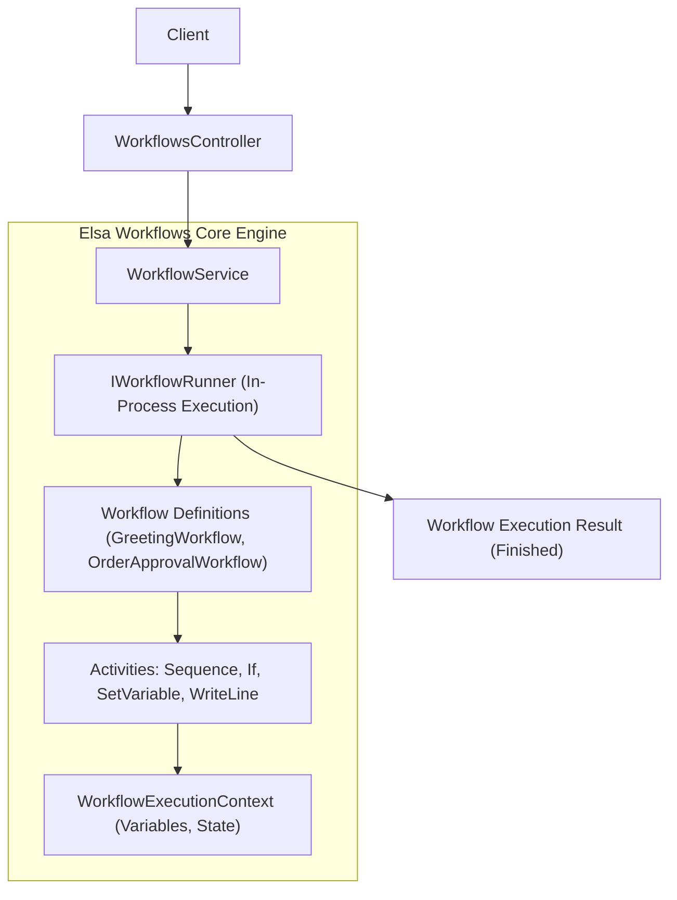
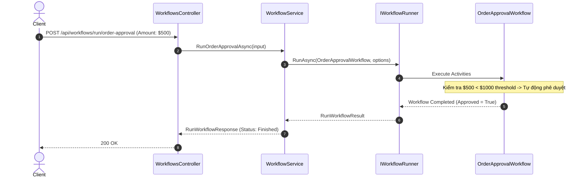

# 48-Elsa: Workflow Engine trong .NET 10

## 1. Giới thiệu tổng quan
**Elsa Workflows** là một bộ thư viện workflow engine mã nguồn mở mạnh mẽ dành cho .NET, cho phép xây dựng các quy trình nghiệp vụ phức tạp, phân tán hoặc in-process thông qua lập trình bằng C# hoặc giao diện kéo thả trực quan.

Dự án mẫu này minh họa:
- Khởi tạo workflow bằng Fluent C# Code-first (`WorkflowBase`, `Sequence`, `If`, `SetVariable`, `WriteLine`).
- Quản trị workflow definitions và thực thi workflow thông qua ASP.NET Core API Controllers.
- Áp dụng luồng phê duyệt đơn hàng tự động (`OrderApprovalWorkflow`) dựa trên ngưỡng số tiền ($1000).

## 2. Kiến trúc & Cấu trúc dự án
```
48-Elsa/
├── WorkflowEngine.slnx
├── README.md
├── WorkflowEngine.Api/
│   ├── WorkflowEngine.Api.csproj
│   ├── Program.cs
│   ├── Properties/launchSettings.json
│   ├── appsettings.json
│   ├── WorkflowEngine.Api.http
│   ├── Models/
│   │   └── WorkflowModels.cs
│   ├── Services/
│   │   └── WorkflowService.cs
│   ├── Workflows/
│   │   └── WorkflowDefinitions.cs
│   └── Controllers/
│       └── WorkflowsController.cs
└── WorkflowEngine.Tests/
    ├── WorkflowEngine.Tests.csproj
    └── WorkflowIntegrationTests.cs
```


## Sơ đồ Kiến trúc & Luồng dữ liệu (Architecture & Data Flow)

### 1. Sơ đồ Kiến trúc Tổng quan (Architecture Overview)


### 2. Mô hình Luồng dữ liệu Chi tiết (Data Flow & Sequence)


### 3. Các Use Cases Cụ thể trong Thực tế (Concrete Use Cases)
- **Tự động hóa Quy trình Nghiệp vụ (Business Process Automation)**: Phê duyệt đơn hàng, tuyển dụng nhân sự, xử lý hồ sơ vay vốn.
- **Lập trình Quy trình Code-First**: Viết workflow bằng C# có kiểm tra kiểu dữ liệu chặt chẽ, dễ debug và unit test.
- **Quy trình Phân tán (Long-running Workflows)**: Dễ dàng mở rộng sang workflow chạy ngầm nhiều ngày có dừng lại chờ sự kiện bên ngoài.


## 3. Cài đặt Package
```xml
<PackageReference Include="Elsa" Version="3.8.2" />
<PackageReference Include="Swashbuckle.AspNetCore" Version="10.2.3" />
```

## 4. Cấu hình Program.cs
Đăng ký runtime workflow của Elsa:
```csharp
builder.Services.AddElsa(elsa =>
{
    elsa.UseWorkflowRuntime(runtime =>
    {
        runtime.AddWorkflow<GreetingWorkflow>();
        runtime.AddWorkflow<OrderApprovalWorkflow>();
    });
});

builder.Services.AddScoped<WorkflowService>();
```

## 5. Định nghĩa Workflow Code-First
```csharp
public class OrderApprovalWorkflow : WorkflowBase
{
    public static readonly decimal ApprovalThreshold = 1000m;

    protected override void Build(IWorkflowBuilder builder)
    {
        var orderId = builder.WithVariable<string>("OrderId", "");
        var amount = builder.WithVariable<decimal>("Amount", 0m);
        var requestedBy = builder.WithVariable<string>("RequestedBy", "");
        var isApproved = builder.WithVariable<bool>("IsApproved", false);
        var reason = builder.WithVariable<string>("Reason", "");

        builder.Root = new Sequence
        {
            Activities =
            {
                new If(context => amount.Get(context) < ApprovalThreshold)
                {
                    Then = new Sequence
                    {
                        Activities =
                        {
                            new SetVariable<bool>(isApproved, _ => true),
                            new SetVariable<string>(reason, context => $"Auto-approved: Amount {amount.Get(context):C} is below threshold"),
                        }
                    },
                    Else = new Sequence
                    {
                        Activities =
                        {
                            new SetVariable<bool>(isApproved, _ => false),
                            new SetVariable<string>(reason, context => $"Requires manual review: Amount exceeds threshold"),
                        }
                    }
                }
            }
        };
    }
}
```

## 6. Controller API
Sử dụng `[ApiController]` với `ControllerBase`:
- `GET /api/workflows/definitions`: Danh sách các quy trình nghiệp vụ đã đăng ký.
- `POST /api/workflows/run/greeting?name={name}`: Chạy quy trình chào hỏi.
- `POST /api/workflows/run/order-approval`: Chạy quy trình duyệt đơn hàng với rẽ nhánh điều kiện.

## 7. Đánh giá & Phản biện (Code Review)
- **Tương thích luồng cũ**: Sử dụng `IWorkflowRunner` để chạy in-process phù hợp với REST API request-response ngắn hạn, không can thiệp hay ảnh hưởng đến luồng lưu trữ cũ.
- **Hiệu năng ứng dụng (App Level)**: `IWorkflowRunner` thực thi nhẹ nhàng trong bộ nhớ mà không cần kết nối cơ sở dữ liệu bên ngoài khi chạy lightweight tasks.
- **Mức độ mở rộng**: Elsa 3.8 hỗ trợ scale out qua `IWorkflowDispatcher` và background queues khi nghiệp vụ phát triển sang long-running workflows.

## 8. Hướng dẫn chạy dự án
```bash
cd 48-Elsa/WorkflowEngine.Api
dotnet run
```
Mở Swagger UI tại: `http://localhost:5148/swagger`

## 9. Hướng dẫn chạy kiểm thử
```bash
cd 48-Elsa
dotnet test WorkflowEngine.slnx
```

## 10. Ví dụ Request/Response
**Request:**
```http
POST /api/workflows/run/order-approval HTTP/1.1
Content-Type: application/json

{
  "orderId": "ORD-12345",
  "amount": 450.00,
  "requestedBy": "user@example.com"
}
```

**Response:**
```json
{
  "workflowInstanceId": "e305ffae21c045b38cb7ff5877f28734",
  "status": "Finished"
}
```

## 11. Các cạm bẫy thường gặp (Gotchas)
- Trong Elsa 3.x, các namespace đã chuyển phần lớn về `Elsa.Workflows` thay vì `Elsa.Workflows.Core.Contracts` như Elsa 2.x.
- Khi truyền input vào workflow in-process qua `RunWorkflowOptions.Input`, các biến cần được đồng bộ tên với `WithVariable`.

## 12. Tài liệu tham khảo
- [Elsa Workflows Official Docs](https://elsaworkflows.io/)
- [Elsa GitHub Repository](https://github.com/elsa-workflows/elsa-core)
