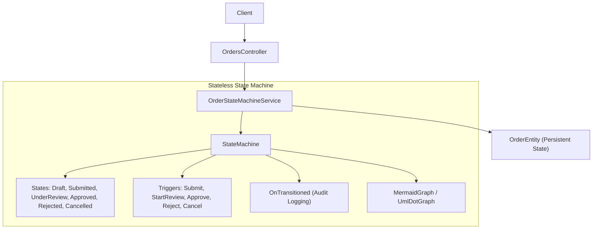
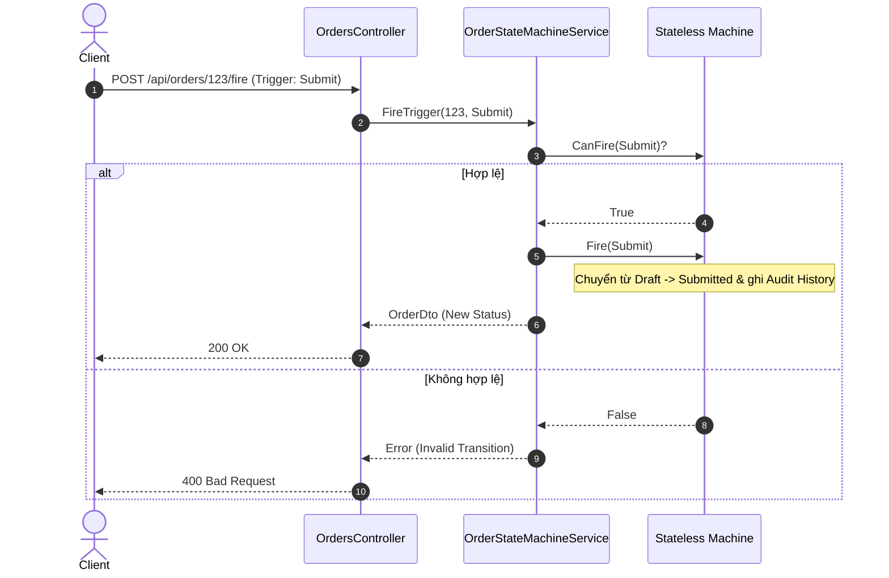
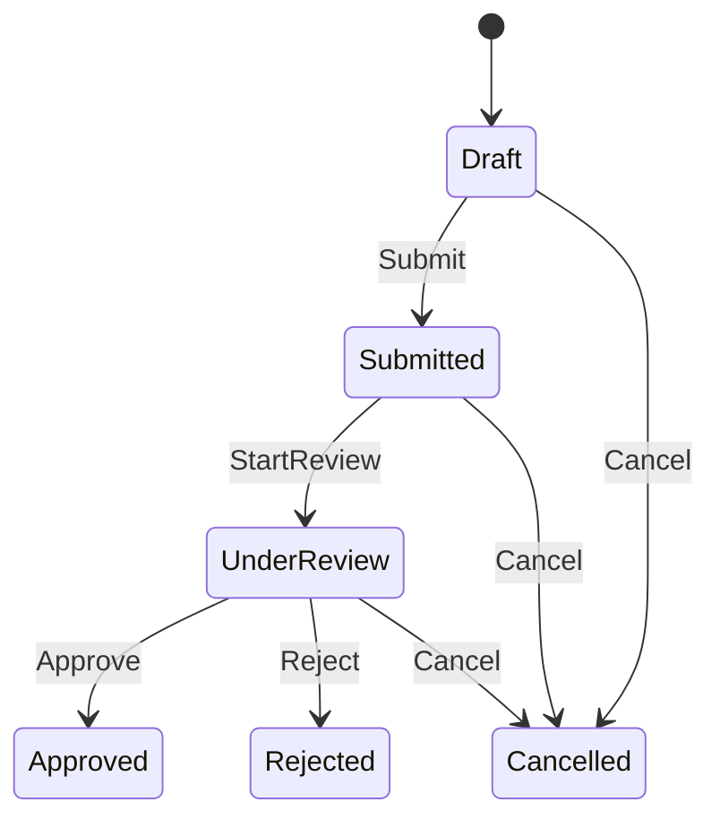

# 49-Stateless: Quản lý Máy trạng thái (State Machine) trong .NET 10

## 1. Giới thiệu tổng quan
**Stateless** là một thư viện C# gọn nhẹ và linh hoạt dùng để tạo và quản lý máy trạng thái hữu hạn (Finite State Machines - FSM) trực tiếp trong mã nguồn .NET.

Dự án mẫu này minh họa:
- Mô hình hóa vòng đời đơn hàng (`Draft` -> `Submitted` -> `UnderReview` -> `Approved` / `Rejected` / `Cancelled`).
- Ràng buộc chuyển đổi trạng thái hợp lệ, ngăn ngừa lỗi logic nghiệp vụ.
- Tra cứu danh sách các trigger được phép thực thi (`PermittedTriggers`).
- Ghi vết lịch sử chuyển đổi (`OnTransitioned`) phục vụ audit log.
- Xuất biểu đồ máy trạng thái dạng DOT (Graphviz) và Mermaid.

## 2. Kiến trúc & Cấu trúc dự án
```
49-Stateless/
├── StateMachineDemo.slnx
├── README.md
├── StateMachineDemo.Api/
│   ├── StateMachineDemo.Api.csproj
│   ├── Program.cs
│   ├── Properties/launchSettings.json
│   ├── appsettings.json
│   ├── StateMachineDemo.Api.http
│   ├── Models/
│   │   └── OrderStateModels.cs
│   ├── Services/
│   │   └── OrderStateMachineService.cs
│   └── Controllers/
│       └── OrdersController.cs
└── StateMachineDemo.Tests/
    ├── StateMachineDemo.Tests.csproj
    └── OrderStateMachineTests.cs
```


## Sơ đồ Kiến trúc & Luồng dữ liệu (Architecture & Data Flow)

### 1. Sơ đồ Kiến trúc Tổng quan (Architecture Overview)


### 2. Mô hình Luồng dữ liệu Chi tiết (Data Flow & Sequence)


### 3. Các Use Cases Cụ thể trong Thực tế (Concrete Use Cases)
- **Quản lý Vòng đời Thực thể (Entity Lifecycle Management)**: Đơn hàng, vé hỗ trợ (Ticket), bài viết blog, hồ sơ xin việc.
- **Ngăn chặn Lỗi Logic Nghiệp vụ**: Tuyệt đối không cho phép nhảy cóc trạng thái (ví dụ: không thể duyệt đơn hàng khi chưa nộp).
- **Xuất Biểu đồ Tự động**: Sinh sơ đồ Mermaid hoặc Graphviz DOT trực tiếp từ code để tài liệu hóa trạng thái.


## 3. Cài đặt Package
```xml
<PackageReference Include="Stateless" Version="5.20.1" />
<PackageReference Include="Swashbuckle.AspNetCore" Version="10.2.3" />
```

## 4. Cấu hình State Machine
```csharp
var machine = new StateMachine<OrderStatus, OrderTrigger>(
    () => order.Status,
    s => order.Status = s);

machine.Configure(OrderStatus.Draft)
    .Permit(OrderTrigger.Submit, OrderStatus.Submitted)
    .Permit(OrderTrigger.Cancel, OrderStatus.Cancelled);

machine.Configure(OrderStatus.Submitted)
    .Permit(OrderTrigger.StartReview, OrderStatus.UnderReview)
    .Permit(OrderTrigger.Cancel, OrderStatus.Cancelled);

machine.Configure(OrderStatus.UnderReview)
    .Permit(OrderTrigger.Approve, OrderStatus.Approved)
    .Permit(OrderTrigger.Reject, OrderStatus.Rejected)
    .Permit(OrderTrigger.Cancel, OrderStatus.Cancelled);

machine.OnTransitioned(t =>
{
    order.History.Add(new OrderHistoryItem(t.Source, t.Destination, t.Trigger, reason, DateTime.UtcNow));
});
```

## 5. Controller API
Sử dụng `[ApiController]` kế thừa `ControllerBase`:
- `POST /api/orders`: Tạo mới đơn hàng ở trạng thái `Draft`.
- `GET /api/orders/{id}`: Xem chi tiết đơn hàng, trạng thái hiện tại và các trigger hợp lệ.
- `POST /api/orders/{id}/fire`: Kích hoạt trigger chuyển trạng thái.
- `GET /api/orders/{id}/graph?format=mermaid`: Xuất sơ đồ FSM trực quan.

## 6. Đánh giá & Phản biện (Code Review)
- **Tương thích luồng cũ**: Stateless lưu trạng thái trực tiếp vào entity thông qua delegate getter/setter `() => entity.Status, s => entity.Status = s`, hoàn toàn tương thích với EF Core hoặc bất kỳ ORM nào mà không cần schema riêng biệt.
- **Hiệu năng ứng dụng (App Level)**: Stateless là in-memory library thuần túy, overhead cực thấp (vài microsecond mỗi transition), không phân bổ tài nguyên nặng.
- **An toàn logic**: Phương thức `CanFire` giúp xác thực trước khi kích hoạt trigger, loại bỏ hoàn toàn các trạng thái không hợp lệ ngoài ý muốn.

## 7. Hướng dẫn chạy dự án
```bash
cd 49-Stateless/StateMachineDemo.Api
dotnet run
```
Mở Swagger UI tại: `http://localhost:5149/swagger`

## 8. Hướng dẫn chạy kiểm thử
```bash
cd 49-Stateless
dotnet test StateMachineDemo.slnx
```

## 9. Ví dụ Request/Response
**Request kích hoạt trigger:**
```http
POST /api/orders/abc123/fire HTTP/1.1
Content-Type: application/json

{
  "trigger": 0,
  "reason": "Khách hàng xác nhận gửi đơn"
}
```

**Response:**
```json
{
  "id": "abc123",
  "customerName": "Nguyen Van A",
  "totalAmount": 1500.0,
  "status": "Submitted",
  "permittedTriggers": ["StartReview", "Cancel"],
  "history": [
    {
      "fromStatus": "Draft",
      "toStatus": "Submitted",
      "trigger": "Submit",
      "reason": "Khách hàng xác nhận gửi đơn",
      "timestamp": "2026-09-20T09:30:00Z"
    }
  ],
  "createdAt": "2026-09-20T09:25:00Z"
}
```

## 10. Xuất biểu đồ Mermaid
Endpoint `GET /api/orders/{id}/graph?format=mermaid` trả về cấu trúc FSM:


## 11. Các cạm bẫy thường gặp (Gotchas)
- Gọi `machine.Fire(trigger)` khi `machine.CanFire(trigger) == false` sẽ ném ngoại lệ `InvalidOperationException`. Luôn kiểm tra `CanFire` hoặc bắt ngoại lệ.
- Trên Stateless phiên bản 5+, khuyến nghị sử dụng `PermittedTriggersAsync` / `FireAsync` khi các action entry/exit là bất đồng bộ.

## 12. Tài liệu tham khảo
- [Stateless GitHub Repository](https://github.com/dotnet-state-machine/stateless)
- [Stateless NuGet Package](https://www.nuget.org/packages/Stateless)
