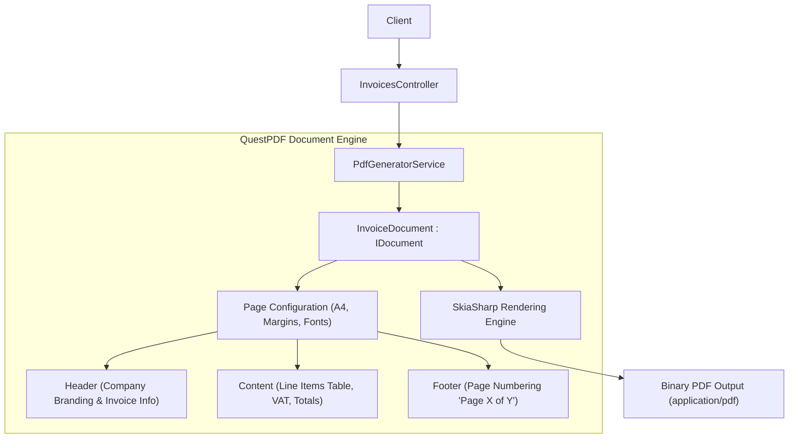
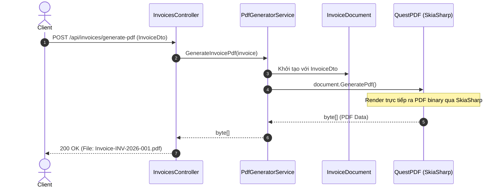

# 50-QuestPDF: Tạo tài liệu PDF theo phong cách Code-First trong .NET 10

## 1. Giới thiệu tổng quan
**QuestPDF** là một thư viện mã nguồn mở hiện đại, hiệu năng cao dùng để tạo file PDF bằng C# theo phong cách Fluent API & Code-first, thay thế các giải pháp HTML-to-PDF cồng kềnh.

Dự án mẫu này minh họa:
- Thiết kế hóa đơn bán hàng (`InvoiceDocument`) triển khai `IDocument` với cấu trúc Header, Content, Table, Summary và Footer.
- Tính toán tự động tổng tiền, thuế VAT (10%), phân trang tự động ("Page X of Y").
- Cấu hình bản quyền `Community` và quản lý phông chữ an toàn đa nền tảng (`Fonts.Lato`).
- API Controller trả về file tải trực tiếp (`application/pdf`) hoặc xem trước metadata.

## 2. Kiến trúc & Cấu trúc dự án
```
50-QuestPDF/
├── PdfReportGenerator.slnx
├── README.md
├── PdfReportGenerator.Api/
│   ├── PdfReportGenerator.Api.csproj
│   ├── Program.cs
│   ├── Properties/launchSettings.json
│   ├── appsettings.json
│   ├── PdfReportGenerator.Api.http
│   ├── Models/
│   │   └── InvoicePdfModels.cs
│   ├── Documents/
│   │   └── InvoiceDocument.cs
│   ├── Services/
│   │   └── PdfGeneratorService.cs
│   └── Controllers/
│       └── InvoicesController.cs
└── PdfReportGenerator.Tests/
    ├── PdfReportGenerator.Tests.csproj
    └── InvoicePdfTests.cs
```


## Sơ đồ Kiến trúc & Luồng dữ liệu (Architecture & Data Flow)

### 1. Sơ đồ Kiến trúc Tổng quan (Architecture Overview)


### 2. Mô hình Luồng dữ liệu Chi tiết (Data Flow & Sequence)


### 3. Các Use Cases Cụ thể trong Thực tế (Concrete Use Cases)
- **Xuất Báo cáo & Hóa đơn Điện tử (Invoices / Statements)**: Tạo file PDF hóa đơn bán hàng, phiếu thu, bảng kê chi tiết.
- **Tạo Chứng chỉ & Báo cáo Phân tích**: Báo cáo tài chính, chứng nhận hoàn thành khóa học.
- **Thay thế Giải pháp HTML-to-PDF**: Nhanh hơn gấp 10 lần, tốn ít tài nguyên máy chủ hơn và hoàn toàn độc lập với trình duyệt.


## 3. Cài đặt Package
```xml
<PackageReference Include="QuestPDF" Version="2026.9.0" />
<PackageReference Include="Swashbuckle.AspNetCore" Version="10.2.3" />
```

## 4. Cấu hình License & Settings
Trước khi tạo tài liệu PDF, cần khai báo loại License và cấu hình phông chữ:
```csharp
QuestPDF.Settings.License = LicenseType.Community;
QuestPDF.Settings.UseSystemFonts = false;
QuestPDF.Settings.ThrowOnMissingFontFamilies = false;
```

## 5. Thiết kế Layout với Fluent API
```csharp
public class InvoiceDocument : IDocument
{
    private readonly InvoiceDto _model;

    public void Compose(IDocumentContainer container)
    {
        container.Page(page =>
        {
            page.Margin(40);
            page.Size(PageSizes.A4);
            page.DefaultTextStyle(x => x.FontSize(10).FontFamily("Lato"));

            page.Header().Element(ComposeHeader);
            page.Content().Element(ComposeContent);
            page.Footer().Element(ComposeFooter);
        });
    }
}
```

## 6. Controller API
Sử dụng `[ApiController]` kế thừa `ControllerBase`:
- `GET /api/invoices/sample`: Lấy dữ liệu hóa đơn mẫu.
- `POST /api/invoices/generate-pdf`: Nhận dữ liệu hóa đơn và trả về luồng binary PDF (`FileContentResult`).
- `POST /api/invoices/metadata`: Lấy thông tin kích thước và số trang mà không cần tải toàn bộ file.

## 7. Đánh giá & Phản biện (Code Review)
- **Tương thích luồng cũ**: Hoàn toàn độc lập, không thay đổi schema cơ sở dữ liệu hay mô hình dữ liệu hiện tại. Đầu vào là DTO thuần túy.
- **Hiệu năng ứng dụng (App Level)**: QuestPDF render trực tiếp thông qua SkiaSharp engine, nhanh gấp nhiều lần so với giải pháp chạy headless Chromium (như PuppeteerSharp hay wkhtmltopdf), tiết kiệm đáng kể CPU và RAM server.
- **Tính khả chuyển (Cross-Platform)**: Sử dụng font nhúng sẵn (`Lato`) và tắt phụ thuộc system fonts để đảm bảo hiển thị đồng nhất trên cả Windows, Linux và Docker containers.

## 8. Hướng dẫn chạy dự án
```bash
cd 50-QuestPDF/PdfReportGenerator.Api
dotnet run
```
Mở Swagger UI tại: `http://localhost:5150/swagger`

## 9. Hướng dẫn chạy kiểm thử
```bash
cd 50-QuestPDF
dotnet test PdfReportGenerator.slnx
```

## 10. Ví dụ Request/Response
**Request:**
```http
POST /api/invoices/generate-pdf HTTP/1.1
Content-Type: application/json

{
  "invoiceNumber": "INV-2026-001",
  "issueDate": "2026-09-20T00:00:00Z",
  "dueDate": "2026-10-20T00:00:00Z",
  "sellerName": "VNPT IT",
  "sellerAddress": "Hanoi, Vietnam",
  "customerName": "Customer Inc",
  "customerEmail": "billing@customer.com",
  "customerAddress": "Danang, Vietnam",
  "items": [
    {
      "description": "Cloud Hosting Service",
      "quantity": 1,
      "unitPrice": 500.00
    }
  ]
}
```

**Response:**
File download: `Invoice-INV-2026-001.pdf` (Content-Type: `application/pdf`).

## 11. Các cạm bẫy thường gặp (Gotchas)
- Quên gán `QuestPDF.Settings.License = LicenseType.Community;` sẽ dẫn đến ngoại lệ bản quyền khi chạy.
- Trên Linux/Docker, nếu chỉ định font hệ thống (như `Arial`, `Times New Roman`) mà container không cài đặt font package, QuestPDF sẽ ném `DocumentDrawingException` trừ khi `ThrowOnMissingFontFamilies = false`.

## 12. Tài liệu tham khảo
- [QuestPDF Official Documentation](https://www.questpdf.com/)
- [QuestPDF GitHub Repository](https://github.com/QuestPDF/QuestPDF)
