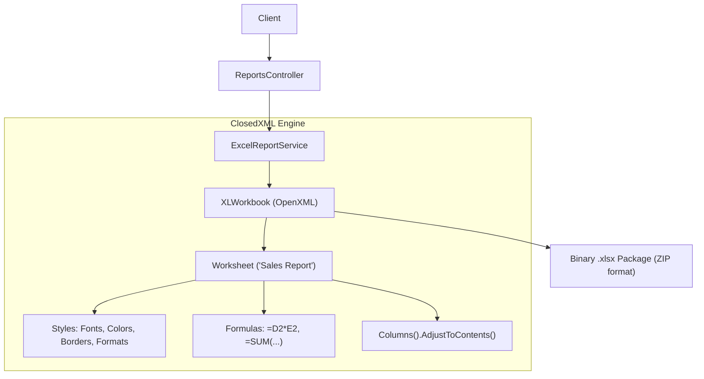
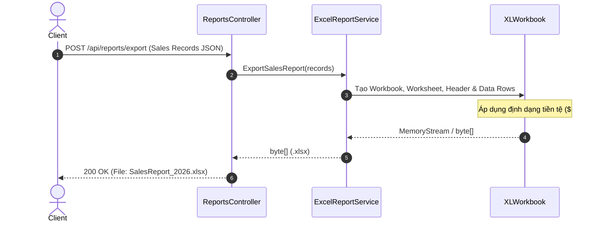

# 51-ClosedXML: Đọc và Ghi file Excel (.xlsx) trong .NET 10

## 1. Giới thiệu tổng quan
**ClosedXML** là một thư viện .NET phổ biến và mạnh mẽ giúp đọc, thao tác và tạo các tập tin Microsoft Excel 2007+ (.xlsx) dựa trên OpenXML mà không yêu cầu cài đặt Microsoft Office trên server.

Dự án mẫu này minh họa:
- Xuất dữ liệu giao dịch bán hàng ra file Excel được định dạng chuyên nghiệp: tiêu đề in đậm, màu nền thương hiệu (`#1B365D`), định dạng số tiền (`$#,##0.00`), công thức tự động (`=SUM(...)`, `=D2*E2`), zebra striping và auto-fit độ rộng cột.
- Đọc và phân tích file Excel tải lên (`IFormFile`), bóc tách dữ liệu thành danh sách DTO có kiểm tra tính hợp lệ và thu thập lỗi chi tiết từng dòng.
- Vòng lặp kiểm thử trọn vẹn (Round-trip test): xuất file Excel rồi tải lại chính file đó để xác thực độ chính xác 100% của dữ liệu.

## 2. Kiến trúc & Cấu trúc dự án
```
51-ClosedXML/
├── ExcelReportManager.slnx
├── README.md
├── ExcelReportManager.Api/
│   ├── ExcelReportManager.Api.csproj
│   ├── Program.cs
│   ├── Properties/launchSettings.json
│   ├── appsettings.json
│   ├── ExcelReportManager.Api.http
│   ├── Models/
│   │   └── ReportModels.cs
│   ├── Services/
│   │   └── ExcelReportService.cs
│   └── Controllers/
│       └── ReportsController.cs
└── ExcelReportManager.Tests/
    ├── ExcelReportManager.Tests.csproj
    └── ExcelReportTests.cs
```


## Sơ đồ Kiến trúc & Luồng dữ liệu (Architecture & Data Flow)

### 1. Sơ đồ Kiến trúc Tổng quan (Architecture Overview)


### 2. Mô hình Luồng dữ liệu Chi tiết (Data Flow & Sequence)


### 3. Các Use Cases Cụ thể trong Thực tế (Concrete Use Cases)
- **Xuất Báo cáo Tài chính & Bán hàng (Excel Export)**: Định dạng đẹp, có công thức tính toán tự động mà người dùng có thể mở trong Microsoft Excel.
- **Nhập Liệu Hàng loạt (Excel Import)**: Đọc dữ liệu từ file Excel của người dùng tải lên, kiểm tra tính hợp lệ và lưu vào database.
- **Xử lý Bảng tính mà Không cần Cài Office**: Chạy hoàn toàn độc lập trên máy chủ Linux/Docker.


## 3. Cài đặt Package
```xml
<PackageReference Include="ClosedXML" Version="0.105.1" />
<PackageReference Include="Swashbuckle.AspNetCore" Version="10.2.3" />
```

## 4. Tạo và Định dạng Bảng tính Excel
```csharp
using var workbook = new XLWorkbook();
var worksheet = workbook.Worksheets.Add("Sales Report");

// Header
worksheet.Cell(1, 1).Value = "Transaction ID";
worksheet.Cell(1, 2).Value = "Customer Name";
worksheet.Range(1, 1, 1, 7).Style.Font.Bold = true;
worksheet.Range(1, 1, 1, 7).Style.Fill.BackgroundColor = XLColor.FromHtml("#1B365D");

// Formulas & Formatting
worksheet.Cell(row, 6).FormulaA1 = $"=D{row}*E{row}";
worksheet.Cell(row, 6).Style.NumberFormat.Format = "$#,##0.00";

// Tự động căn chỉnh độ rộng cột
worksheet.Columns().AdjustToContents();
```

## 5. Controller API
Sử dụng `[ApiController]` kế thừa `ControllerBase`:
- `GET /api/reports/sample-data`: Lấy dữ liệu bán hàng mẫu để kiểm thử.
- `POST /api/reports/export`: Nhận danh sách giao dịch và trả về file `.xlsx` (`application/vnd.openxmlformats-officedocument.spreadsheetml.sheet`).
- `POST /api/reports/import`: Nhận file `.xlsx` qua multipart form-data và phân tích thành dữ liệu có cấu trúc.

## 6. Đánh giá & Phản biện (Code Review)
- **Tương thích luồng cũ**: Hoạt động hoàn toàn độc lập ở tầng Application/Presentation, chuyển đổi hai chiều giữa file Excel và DTOs mà không can thiệp vào tầng cơ sở dữ liệu.
- **Hiệu năng ứng dụng (App Level)**: ClosedXML tải toàn bộ DOM của Excel vào bộ nhớ RAM. Đối với các file cực lớn (> 100,000 dòng), nên cân nhắc sử dụng streaming với OpenXML SAX reader để tránh tốn dung lượng RAM. Đối với báo cáo nghiệp vụ thông thường (< 10,000 dòng), ClosedXML cung cấp trải nghiệm API trực quan, dễ bảo trì nhất.
- **Tính toàn vẹn dữ liệu**: Việc sử dụng công thức Excel gốc (`=SUM(...)`) thay vì tính sẵn số cứng cho phép người dùng mở file trong Excel và tiếp tục chỉnh sửa số liệu mà tổng số vẫn tự động cập nhật chính xác.

## 7. Hướng dẫn chạy dự án
```bash
cd 51-ClosedXML/ExcelReportManager.Api
dotnet run
```
Mở Swagger UI tại: `http://localhost:5151/swagger`

## 8. Hướng dẫn chạy kiểm thử
```bash
cd 51-ClosedXML
dotnet test ExcelReportManager.slnx
```

## 9. Ví dụ Request/Response
**Request Xuất Báo Cáo:**
```http
POST /api/reports/export HTTP/1.1
Content-Type: application/json

[
  {
    "transactionId": "TXN-1001",
    "customerName": "Acme Corp",
    "product": "Cloud Service",
    "quantity": 5,
    "unitPrice": 1200.00,
    "saleDate": "2026-01-15T00:00:00Z"
  }
]
```

**Response:** File download `SalesReport_20260920_093000.xlsx`.

## 10. Các cạm bẫy thường gặp (Gotchas)
- Khi đọc file Excel người dùng upload, luôn bỏ qua dòng tiêu đề và kiểm tra dòng tổng cộng (`TOTAL`) để tránh import nhầm dòng tóm tắt thành một bản ghi dữ liệu.
- Các ô công thức (`FormulaA1`) trong ClosedXML nếu muốn đọc giá trị đã tính toán từ Excel cần gọi `cell.CachedValue` hoặc đảm bảo file đã được Excel tính toán trước khi lưu.

## 11. Tài liệu tham khảo
- [ClosedXML Official Documentation](https://closedxml.readthedocs.io/)
- [ClosedXML GitHub Repository](https://github.com/ClosedXML/ClosedXML)
