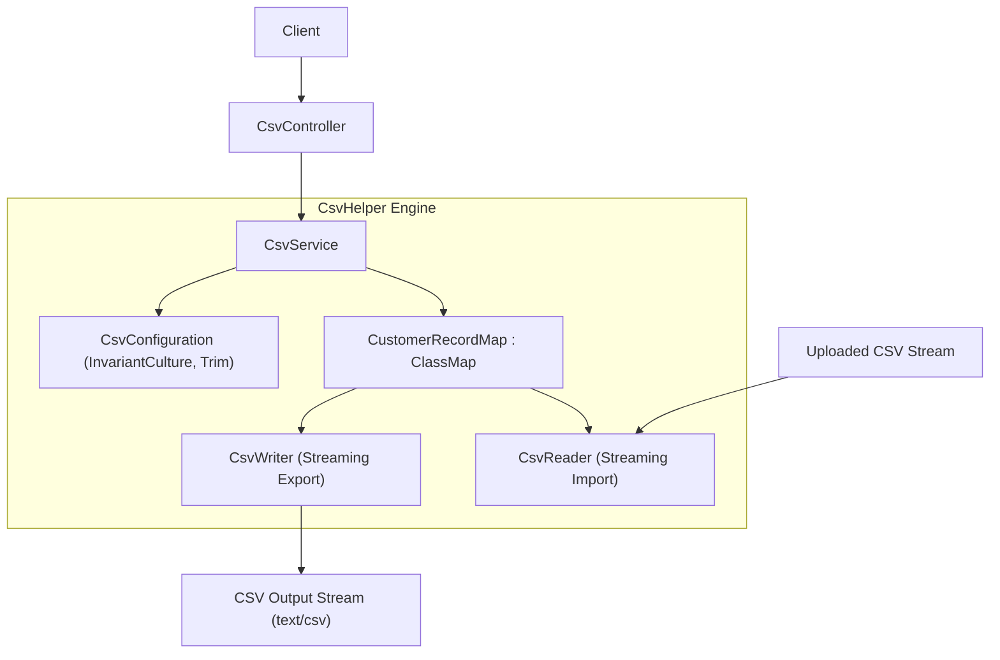
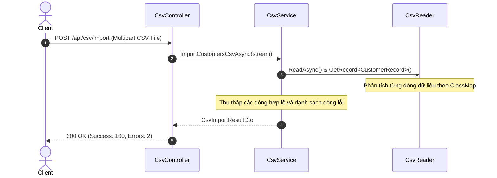

# 52-CsvHelper: Đọc và Ghi file CSV Hiệu Năng Cao trong .NET 10

## 1. Giới thiệu tổng quan
**CsvHelper** là thư viện C# tiêu chuẩn công nghiệp và phổ biến nhất để đọc và ghi các tập tin định dạng CSV (Comma-Separated Values). Thư viện có tốc độ thực thi cực nhanh, cấu hình linh hoạt và hỗ trợ ánh xạ tự động hoặc tùy chỉnh vào các đối tượng C#.

Dự án mẫu này minh họa:
- Tùy biến ánh xạ thuộc tính thông qua `ClassMap<T>` (`CustomerRecordMap`): đổi tên cột header, định dạng số thập phân, định dạng ngày tháng `yyyy-MM-dd`.
- Xuất danh sách khách hàng ra luồng file CSV với `CsvWriter` (UTF-8, InvariantCulture).
- Đọc và phân tích file CSV tải lên (`IFormFile`) với `CsvReader` theo cơ chế streaming bất đồng bộ (`ReadAsync`), thu thập thống kê dòng hợp lệ và dòng lỗi.
- Kiểm thử Round-trip (Export -> Import) xác nhận độ toàn vẹn 100% của dữ liệu.

## 2. Kiến trúc & Cấu trúc dự án
```
52-CsvHelper/
├── CsvDataProcessor.slnx
├── README.md
├── CsvDataProcessor.Api/
│   ├── CsvDataProcessor.Api.csproj
│   ├── Program.cs
│   ├── Properties/launchSettings.json
│   ├── appsettings.json
│   ├── CsvDataProcessor.Api.http
│   ├── Models/
│   │   └── CustomerCsvModels.cs
│   ├── Services/
│   │   └── CsvService.cs
│   └── Controllers/
│       └── CsvController.cs
└── CsvDataProcessor.Tests/
    ├── CsvDataProcessor.Tests.csproj
    └── CsvProcessorTests.cs
```


## Sơ đồ Kiến trúc & Luồng dữ liệu (Architecture & Data Flow)

### 1. Sơ đồ Kiến trúc Tổng quan (Architecture Overview)


### 2. Mô hình Luồng dữ liệu Chi tiết (Data Flow & Sequence)


### 3. Các Use Cases Cụ thể trong Thực tế (Concrete Use Cases)
- **Nhập/Xuất Dữ liệu Khối lượng Lớn (Big Data CSV Import/Export)**: Cơ chế streaming giúp xử lý file CSV dung lượng nhiều GB với lượng RAM tiêu thụ cực thấp.
- **Đồng bộ Dữ liệu với Hệ thống Cũ (Legacy Systems)**: Trao đổi dữ liệu khách hàng, danh bạ, giao dịch qua định dạng CSV tiêu chuẩn.
- **Ánh xạ Cột Linh hoạt (Custom ClassMap)**: Đổi tên cột, định dạng ngày tháng, chuyển đổi kiểu dữ liệu an toàn.


## 3. Cài đặt Package
```xml
<PackageReference Include="CsvHelper" Version="33.1.0" />
<PackageReference Include="Swashbuckle.AspNetCore" Version="10.2.3" />
```

## 4. Cấu hình ClassMap
```csharp
public sealed class CustomerRecordMap : ClassMap<CustomerRecord>
{
    public CustomerRecordMap()
    {
        Map(m => m.Id).Name("Customer ID");
        Map(m => m.FullName).Name("Full Name");
        Map(m => m.Email).Name("Email Address");
        Map(m => m.PhoneNumber).Name("Phone Number");
        Map(m => m.Balance).Name("Account Balance").TypeConverterOption.Format("F2");
        Map(m => m.IsActive).Name("Active Status");
        Map(m => m.RegisteredDate).Name("Registration Date").TypeConverterOption.Format("yyyy-MM-dd");
    }
}
```

## 5. Đọc và Ghi Dữ liệu CSV
```csharp
// Ghi CSV
using var writer = new StreamWriter(stream, Encoding.UTF8);
using var csv = new CsvWriter(writer, config);
csv.Context.RegisterClassMap<CustomerRecordMap>();
csv.WriteRecords(records);

// Đọc CSV theo dòng
using var reader = new StreamReader(stream, Encoding.UTF8);
using var csvReader = new CsvReader(reader, config);
csvReader.Context.RegisterClassMap<CustomerRecordMap>();
while (await csvReader.ReadAsync())
{
    var record = csvReader.GetRecord<CustomerRecord>();
}
```

## 6. Controller API
Sử dụng `[ApiController]` kế thừa `ControllerBase`:
- `GET /api/csv/sample`: Lấy danh sách khách hàng mẫu.
- `POST /api/csv/export`: Xuất dữ liệu khách hàng ra file CSV tải xuống (`text/csv`).
- `POST /api/csv/import`: Tiếp nhận file `.csv` upload qua form-data và phân tích thành dữ liệu có cấu trúc kèm báo cáo lỗi.

## 7. Đánh giá & Phản biện (Code Review)
- **Tương thích luồng cũ**: Hoạt động thuần túy ở tầng xử lý I/O dữ liệu đầu vào/ra, không ràng buộc cơ sở dữ liệu hay mô hình thực thể domain.
- **Hiệu năng ứng dụng (App Level)**: CsvHelper sử dụng cơ chế streaming cursor (`ReadAsync`), không cần nạp toàn bộ nội dung file vào RAM cùng lúc, cho phép xử lý các file CSV dung lượng hàng gigabyte với lượng RAM tiêu thụ cố định và cực thấp.
- **Tính an toàn & Validation**: Cấu hình `MissingFieldFound = null` và `BadDataFound = null` kết hợp bắt ngoại lệ chi tiết từng dòng giúp API hoạt động bền bỉ, không bị crash toàn bộ batch khi một vài dòng dữ liệu đầu vào bị lỗi format.

## 8. Hướng dẫn chạy dự án
```bash
cd 52-CsvHelper/CsvDataProcessor.Api
dotnet run
```
Mở Swagger UI tại: `http://localhost:5152/swagger`

## 9. Hướng dẫn chạy kiểm thử
```bash
cd 52-CsvHelper
dotnet test CsvDataProcessor.slnx
```

## 10. Ví dụ Request/Response
**Request Xuất CSV:**
```http
POST /api/csv/export HTTP/1.1
Content-Type: application/json

[
  {
    "id": "CUST-001",
    "fullName": "Alice Smith",
    "email": "alice@example.com",
    "phoneNumber": "+1-555-0100",
    "balance": 1500.50,
    "isActive": true,
    "registeredDate": "2025-06-15T00:00:00Z"
  }
]
```

**Response:** File download `Customers_20260920_093500.csv`:
```csv
Customer ID,Full Name,Email Address,Phone Number,Account Balance,Active Status,Registration Date
CUST-001,Alice Smith,alice@example.com,+1-555-0100,1500.50,True,2025-06-15
```

## 11. Các cạm bẫy thường gặp (Gotchas)
- Luôn chỉ định `CultureInfo.InvariantCulture` trong `CsvConfiguration` để tránh việc dấu phân cách số thập phân (dấu phẩy `,` vs dấu chấm `.`) bị thay đổi theo ngôn ngữ máy chủ (ví dụ máy chủ tiếng Pháp hoặc tiếng Việt).
- Khi ghi dữ liệu với `StreamWriter`, bắt buộc phải gọi `writer.Flush()` trước khi lấy byte array từ `MemoryStream`.

## 12. Tài liệu tham khảo
- [CsvHelper Official Documentation](https://joshclose.github.io/CsvHelper/)
- [CsvHelper GitHub Repository](https://github.com/JoshClose/CsvHelper)
