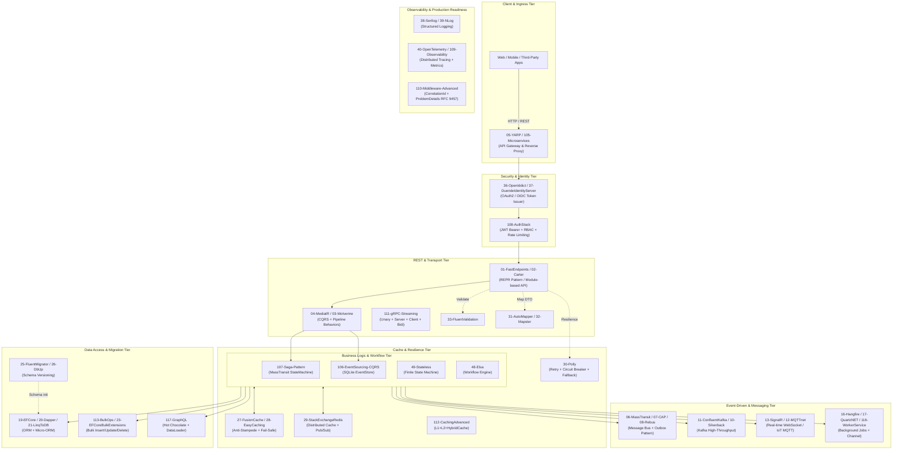

# .NET 10 Production Library Playbook

<p align="center">
  
  
  
  
  
  
</p>

---

## 📖 Tổng Quan Dự Án (Overview & Philosophy)

Kho lưu trữ này là **Bộ tài liệu kiến trúc thực chiến và mã nguồn mẫu toàn diện gồm 52 dự án thư viện độc lập và 20 dự án showcase** trong hệ sinh thái **.NET 10 (C# 13)**.

### 🎯 Triết lý cốt lõi (Core Principles)
1. **Tập trung vào bài toán thực tế**: Mỗi project giải quyết một **vấn đề sản xuất cụ thể (Pain Point)** kèm use case doanh nghiệp thực tiễn, không dừng lại ở mức hướng dẫn cú pháp cơ bản.
2. **Chuẩn hóa kỹ thuật**:
   - **.NET 10 LTS**: Tận dụng C# 13, Primary Constructors, `IExceptionHandler`, `HybridCache`, AOT compatibility.
   - **ASP.NET Core Controller**: Bắt buộc `[ApiController] : ControllerBase` — không dùng Minimal API (ngoại trừ project chuyên biệt).
   - **Độc lập hoàn toàn**: Mỗi dự án là một solution độc lập, copy và chạy ngay lập tức không phụ thuộc project cha.
   - **Cổng dịch vụ phân lập**: 52 dự án được gán dải cổng riêng từ `5101` đến `5152`, không trùng lặp.
   - **Sẵn sàng kiểm thử**: Mọi dự án có **REST Controller**, **Unit/Integration Test** và file **`*.http`** chuẩn hóa.

---

## 🗺️ Bản Đồ Kiến Trúc Hệ Thống (System Blueprint)



---

## 📋 Danh Mục Toàn Diện 52 Thư Viện Thực Chiến

### I. Web API & Giao Tiếp Client-Server (01 – 06)

| Dự án | Port | Thư viện / Công nghệ | Vấn đề giải quyết trong thực tế (Pain Point) |
|---|:---:|---|---|
| [**01-FastEndpoints**](./01-FastEndpoints/) | `5101` | FastEndpoints | Loại bỏ God Controller phình to; mỗi endpoint là một class độc lập theo kiến trúc REPR (Request-Endpoint-Response), tốc độ vượt trội so với MVC truyền thống. |
| [**02-Carter**](./02-Carter/) | `5102` | Carter | Tổ chức hàng trăm Minimal API endpoint vào các `ICarterModule` độc lập mà không làm bừa bãi `Program.cs`, hỗ trợ Content Negotiation và plugin hóa. |
| [**03-Wolverine**](./03-Wolverine/) | `5103` | Wolverine | Triển khai CQRS + Event-Driven Architecture với cú pháp Zero-Interface (POCO thuần); Transactional Outbox tích hợp, tốc độ nhờ Compile-time Code Generation. |
| [**04-MediatR**](./04-MediatR/) | `5104` | MediatR | Tách rời Controller khỏi Business Logic; tự động áp dụng Cross-cutting Concerns (Validation, Logging, Transaction) qua Pipeline Behaviors cho mọi request. |
| [**05-Scrutor**](./05-Scrutor/) | `5105` | Scrutor | Tự động đăng ký toàn bộ Service/Repository theo quy ước assembly scanning; triển khai Decorator Pattern sạch sẽ mà không cần sửa code gốc. |
| [**06-MassTransit**](./06-MassTransit/) | `5106` | MassTransit | Enterprise Service Bus hoàn chỉnh hỗ trợ RabbitMQ/Kafka/Azure SB; điều phối Saga phân tán, Dead Letter Queue và Consumer Fault Handling. |

---

### II. Messaging & Kiến Trúc Hướng Sự Kiện (07 – 10)

| Dự án | Port | Thư viện / Công nghệ | Vấn đề giải quyết trong thực tế (Pain Point) |
|---|:---:|---|---|
| [**07-CAP**](./07-CAP/) | `5107` | DotNetCore.CAP | Đảm bảo Eventual Consistency tuyệt đối giữa thao tác ghi DB nghiệp vụ và xuất bản Message ra Broker (Transactional Outbox), chặn trùng giao dịch tự động. |
| [**08-Rebus**](./08-Rebus/) | `5108` | Rebus | Service Bus tinh gọn (lean) cho ứng dụng vừa và nhỏ; quản lý Saga trạng thái dài hạn với cú pháp C# tường minh, không bị ẩn bởi quá nhiều tầng trừu tượng. |
| [**09-NServiceBus**](./09-NServiceBus/) | `5109` | NServiceBus | Nền tảng messaging cấp Enterprise với giám sát trực quan (ServicePulse/ServiceInsight); xử lý quy trình nghiệp vụ kéo dài nhiều tuần, phục hồi lỗi tự động. |
| [**10-Silverback**](./10-Silverback/) | `5110` | Silverback | Khung chuyên biệt cho Kafka/RabbitMQ với Transactional Outbox/Inbox, Batch Processing và Partition Rebalancing; đảm bảo ngữ nghĩa Exactly-Once. |

---

### III. Streaming, Real-time & Actor Model (11 – 15)

| Dự án | Port | Thư viện / Công nghệ | Vấn đề giải quyết trong thực tế (Pain Point) |
|---|:---:|---|---|
| [**11-ConfluentKafka**](./11-ConfluentKafka/) | `5111` | Confluent.Kafka | Kafka Producer/Consumer hiệu năng cao (hàng trăm nghìn msg/giây); xử lý telemetry IoT theo thời gian thực với Consumer Group và partition assignment. |
| [**12-MQTTnet**](./12-MQTTnet/) | `5112` | MQTTnet | Nhúng MQTT Broker trực tiếp vào ứng dụng .NET cho hệ thống IoT Smart Home/Industry; điều khiển thiết bị qua publish/subscribe trong điều kiện mạng yếu. |
| [**13-SignalR**](./13-SignalR/) | `5113` | SignalR | Đẩy thông báo thời gian thực xuống hàng nghìn client (WebSocket/SSE/Long-Polling) mà không polling liên tục; Chat, Dashboard live update, Stock price feed. |
| [**14-MicrosoftOrleans**](./14-MicrosoftOrleans/) | `5114` | Microsoft Orleans | Virtual Actor Model cho hệ thống phân tán — mỗi Grain là một Actor stateful; xử lý hàng triệu đối tượng cô lập mà không lo thread management hay sharding thủ công. |
| [**15-AkkaNET**](./15-AkkaNET/) | `5115` | Akka.NET | Actor System, Mailbox và Hierarchical Supervision Tree; xây dựng hệ thống chịu lỗi tự phục hồi (Let it crash), luồng xử lý song song cực cao. |

---

### IV. Lập Lịch & Background Jobs (16 – 18)

| Dự án | Port | Thư viện / Công nghệ | Vấn đề giải quyết trong thực tế (Pain Point) |
|---|:---:|---|---|
| [**16-Hangfire**](./16-Hangfire/) | `5116` | Hangfire | Chạy background job bền vững (persistent) — không mất khi server restart; Dashboard trực quan để retry thủ công, theo dõi lịch sử thực thi theo thời gian thực. |
| [**17-QuartzNET**](./17-QuartzNET/) | `5117` | Quartz.NET | Lập lịch phức tạp (ngày cuối tháng, misfire handling); lưu trạng thái trigger vào DB, chống trùng lặp khi chạy Cluster nhiều instance song song. |
| [**18-Coravel**](./18-Coravel/) | `5118` | Coravel | Scheduler in-process siêu nhẹ — định nghĩa Cron trực tiếp bằng C# Fluent API, không cần DB bên ngoài; phù hợp microservice nhỏ và Serverless. |

---

### V. Truy Cập Cơ Sở Dữ Liệu & ORM (19 – 24)

| Dự án | Port | Thư viện / Công nghệ | Vấn đề giải quyết trong thực tế (Pain Point) |
|---|:---:|---|---|
| [**19-EFCore**](./19-EFCore/) | `5119` | Entity Framework Core 10 | ORM đầy đủ tính năng: Change Tracker, Lazy/Eager Loading, LINQ projection; triệt tiêu N+1 Query bằng `AsNoTracking` và `Include` có kiểm soát. |
| [**20-Dapper**](./20-Dapper/) | `5120` | Dapper | Micro-ORM tốc độ cao — ánh xạ kết quả SQL thô trực tiếp sang POCO; DBA kiểm soát từng dòng SQL, hiệu năng vượt EF Core 3–5 lần cho Read-heavy workload. |
| [**21-LinqToDB**](./21-LinqToDB/) | `5121` | LinqToDB | LINQ-to-SQL type-safe với BulkCopy native và Set-based Update; chèn hàng trăm nghìn bản ghi không cần round-trip, nhanh hơn EF Core 10–20 lần. |
| [**22-RepoDb**](./22-RepoDb/) | `5122` | RepoDb | Hybrid ORM kết hợp tốc độ Micro-ORM và tính năng Full-ORM; Property Handlers, Expression-based QueryField, batch merge built-in. |
| [**23-EFCoreBulkExtensions**](./23-EFCoreBulkExtensions/) | `5123` | EF Core Bulk Extensions | Bổ sung `BulkInsertAsync`, `BulkUpdateAsync`, `BulkDeleteAsync` cho EF Core — chèn 100K bản ghi trong vài giây thay vì hàng phút với `SaveChanges` thông thường. |
| [**24-Marten**](./24-Marten/) | `5124` | Marten | Dùng PostgreSQL làm Document DB (JSONB) và EventStore đồng thời — không cần thêm Mongo; lưu trữ Event Sourcing, project ReadModel bằng Projection. |

---

### VI. Schema Migration (25 – 26)

| Dự án | Port | Thư viện / Công nghệ | Vấn đề giải quyết trong thực tế (Pain Point) |
|---|:---:|---|---|
| [**25-FluentMigrator**](./25-FluentMigrator/) | `5125` | FluentMigrator | Định nghĩa migration bằng C# Fluent API có type-safe, auto Rollback và version control; loại bỏ lỗi quên chạy script DB khi deploy Production. |
| [**26-DbUp**](./26-DbUp/) | `5126` | DbUp | Chạy các file SQL script thuần (`.sql`) theo thứ tự phiên bản và ghi nhật ký vào DB — phù hợp team DBA ưa SQL hơn ORM migration. |

---

### VII. Caching & Khả Năng Chống Chịu Lỗi (27 – 30)

| Dự án | Port | Thư viện / Công nghệ | Vấn đề giải quyết trong thực tế (Pain Point) |
|---|:---:|---|---|
| [**27-FusionCache**](./27-FusionCache/) | `5127` | FusionCache | Anti-Stampede Lock ngăn nghìn request đồng thời đánh DB khi cache miss; Fail-Safe trả giá trị cũ khi backend lỗi thay vì throw exception. |
| [**28-EasyCaching**](./28-EasyCaching/) | `5128` | EasyCaching | Caching Abstraction Layer — đổi provider từ Memory sang Redis qua config; Prefix-based invalidation, Serialization pluggable. |
| [**29-StackExchangeRedis**](./29-StackExchangeRedis/) | `5129` | StackExchange.Redis | Truy cập trực tiếp Redis Data Structures (Hash, Set, SortedSet, Pub/Sub); Distributed Lock, Atomic Increment, Leaderboard thời gian thực. |
| [**30-Polly**](./30-Polly/) | `5130` | Polly v8 (Polly.Core) | Resilience Pipeline đầy đủ: Retry với Exponential Backoff, Circuit Breaker chống sập dây chuyền, Timeout, Hedging và Fallback cho HTTP client. |

---

### VIII. Mapping & Validation (31 – 33)

| Dự án | Port | Thư viện / Công nghệ | Vấn đề giải quyết trong thực tế (Pain Point) |
|---|:---:|---|---|
| [**31-AutoMapper**](./31-AutoMapper/) | `5131` | AutoMapper | Loại bỏ hàng nghìn dòng getter/setter thủ công; Flattening, ReverseMap, Projection (LINQ), ValueTransformer và convention-based Profiles. |
| [**32-Mapster**](./32-Mapster/) | `5132` | Mapster | Object Mapping hiệu năng cao hơn AutoMapper nhờ Code Generation; TypeAdapterConfig linh hoạt, FlattenIf, `Adapt<T>` extension method tự nhiên. |
| [**33-FluentValidation**](./33-FluentValidation/) | `5133` | FluentValidation | Validation Rules strongly-typed, testable độc lập — chặn dữ liệu bẩn tại Controller trước khi vào Business Logic; Child Validators, RuleSet, Async rules. |

---

### IX. HTTP Clients (34 – 35)

| Dự án | Port | Thư viện / Công nghệ | Vấn đề giải quyết trong thực tế (Pain Point) |
|---|:---:|---|---|
| [**34-Refit**](./34-Refit/) | `5134` | Refit | Khai báo REST client bằng C# Interface thuần — không viết `HttpClient` code lặp đi lặp lại; tự động serialize/deserialize, Headers, Multipart. |
| [**35-Flurl**](./35-Flurl/) | `5135` | Flurl.Http | Fluent URL Builder + HTTP Client trong một; `HttpTest` intercept toàn bộ call trong Unit Test mà không cần mock `HttpMessageHandler` phức tạp. |

---

### X. Bảo Mật & Identity (36 – 37)

| Dự án | Port | Thư viện / Công nghệ | Vấn đề giải quyết trong thực tế (Pain Point) |
|---|:---:|---|---|
| [**36-OpenIddict**](./36-OpenIddict/) | `5136` | OpenIddict | Xây dựng Authorization Server chuẩn OAuth2/OIDC nhúng trực tiếp vào ASP.NET Core — không cần host riêng; Client Credentials, PKCE, Token Introspection. |
| [**37-DuendeIdentityServer**](./37-DuendeIdentityServer/) | `5137` | Duende IdentityServer | Enterprise Identity Platform hoàn chỉnh: SSO, Authorization Code + PKCE, Dynamic Client Registration, Back-Channel Logout. |

---

### XI. Logging (38 – 39)

| Dự án | Port | Thư viện / Công nghệ | Vấn đề giải quyết trong thực tế (Pain Point) |
|---|:---:|---|---|
| [**38-Serilog**](./38-Serilog/) | `5138` | Serilog | Structured Logging với Property Enrichment (UserId, RequestId) — log thành JSON đẩy thẳng ELK/Loki/Seq; LogContext, Destructure, multiple Sinks. |
| [**39-NLog**](./39-NLog/) | `5139` | NLog | Logging linh hoạt cấu hình XML/JSON; MemoryTarget cho Integration Test, Database Target, async Wrapper để không block request thread. |

---

### XII. Observability (40)

| Dự án | Port | Thư viện / Công nghệ | Vấn đề giải quyết trong thực tế (Pain Point) |
|---|:---:|---|---|
| [**40-OpenTelemetry**](./40-OpenTelemetry/) | `5140` | OpenTelemetry | Ba trụ Observability: Distributed Tracing (ActivitySource + Jaeger), Metrics (Prometheus), Logs (OTLP Exporter) — tích hợp Grafana dashboard. |

---

### XIII. Testing & API Documentation (41 – 47)

| Dự án | Port | Thư viện / Công nghệ | Vấn đề giải quyết trong thực tế (Pain Point) |
|---|:---:|---|---|
| [**41-Bogus**](./41-Bogus/) | `5141` | Bogus | Sinh dữ liệu giả lập có ý nghĩa thực tế (tên người Việt, CCCD, địa chỉ, giá cả) với seed cố định — đảm bảo test deterministic, dễ debug. |
| [**42-Verify**](./42-Verify/) | `5142` | Verify (Verify.Xunit) | Snapshot Testing — so sánh output JSON/HTML/PDF với file verified đã approved; tự động scrub Guid và DateTime biến đổi, đảm bảo regression detection. |
| [**43-FluentAssertions**](./43-FluentAssertions/) | `5143` | FluentAssertions | Assertion ngôn ngữ tự nhiên, dễ đọc; `BeEquivalentTo` so sánh sâu toàn bộ object graph, `AssertionScope` gom nhiều lỗi một lần thay vì fail từng cái. |
| [**44-BenchmarkDotNet**](./44-BenchmarkDotNet/) | `5144` | BenchmarkDotNet | Benchmark nanosecond chuẩn xác với JIT warmup tự động; `MemoryDiagnoser` đo allocation, `HardwareCounters`, so sánh nhiều implementation. |
| [**45-SpecFlow**](./45-SpecFlow/) | `5145` | SpecFlow (SpecFlow.xUnit) | BDD — viết kịch bản kiểm thử bằng Gherkin (`Given / When / Then`) để Business Analyst cùng đọc và nghiệm thu; Living Documentation tự sinh từ test. |
| [**46-Swashbuckle**](./46-Swashbuckle/) | `5146` | Swashbuckle.AspNetCore | Tự động sinh OpenAPI 3.0, Swagger UI có thể gọi thử trực tiếp; Multi-version API (V1/V2), Operation Filters, XML comments integration. |
| [**47-NSwag**](./47-NSwag/) | `5147` | NSwag | OpenAPI toolchain hoàn chỉnh: Swagger UI + ReDoc + tự động generate C# Client SDK và TypeScript SDK từ spec — API-first development workflow. |

---

### XIV. Workflow, FSM & Xử Lý Tệp Tin (48 – 52)

| Dự án | Port | Thư viện / Công nghệ | Vấn đề giải quyết trong thực tế (Pain Point) |
|---|:---:|---|---|
| [**48-Elsa**](./48-Elsa/) | `5148` | Elsa Workflows | Workflow Engine code-first — định nghĩa quy trình phê duyệt, onboarding nhiều bước bằng C# hoặc JSON; in-process runner không cần Docker external. |
| [**49-Stateless**](./49-Stateless/) | `5149` | Stateless | Finite State Machine nhẹ, embeddable — quản lý vòng đời đơn hàng (Draft→Paid→Shipped→Completed); Guard Conditions, History State, xuất Mermaid/DOT diagram. |
| [**50-QuestPDF**](./50-QuestPDF/) | `5150` | QuestPDF | Sinh PDF Hóa đơn/Báo cáo bằng C# Fluent API — không phụ thuộc LibreOffice hay Puppeteer; layout responsive, table tự xuống dòng, Emoji hỗ trợ. |
| [**51-ClosedXML**](./51-ClosedXML/) | `5151` | ClosedXML | Đọc/ghi file Excel `.xlsx` không cần cài Office; tạo bảng biểu có định dạng màu sắc, Formula, DataValidation; roundtrip import-export chính xác. |
| [**52-CsvHelper**](./52-CsvHelper/) | `5152` | CsvHelper | Import/Export CSV hiệu năng cao — ClassMap tự động map cột theo tên/index; xử lý encoding, dấu phẩy bên trong ngoặc kép, streaming file lớn. |

---

## 🏗️ Dự Án Tổng Hợp & Showcase (100 – 117)

### Tổng Hợp: 52 Thư Viện Trong 1 Use Case

| Dự án | Port | Mô tả | Tests |
|---|:---:|---|:---:|
| [**100-AllInOne**](./100-AllInOne/) | `5200` | Toàn bộ 52 thư viện phối hợp trong một use case **E-Commerce Order Fulfillment & Audit Platform** hoàn chỉnh. | 10/10 |

---

### Benchmark Stack: Battle-tested vs Modern High-Performance

| Dự án | Port | Stack | Mục đích | Tests |
|---|:---:|---|---|:---:|
| [**101-EnterpriseClassic**](./101-EnterpriseClassic/) | `5201` | MediatR · AutoMapper · Dapper · EF Core · MassTransit · Hangfire · Serilog | Battle-tested Enterprise Stack — ổn định lâu năm, production-proven tại hàng nghìn doanh nghiệp. | 8/8 |
| [**102-ModernHighPerf**](./102-ModernHighPerf/) | `5202` | Wolverine · Mapster · FusionCache · CAP · EF Core · OpenTelemetry · NSwag | Modern High-Performance Stack — throughput tối đa, latency thấp, cloud-native ready. | 8/8 |

---

### Architecture Patterns

| Dự án | Port | Stack | Mục đích | Tests |
|---|:---:|---|---|:---:|
| [**103-BenchmarkShowdown**](./103-BenchmarkShowdown/) | — | BenchmarkDotNet · AutoMapper · Mapster · Dapper · EF Core | Benchmark thực chiến đo ns/op & allocation: Classic vs Modern Libraries. | 6/6 |
| [**104-CleanVerticalSlice**](./104-CleanVerticalSlice/) | `5204` | MediatR · FluentValidation · EF Core · Serilog | Clean Architecture (4 layer) + Vertical Slice (feature-first), Value Object, Aggregate Root, Domain Events. | 10/10 |
| [**105-Microservices-Basic**](./105-Microservices-Basic/) | `5300/5301/5302` | gRPC · YARP · EF Core | ProductService (REST+gRPC) + OrderService (REST+gRPC client) + YARP API Gateway. | 10/10 |
| [**106-EventSourcing-CQRS**](./106-EventSourcing-CQRS/) | `5306` | SQLite EventStore · EF Core | Event Store, Aggregate Rebuild từ events, Snapshot, Read Model Projection. | 12/12 |
| [**107-Saga-Pattern**](./107-Saga-Pattern/) | `5307` | MassTransit StateMachine | Orchestration Saga: Order → Payment → Inventory → Shipping + Compensation flow khi bất kỳ bước thất bại. | 10/10 |

---

### Security & Infrastructure

| Dự án | Port | Stack | Mục đích | Tests |
|---|:---:|---|---|:---:|
| [**108-AuthStack**](./108-AuthStack/) | `5308` | JWT Bearer · BCrypt · EF Core · Rate Limiting | JWT Auth + Refresh Token Rotation + RBAC Policy + Rate Limiting (sliding window). | 12/12 |
| [**109-Observability**](./109-Observability/) | `5309` | OpenTelemetry · Prometheus · Serilog | Ba trụ Observability: `/metrics` Prometheus + Distributed Tracing + Structured Logging. | 8/8 |
| [**110-Middleware-Advanced**](./110-Middleware-Advanced/) | `5310` | ASP.NET Core Middleware · ProblemDetails RFC 9457 | Custom Pipeline: CorrelationId + Request/Response Logging + `IExceptionHandler` + ProblemDetails. | 12/12 |

---

### Performance & Real-time

| Dự án | Port | Stack | Mục đích | Tests |
|---|:---:|---|---|:---:|
| [**111-gRPC-Streaming**](./111-gRPC-Streaming/) | `5311/5321` | gRPC · Protobuf | 4 gRPC patterns: Unary + Server Streaming + Client Streaming + Bidirectional Streaming. | 10/10 |
| [**112-CachingAdvanced**](./112-CachingAdvanced/) | `5312` | IMemoryCache · IDistributedCache · HybridCache · FusionCache | L1 Memory + L2 Distributed + HybridCache (.NET 9+) + Anti-stampede FusionCache. | 10/10 |
| [**113-BulkOps**](./113-BulkOps/) | `5313` | EF Core · EFCore.BulkExtensions · LinqToDB | Bulk Insert/Update/Delete: `ExecuteUpdateAsync` native vs BulkExtensions vs LinqToDB BulkCopy. | 11/11 |
| [**116-WorkerService**](./116-WorkerService/) | `5316` | `System.Threading.Channels` · BackgroundService · PeriodicTimer | `IHostedService` + `Channel<T>` producer/consumer + `PeriodicTimer` periodic background jobs. | 10/10 |

---

### Testing & Architecture Quality

| Dự án | Port | Stack | Mục đích | Tests |
|---|:---:|---|---|:---:|
| [**114-TestingMastery**](./114-TestingMastery/) | `5314` | Moq · NSubstitute · Verify.Xunit · FluentAssertions | Unit (Moq + NSubstitute) + Integration (`WebApplicationFactory`) + Snapshot testing (Verify). | 16/16 |
| [**115-ArchitectureTests**](./115-ArchitectureTests/) | `5315` | NetArchTest.Rules · EF Core | Tự động kiểm tra dependency rules: Domain ← Application ← Infrastructure ← Api trên CI/CD. | 12/12 |

---

### Modern API Styles

| Dự án | Port | Stack | Mục đích | Tests |
|---|:---:|---|---|:---:|
| [**117-GraphQL**](./117-GraphQL/) | `5317` | Hot Chocolate 14 · EF Core · DataLoader | GraphQL Query/Mutation/Subscription + DataLoader (chặn N+1) + Filtering/Sorting + Banana Cake Pop UI. | 11/11 |

---

### AI & Intelligent Agents

| Dự án | Port | Stack | Mục đích | Tests |
|---|:---:|---|---|:---:|
| [**118-AI-Agent-Messaging**](./118-AI-Agent-Messaging/) | `5153` | MassTransit · Semantic Kernel | AI Agent tích hợp vào Event-Driven Pipeline; AI model tháo lắp (pluggable/NoOp fallback) không ảnh hưởng workflow chính. | 13/13 |
| [**119-RAG-Pipeline**](./119-RAG-Pipeline/) | `5154` | Semantic Kernel · TF-IDF Vector Search | Upload tài liệu → Chunking → Vector Search → AI trả lời; AI pluggable, fallback keyword search khi AI disabled. | 28/28 |

---

## 🎯 Ma Trận Lựa Chọn Giải Pháp Doanh Nghiệp (Solution Blueprints)

Tùy theo loại hình bài toán cần giải quyết, kết hợp các dự án mẫu thành bộ khung kiến trúc hoàn chỉnh:

```
┌──────────────────────────────────────────────────────────────────────────────────────────────┐
│ 1. Ứng Dụng Quản Trị Doanh Nghiệp (Back-Office / ERP / CRM)                                 │
│    👉 04-MediatR + 19-EFCore + 25-FluentMigrator + 27-FusionCache + 31-AutoMapper + 33-Fluent│
├──────────────────────────────────────────────────────────────────────────────────────────────┤
│ 2. Hệ Thống Chịu Tải Cao & Thương Mại Điện Tử (High-Throughput E-Commerce)                  │
│    👉 01-FastEndpoints + 06-MassTransit + 29-Redis + 30-Polly + 40-OpenTelemetry             │
├──────────────────────────────────────────────────────────────────────────────────────────────┤
│ 3. Ngân Hàng, Ví Điện Tử & FinTech (High-Integrity Financial Ledger)                        │
│    👉 106-EventSourcing + 07-CAP + 36-OpenIddict + 108-AuthStack + 50-QuestPDF               │
├──────────────────────────────────────────────────────────────────────────────────────────────┤
│ 4. Hệ Thống IoT & Thời Gian Thực (Low-Latency Real-Time / IoT Streaming)                    │
│    👉 12-MQTTnet + 11-ConfluentKafka + 111-gRPC-Streaming + 13-SignalR + 40-OpenTelemetry   │
├──────────────────────────────────────────────────────────────────────────────────────────────┤
│ 5. Microservices & Distributed Systems                                                       │
│    👉 105-Microservices + 107-Saga + 06-MassTransit + 109-Observability + 30-Polly          │
├──────────────────────────────────────────────────────────────────────────────────────────────┤
│ 6. Chuẩn Hóa Kiến Trúc & Kiểm Thử Tự Động (Clean Architecture & Automated QA)              │
│    👉 104-CleanVerticalSlice + 114-TestingMastery + 115-ArchitectureTests + 44-BenchmarkDotNet│
└──────────────────────────────────────────────────────────────────────────────────────────────┘
```

---

## 🚀 Hướng Dẫn Chạy & Kiểm Thử Nhanh

### 1. Yêu cầu môi trường
- **.NET SDK**: 10.0 trở lên ([tải tại dotnet.microsoft.com](https://dotnet.microsoft.com/download)).
- **IDE**: Visual Studio 2022+, JetBrains Rider, hoặc VS Code + C# Dev Kit.

### 2. Khởi chạy một dự án bất kỳ
Ví dụ muốn chạy dự án **`27-FusionCache`**:
```bash
# Di chuyển vào thư mục dự án
cd 27-FusionCache

# Khởi chạy ứng dụng
dotnet run --project ProductCatalogCache.Api
```
Ứng dụng sẽ lắng nghe tại `http://localhost:5127`. Swagger UI tại `http://localhost:5127/swagger`.

### 3. Kiểm thử tự động (TDD)
```bash
# Chạy tất cả test trong solution
dotnet test

# Chạy test với báo cáo chi tiết
dotnet test --logger "console;verbosity=detailed"
```

### 4. Kiểm thử qua file `*.http`
Mỗi thư mục dự án đều có sẵn một file **`*.http`** chuẩn hóa với toàn bộ endpoints.
- Trên **Visual Studio / Rider**: Mở file `.http` và bấm nút ▶ bên cạnh mỗi request.
- Trên **VS Code**: Cài extension **REST Client** (Huachao Mao), mở file và bấm `Send Request` hiển thị trên mỗi endpoint.

---

## 📄 Bản Quyền (License)
Dự án được phân phối dưới giấy phép mã nguồn mở **MIT License**. Mọi lập trình viên và doanh nghiệp được tự do tham khảo, tái sử dụng và áp dụng vào các hệ thống sản xuất thương mại.
